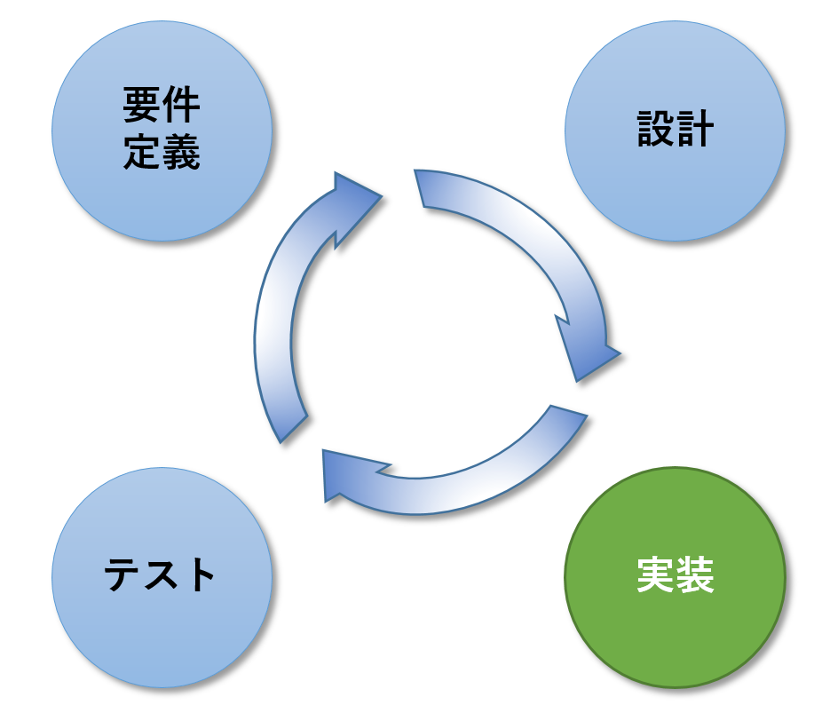

include::_include_all.adoc[]

[[introduction]]
= はじめに

本ガイドラインはマイクロサービスアーキテクチャを用いたシステム開発における代表的なシステムアーキテクチャやデザインパターンについて説明し、実装サンプルを提供する。 +
例示としてサンプルアプリケーションのソースコードや設定を参照して説明を行う。

== 規約
本ドキュメントを使用するにあたり、下記の規約に同意する必要がある。同意しない場合は、本ドキュメント及びその複製物のすべてを直ちに消去又は破棄すること。

. 本ドキュメントの著作権及びその他一切の権利は、日本電信電話株式会社(下記「NTT」とする)あるいはNTTに権利を許諾する第三者に帰属する。
. 本ドキュメントの一部または全部を、自らが使用する目的において、複製、翻訳、翻案することができる。ただし本ページの規約全文、およびNTTの著作権表示を削除することはできない。
. 本ドキュメントの一部または全部を、自らが使用する目的において改変したり、本ドキュメントを用いた二次的著作物を作成することができる。ただし、「参考文献：{doctitle}」あるいは同等の表現を、作成したドキュメント及びその複製物に記載するものとする。
. 前2項によって作成したドキュメント及びその複製物を、無償の場合に限り、第三者へ提供することができる。
. NTTの書面による承諾を得ることなく、本規約に定められる条件を超えて、本ドキュメント及びその複製物を使用したり、本規約上の権利の全部又は一部を第三者に譲渡したりすることはできない。
. NTTは、本ドキュメントの内容の正確性、使用目的への適合性の保証、使用結果についての的確性や信頼性の保証、及び瑕疵担保義務も含め、直接、間接に被ったいかなる損害に対しても一切の責任を負わない。
. NTTは、本ドキュメントが第三者の著作権、その他如何なる権利も侵害しないことを保証しない。また、著作権、その他の権利侵害を直接又は間接の原因としてなされる如何なる請求(第三者との間の紛争を理由になされる請求を含む)に関しても、NTTは一切の責任を負わない。

本ドキュメントで使用されている各社の会社名及びサービス名、商品名に関する登録商標および商標は、下記のとおりである。

* Macchinetta は、NTTの登録商標である。
* その他の会社名、製品名は、各社の登録商標または商標である。

== 目的
本ガイドラインでは、Spring Bootアプリケーションをベースとし、 クラウドプラットフォーム上で動作させることを想定した、
マイクロサービスアーキテクチャによるWebアプリケーション開発をするための実装サンプルとその説明を提供する。

本ガイドラインの内容は、主に実装時の参考情報となることを目的として書かれている。

== 想定読者
本ガイドラインはソフトウェア開発経験のあるアーキテクトやプログラマ向けに書かれており、 下記の知識、経験があることを前提としている。

* Spring BootアプリケーションによるWebアプリケーションの開発経験がある
* 必須ではないが、コンテナ技術、Kubernetesに関する知識、使用経験があることが望ましい

== 本ガイドラインの開発における適用範囲
本ガイドラインが想定する開発における適用範囲は主に実装の部分となる。マイクロサービスの分割指針、設計、テストに関しては説明の対象外とする。

本ガイドラインではマイクロサービスアーキテクチャの基本的な概念の説明と実装サンプルを提供する。

== 本ガイドラインの構成
本ガイドラインは実装を行う際に、個々の要素・機能の項目が参照されることを想定している。まず全体構成についての説明に目を通し、次にKubernetes章を読んで基本的な知識を確認した上で、必要に応じて各章の説明を読むことを推奨する。

.本ガイドラインの構成と読み方
[cols="4a,2a,4"]
|===
| 大項目 | 章 | 読み方

| アーキテクチャ概要

| <<02_architecture_summary.adoc#architecture_summary,2. アーキテクチャ概要>>
|
ここではマイクロサービスアーキテクチャの一般的な構成を説明する。 +
まず最初に本章を読み、本ガイドラインの全容を把握することを推奨する。 さらに本章の情報を元に、開発するアプリケーションが本ガイドラインの対象として合致するか判断した上で、 本ガイドラインのどの部分を採用するか、拡張・追加する必要のある機能が何かを大まかに洗い出す。

| サンプルアプリケーション

| <<03_sample_application.adoc#sample_application,3. サンプルアプリケーション>>
| サンプルアプリケーションの概要と、どの部分に本ガイドラインが説明する要素が実現されているかが、ここで示されている。 +
アーキテクチャ概要と合わせて最初に読み、採用部分と追加・拡張を判断するためのインプットとすること。

| コンテナ

| <<04_kubernetes.adoc#kubernetes_section,4. Kubernetes>>
| コンテナオーケストレーションシステムのデファクトスタンダードであるKubernetesについて説明する。 +
サンプルアプリケーションはKubernetesを実行環境として実装されている。説明中に記載したコードサンプルにはKubernetesを前提とした設定なども含まれるため、機能の説明に進む前に本章を一読することを推奨する。

| マイクロサービスアーキテクチャで利用する主な機能

| <<05_api_gateaway.adoc#api_gateaway,5. APIゲートウェイ>>

<<06_service_discovery.adoc#service_discovery,6. サービスディスカバリ>>

<<07_circuit_breaker.adoc#circuit_breaker,7. サーキットブレーカ>> +

<<08_access_control.adoc#access_control,8. アクセス制御>> +

<<09_property_external_manage.adoc#property_external_manage,9. 設定の外部化>> +

<<10_synchronization.adoc#synchronization,10. 同期連携>>
| マイクロサービスアーキテクチャを開発するにあたって利用される主な機能について説明されている。 +
担当する業務機能に必要となる要素の説明を適宜、読むことを推奨する。

| マイクロサービスアーキテクチャの運用に必要な項目

| <<11_log_aggregation.adoc#log_aggregation,11. ログ集中管理>> +
<<12_distributed_tracing.adoc#distributed_tracing,12. 分散トレーシング>> +
<<13_healthcheck.adoc#healthcheck,13. ヘルスチェック>>
| マイクロサービスアーキテクチャの運用に必要となる機能について説明する。 +
アプリケーション基盤の開発者は説明を読み、必要性と実装・拡張のポイントを理解した上で実装を行うことを推奨する。

| デプロイメント

| <<14_deployment.adoc#deployment_section,14. デプロイメント>>
| マイクロサービスアーキテクチャにおけるデプロイメントについて説明する。 +
主にデプロイメント戦略についての説明がされており、本文を参照し、適切なCI/CDの構築に役立ててもらいたい。

|===

== 本ガイドラインが説明するアーキテクチャと使用するプロダクト
本ガイドラインが説明するアーキテクチャと対応するプロダクトの一覧を下記に示す。

.本ガイドラインの説明対象
[cols="1,4,5a"]
|===
| 項番 | 構成要素 | 対応するプロダクト

| 1 | APIゲートウェイ | Nginx Ingress
| 2 | サービスディスカバリ | Service(Kubernetes)
| 3 | サーキットブレーカ | Resilience4j
| 4 | アクセス制御 | Spring Security OAuth
| 5 | プロパティの外部管理 | ConfigMap(Kubernetes)
| 6 | 同期連携 | OpenFeign
| 7
| ログ集中管理
| * Elasticsearch
* Fluentd
* Kibana

| 8 | 分散トレーシング | Jaeger

| 9
| ヘルスチェック
| * LivenessProbe/ReadinessProbe(Kubernetes)
* Spring Boot Actuator

| 10 | デプロイメント | -
| 11 | コンテナ管理 | Kubernetes
|===

== サンプルアプリケーションの検証環境

サンプルアプリケーションの検証環境を下記に示す。

[cols="1,5a,5a"]
|===
| Product |  Version | 備考

| EC2 | Amazon Linux 2 AMI 2.0.20190823.1 x86_64 HVM gp2 |

| Java | OpenJDK 11.0.5 | Dockerイメージに下記を使用した。

* adoptopenjdk/openjdk11:alpine (openjdk-11.0.5_10-alpine)

| PostgreSQL | 11.6 | Dockerイメージに下記を使用した。

* postgres:11-alpin (11.6-alpine)

| Docker
| * Client Version: 18.06.1-ce
* Server Version: 18.06.1-ce
|

| Kubernetes
| 検証環境としてEKSを使用した。

* EKS Kubernetes Worker AMI with AmazonLinux2 image, (k8s: 1.13.11, docker:18.06)
| 開発環境としてminikubeを使用した。

* minikube v1.3.1 on Windows (amd64)

| kubectl
| * Client Version: v1.13.8-eks-cd3eb0
* Server Version: v1.13.12-eks-5ac0f1
| 開発環境(minikube)

* Client Version: v1.14.3
* Server Version: v1.15.2

| helm
| * Client Version: v2.14.3
* Server Version: v2.14.3
|

|===

== 利用するOSSのバージョン
サンプルアプリケーションで利用するOSSの一覧を下記に示す。

.OSS一覧
[cols="3,3,1"]
|===
| GroupId | ArtifactId | Version

| org.springframework.boot | spring-boot-starter-actuator | 2.1.7
| org.springframework.boot | spring-boot-starter-web | 2.1.7
| org.springframework.boot | spring-boot-starter-data-jpa | 2.1.7
| org.springframework.boot | spring-boot-starter-test | 2.1.7
| org.springframework.boot | spring-boot-starter-aop | 2.1.7

| org.springframework.cloud | spring-cloud-stream | Greenwich.SR2
| org.springframework.cloud | spring-cloud-stream-binder-kafka-streams | Greenwich.SR2
| org.springframework.cloud | spring-cloud-stream-binder-kafka | Greenwich.SR2
| org.springframework.cloud | spring-cloud-starter-openfeign | Greenwich.SR2
| org.springframework.cloud | spring-cloud-starter-kubernetes | Greenwich.SR2
| org.springframework.cloud | spring-cloud-starter-kubernetes-ribbon | Greenwich.SR2
| org.springframework.cloud | spring-cloud-stream-test-support | Greenwich.SR2
| org.springframework.cloud | spring-cloud-starter-contract-stub-runner | Greenwich.SR2
| org.springframework.cloud | spring-cloud-commons | Greenwich.SR2

| org.springframework.security.oauth | spring-security-oauth2 | 2.3.6.RELEASE
| org.springframework.security.oauth.boot | spring-security-oauth2-autoconfigure | 2.1.2.RELEASE

| org.apache.kafka | kafka-streams | 2.0.1

| org.projectlombok | lombok | 1.18.8

| org.postgresql | postgresql | 42.2.6

| io.micrometer | micrometer-registry-prometheus | 1.1.5

| io.opentracing.contrib | opentracing-spring-cloud-starter | 0.3.4
| io.opentracing.contrib | opentracing-spring-jaeger-cloud-starter | 2.0.3

| io.github.resilience4j | resilience4j-spring-boot2 | 1.0.0

| com.github.dozermapper | dozer-spring-boot-autoconfigure | 6.4.1

| com.sun.xml.bind | jaxb-core | 2.3.0.1
| com.sun.xml.bind | jaxb-impl | 2.3.1
| javax.xml.bind | jaxb-api | 2.3.1

| com.fasterxml.jackson.dataformat | jackson-dataformat-xml | 2.9.9

|===
