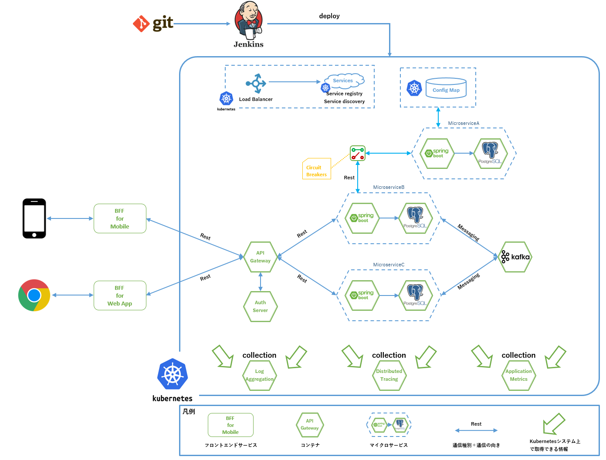
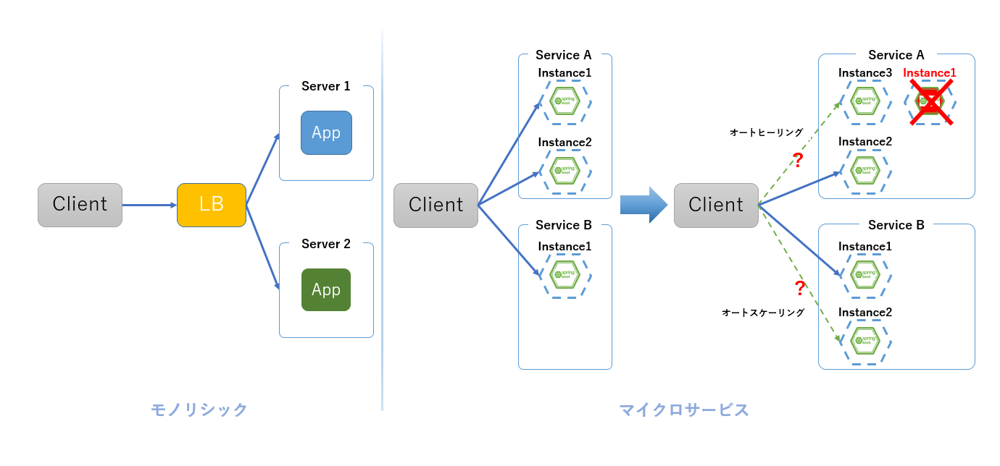

include::_include_all.adoc[]

[[architecture_summary]]
= アーキテクチャ概要

ここではマイクロサービスアーキテクチャの構成を説明する。

== アーキテクチャ
Kubernetesを利用したマイクロサービスアーキテクチャの構成例を下記に示す。

.マイクロサービスアーキテクチャ構成概要図

[[architecture_component]]
== 構成要素説明
マイクロサービスアーキテクチャ構成概要図に示した構成要素について簡単に説明する。

それぞれ、詳細な説明はリンク先の各章の説明を参照すること。

=== APIゲートウェイ(API Gateway)
Webアプリケーションでは、クライアントからのリクエストを受け付けるためのエンドポイントを設定し、公開する必要がある。
公開したエンドポイントで、指定したプロトコルによるリクエストを受け付け、処理結果を返却する。

モノリシックなアプリケーションでは、処理を受け付けるサービスは基本的には1つであり、リクエストごとにどのサービスへ処理を依頼するかを考慮する必要がなかった。

マイクロサービスアーキテクチャは、個別の機能を担う複数のマイクロサービスによって構成され、それぞれがエンドポイント持ち、リクエストを受け付ける。
これらを直接、外部に公開する場合、クライアントはマイクロサービスの構成とエンドポイントをすべて把握し、処理ごとにリクエスト先のサービスを設定することになる。

APIゲートウェイの主な役割はそうした複雑さを吸収し、バックエンド処理を行うサービス群のファサードとなることである。

.APIゲートウェイ概念図
image:../images/05_apigateway/apigateway_overview_02.png[width="800",align='center']

APIゲートウェイはマイクロサービスのエンドポイントを集約し、アクセス方式を管理することで、単一のアプリケーションとしてのエンドポイントをクライアントに提供する。

<<05_api_gateaway.adoc#api_gateaway,APIゲートウェイ>>にて説明する。

=== サービスディスカバリ(Service Discovery)
マイクロサービスアーキテクチャでは、可用性や耐障害性の確保を目的として、各サービスがインスタンス数を動的に増減させる。
そのため、サービス名から動的に変化する物理的な接続先(IPアドレス/ポート)を解決し、ロードバランシングを行う必要がある。

モノリシックなアプリケーションでは、接続先が動的に変化するような構成がとられることはなかったために発生しなかった、こうした問題に対処するための
仕組みが、サービスディスカバリである。

サービスディスカバリは動的に増減するサービスの接続先を管理し、適切に接続を分散する仕組みを提供する。
接続元(UIサービスや、他のマイクロサービスなど)は接続先のサービス名を知っているだけでよく、接続先の動的な変更はサービスディスカバリが吸収し、
複雑さを排した接続情報を提供する。

.Service Discovery概念図

<<06_service_discovery.adoc#service_discovery,サービスディスカバリ>>にて説明する。

=== アクセス制御(Auth Server)
アクセス制御とは、サービスにアクセスするクライアントに対してアクセス許可を与えるための機能である。アクセス制御には2つの段階がある。

* 認証(Authentication)
  - クライアントがアクセス許可を受けていることを確認する
* 認可(Authorization)
  - クライアントに与えられたアクセス権限を元にリソースへのアクセス可否を制御する

モノリシックなアプリケーションでは、一般的にセッションとクッキーを利用して認証・認可が行われてきたが、
こうした方式はシステム全体で使用できる共有メモリが必要であり、多数のマイクロサービスが連携するマイクロサービスアーキテクチャでは実現が難しい。

さらに、マイクロサービスアーキテクチャでは、各マイクロサービスが個別に認証・認可の仕組みを用意してしまった場合、クライアントは各々のマイクロサービスについてアクセス許可を求めなければならず、
リクエスト処理を複雑なものにしてしまう。

本ガイドラインでは、複数の独立したサービス間での認証・認可を解決する方式として実績のあるOAuth2.0を採用し、マイクロサービスアーキテクチャにおける認証・認可を実現している。

<<08_access_control.adoc#access_control,アクセス制御>>にて説明する。

=== 設定の外部化(Config Map)
マイクロサービスアーキテクチャでは、下記に述べる理由から設定をアプリケーションに内包せず、外部化して集中管理する事が適切となる。

マイクロサービスアーキテクチャでは、マイクロサービスのコンテナを動的に増減させるため、コンテナ上で稼働するサービスインスタンスは基本的にイミュータブルかつステートレスでなければならない。
また、マイクロサービスアーキテクチャでは多数のマイクロサービスを稼働させるため、それぞれのマイクロサービスが個別に設定をもつと、管理が煩雑なものになってしまう。

さらに、アプリケーションの開発にあたっては、一般的に開発環境、試験環境、本番環境など複数の環境が用意される。
そのため、マイクロサービスごとの設定に加えて環境ごとの設定を管理する必要も生じる。

こうした点は、デプロイされるインスタンス数やインスタンスの生成タイミングが決まっているモノリシックなアプリケーションでは問題になりにくかった。

上記の設定管理における問題を解消するため、マイクロサービスアーキテクチャでは設定の外部化を行い、コンテナに配置するリリースモジュールから個別の設定を分離する。
これによって、どの環境でも同一のビルド成果物を使用することが可能となり、リリースモジュールから分離した設定を環境ごとに用意し、起動時に与えるようにすることで、管理の煩雑さ、複雑さを低減できる。

<<09_property_external_manage.adoc#property_external_manage,設定の外部化>>にて説明する。

=== 非同期連携(図ではMessagingの矢印で表現)
マイクロサービスアーキテクチャでは、複数のマイクロサービスが相互に連携して業務処理を実現する。

連携処理方式としては、同期連携、非同期連携のどちらかを選択することになるが、マイクロサービスアーキテクチャとしてはサービス同士をできる限り疎結合とすることが望ましい。
そこで、まずは特別な仕組みを必要とすることなく、サービス間の依存度を低く保つ事の出来る非同期連携が可能であるかを検討されたい。

連携処理方式として非同期連携を選択するにあたっては下記のメリットが考えられる。

* サービス間をできる限り疎結合に保つという、マイクロサービスアーキテクチャの思想により近い構成をとることができる
* 処理の中間や終端となるサービスに遅延が発生した場合など、異常を処理の連携元に伝搬させず、影響範囲を絞ることができる
* 連携元となるサービスは、後続のサービスが障害を起こした場合も直接的な影響を受けないため、縮退運転による処理の継続といった対策を取りやすい

本ガイドラインでは説明対象外となるため非同期連携については詳述しないが、しばしば採用される処理方式であるため、サンプルアプリケーションでは例示として下記の部分で非同期連携を行っている。

* 予約サービスから予約通知サービスへの予約情報連携
* 購入サービスから購入通知サービスへの購入情報連携

=== 同期連携(図ではRestの矢印で表現)
先に述べた非同期連携では業務処理の実現が難しい場合、同期連携を選択することになる。

サンプルアプリケーションでは、本来は予約処理の一部である航空運賃計算を、保守性を考慮して独立したマイクロサービスとしている。
そのため、予約サービスから運賃計算サービスに運賃計算処理を依頼する、といった同期連携処理を実装している。

同期連携における処理方式のうち、本ガイドラインではFeignを使用したHTTP通信による同期連携について記載する。

<<10_synchronization.adoc#synchronization,同期連携>>にて説明する。

同期連携では、非同期連携に対してサービス間の依存度は高まってしまう。
そのため、障害の伝搬を抑制するような仕組みを別途、検討する必要がある。

これに関しては、サーキットブレーカで述べる。

=== サーキットブレーカ(Circuit Breaker)
同期処理を行うにあたって、連携先のサービスが何らかの原因で応答できない場合、応答を待つ連携元でスレッドなどのリソースを待機状態のまま消費してしまう。
その結果として、連携元サービス全体の処理が低下、クライアントに応答を返せないといった事が起こりうる。

これ自体は従来からある問題であるが、複数のマイクロサービスが連携して1つのウェブサービスを実現するマイクロサービスアーキテクチャでは、障害を複数のマイクロサービスに伝搬させ全体の動作を損なう、より大きな懸念事項となる。

そうした障害の伝搬を防ぐための仕組みがサーキットブレーカである。

サーキットブレーカは、単位時間内でのエラー応答、タイムアウトの回数といった閾値などを連携先のサービスごとに設定し、リクエストにおける成功/失敗の状況を監視してサービス間連携の接続・遮断を行う。

<<07_circuit_breaker.adoc#circuit_breaker,サーキットブレーカ>>にて説明する。

=== ログ集中管理(Log aggregation)
マイクロサービスアーキテクチャはコンテナ技術を利用して実現される。各マイクロサービスのインスタンスを稼働させるコンテナはスケールアウト/インによって増減したり、何かしらの原因で停止、削除されることがありうる。

そのため、ログをファイル出力して個別のコンテナに保存するような方法ではログが失われてしまう。そこで、別途ログを管理する仕組みを用意する必要がある。

<<11_log_aggregation.adoc#log_aggregation,ログ集中管理>>にて説明する。

=== 分散トレーシング(Distributed tracing)
先に述べてきたとおり、マイクロサービスアーキテクチャを採用してアプリケーションを実現するに当たっては同期連携、非同期連携して各マイクロサービスを協調させる場合がある。
その際、あるリクエストによってどのサービスのどの処理がいつ、どう連携して行われたのか、追跡、照会できる必要がある。

本ガイドラインではJaegerを用いてOpen Tracingに準拠した分散トレーシングを実現している。

<<12_distributed_tracing.adoc#distributed_tracing,分散トレーシング>>にて説明する。

=== ヘルスチェック(図ではService discovery, Application metoricsに関連する)
マイクロサービスごとに複数のコンテナが稼働し、それぞれのコンテナへのルーティングが行われるにあたって、起動処理中など応答できないコンテナにリクエストを渡すわけにはいかない。
そこで、各コンテナが正常に応答できる状態であるかを確認できる必要がある。

サービスディスカバリがコンテナの状態を把握してルーティング先のリストを管理できるよう、各コンテナが稼働状態を知らせるための機能がヘルスチェックである。

<<13_healthcheck.adoc#healthcheck,ヘルスチェック>>にて説明する。

=== Kubernetes
Kuberntesとは、コンテナ化されたアプリケーションのデプロイ、スケール、状態監視など、コンテナ管理を行うために開発されたオープンソースのオーケストレーションシステムである。

<<04_kubernetes.adoc#kubernetes_section,Kubernetes>>にて説明する。

=== デプロイメント(図ではJenkinsからの矢印で表現)
マイクロサービスアーキテクチャでは、頻繁にマイクロサービスのデプロイが行われる。
そのため、デプロイによるサービス停止時間の最小化や、デプロイ失敗時の切り戻しなど、デプロイを安全にかつ迅速に行うための仕組みが必要となる。

本ガイドラインでは、そうしたデプロイの仕組みをBlue-Green Deploymentによって実現している。

<<14_deployment.adoc#deployment_section,デプロイメント>>にて説明する。

=== マイクロサービスアーキテクチャとして代表的なデザインパターン
本ガイドラインでは説明対象外となるため章を設けての説明は行わないが、マイクロサービスアーキテクチャとして代表的なデザインパターンであるSAGA、CQRS、BFFをここで簡単に説明する。

==== SAGA
マイクロサービスはそれぞれにDBを持ち、他サービスのDBには直接関与しない。そのため、複数のマイクロサービスで連携して処理を行う場合、データの更新を複数のマイクロサービスで協調して実施する必要が出てくる。

したがって、トランザクションを担保する範囲が複数のマイクロサービスにまたがることになる。マイクロサービスアーキテクチャを採用する場合、こうした複雑なトランザクションを制御するための仕組みを用意する必要がある。
これを補償トランザクションという。

たとえばサンプルアプリケーションでは下記のような業務処理で補償トランザクションが必要となる。

. 予約サービスがフライトチケット予約を受け付ける
. 予約サービスが予約情報を登録する
. 予約サービスはフライトサービスに空席情報の更新を依頼する
. 予約サービスは購入サービスに購入情報の登録を依頼する

購入情報の登録が失敗した場合、一連の処理として登録・更新してきた予約情報、空席情報を処理前の状態にロールバックさせる必要がある。

これを実現する処理方式の1つがSAGAである。

本ガイドラインでは説明対象外となるためSAGAについては詳述しないが、マイクロサービスの設計において補償トランザクションを考慮する場面は少なくないため、サンプルアプリケーションでは例示として上記例に上げた処理中にSAGAによる補償トランザクションの実装を行っている。

==== CQRS
CQRSパターンは、更新モデルと参照モデルを分離するデザインパターンである。

CQRSでは更新操作をコマンドとし、参照操作をクエリとして実装する。更新操作と参照操作を明確に分離し、かつデータモデルを更新モデルと参照モデルに分離することで下記の効果を狙う。

* 処理特性に応じたデータストアの選択
  - 更新モデルと参照モデルを分離させることができる。これにより、それぞれに最適なスキーマ定義やデータストアを選択可能となる。
* 特性に応じたパフォーマンスチューニング
  - 更新モデルと参照モデルを分離させることで、それぞれにパフォーマンスチューニング、スケールを行うことが可能となる。

本ガイドラインでは説明対象外となるためCQRSについては記載しないが、マイクロサービスの設計において採用される場合が少なくないため、サンプルアプリケーションでは例示として下記の部分に実装を行っている。

* フライトサービスはローカルDBのフライト情報、空席情報を更新し、更新情報をKafkaを介して予約サービスに連携する
* 予約サービスは参照用のローカルDBにフライトサービスから連携された情報をためていく
* 予約サービスはフライトサービスから連携された情報を使って空席情報照会などを行う

==== BFF
ユーザの利用する環境が多様化していることに対応するため、今日のアプリケーションは様々なUIを用意する場合が多い。

* HTML5/JavaScriptをベースとしたUI
* Android向けUI
* iOS向けUI

そのために、バックエンドとなる業務処理サービス群が提供するAPIを、UIを提供するためのフロントエンドサービスが利用する、といった構成をとる。

バックエンドサービスとフロントエンドサービスを疎結合とし、役割を明確に分けることで、個々のフロントエンドに依存する業務要件からバックエンドを切り離すことができる。
これによって、業務処理サービスは本来の役割である業務処理に集中し、フロントエンドサービスはユーザのサービス体験を向上させる役割に集中することができる。

こうした設計パターンをBFF(Backends for frontends)という。

本ガイドラインでは説明対象外となるため、BFFについては詳述しない。
