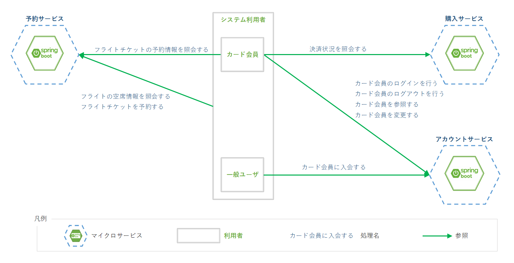
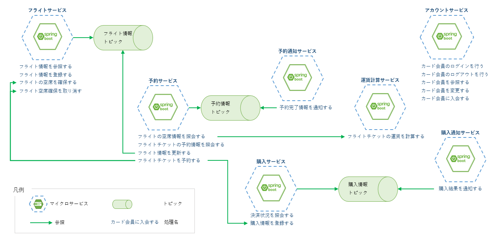

include::_include_all.adoc[]

[[sample_application]]
= サンプルアプリケーション

[[sample_application_overview]]
== Overview
本ガイドラインでは、マイクロサービスアーキテクチャとしての構成例や機能の実現例を示すためにサンプルアプリケーションを提供する。

サンプルアプリケーションはクラウドプラットフォーム上に展開したコンテナで稼働し、インターネット接続を介してクライアントにサービスを提供するWebアプリケーションである。
システム名は「航空チケット予約システム」とする。

[[sample_application_functional_requirement]]
=== 機能要件
サンプルアプリケーションの機能要件を下図に示す。

.サンプルアプリケーションの機能要件

. 予約サービス
.. フライトの空席情報を照会する
.. フライトチケットを予約する
.. フライトチケットの予約情報を照会する

. 購入サービス
.. 決済状況を照会する

. アカウントサービス
.. カード会員のログイン/ログアウトを行う
.. カード会員情報を参照する
.. カード会員情報を変更する
.. カード会員に入会する

[NOTE]
====
* 本ガイドラインでは、画面を含むクライアントアプリケーションは機能要件に含まない
* 航空チケット予約システムとしては、飛行機の運行情報管理といった機能も含まれると想定されるが、サンプル実装の提供を目的としているため、本節に上げた要件に絞って実装している
====

[[sample_application_service]]
=== サービス構成
ここではサンプルアプリケーションのサービス構成について記載する。

[NOTE]
====
<<01_introduction.adoc#introduction,はじめに>>で記載したとおり、本ガイドラインではマイクロサービスとしてのサービス分割・構成に関する設計については説明しない。
本節では各サービスの役割や分割の目的を簡単に記載しているが、あくまで参考情報として目を通すに留めること。
====

サンプルアプリケーションのサービス構成は下図のとおりである。

サンプルアプリケーションは7つのサービスで構成される。各サービスの概要を下記に記載する。

[cols="2,2,6a"]
.サービス概要
|===
| サービス名 | プロジェクト名 | サービス概要

| フライトサービス　| msa-flight | * フライト情報(ルートや機体の情報)を管理するサービス
* フライト情報は予約サービスで参照される情報だが、下記を考慮してサービスを分割した
** フライト計画の定期的な見直し、空港の閉鎖、新設といったマスタ情報の更新が想定される
** これらマスタ情報の保守を行いやすくするため、フライトサービスとして独立させる

| 予約サービス | msa-reserve | * フライトチケットの予約処理を担当するサービス
* フライト情報は分散メッセージキューを介してフライトサービスから取得し、予約サービスのDBに保存する

| 運賃計算サービス | msa-flight-ticket-fare-calculation | * 基本運賃、搭乗クラス、ピーク時期、割引を使用して運賃計算処理を行うサービス
* 運賃計算処理は予約処理の一部だが、割引や運賃計算ロジックは頻繁に変更されることが予想される
* 運賃計算処理の変更を容易にし、予約処理全体の保守性を高めるために運賃計算処理をサービスとして切り出した

| 予約通知サービス | msa-reserve-notice | * 利用者への予約通知を行うサービス
* 通知は予約処理の一部ではあるが、通知の障害が予約処理を妨げるといった事態を回避したい
* そのため、耐障害性を考慮して通知を分離し、非同期連携で行うこととした

| 購入サービス | msa-purchase  | * チケット購入状況を管理するサービス
* 支払方法の変更、追加への対応を容易にするため、購入処理をサービスとして独立させた

| 購入通知サービス | msa-purchase-notice | * 利用者への購入通知を行うサービス
* 予約完了時に支払期限の通知などを行う
* 予約通知サービスと同様の観点から独立したサービスとした

| アカウントサービス | msa-account | 会員情報の登録・参照・更新、ログイン・ログアウト処理、認可情報の管理を行うサービス。
|===

また、説明中に登場するマイクロサービス、Kubernetesの設定などを管理するプロジェクトについてもここに記載する。
本文中に例示されるファイルは上記のマイクロサービス実装プロジェクトと、下記の設定関連プロジェクトに含まれる。

[cols='3,7a']
|===
| プロジェクト名 | 概要

| msa-env | 環境変数などの設定、メトリクスなどの運用・分析関連プロダクト導入に関する設定を管理するプロジェクト。
| msa-jenkins | デプロイメントを自動化するためのスクリプトを管理するプロジェクト。 [red]#※#
|===

[red]#※# 本ガイドラインではCI/CDについて説明しないため本文中では触れないが、デプロイメントはJenkinsを使用して行っているためプロジェクト名にjenkensを含んでいる。

[[sample_application_environment]]
=== 実行環境
アプリケーションの開発に当たっては、ローカル開発環境、検証環境、本番環境などといった複数の環境が必要となる。

本ガイドラインはKubernetesを前提とした内容であるため、Namespaceによってアプリケーションの動作環境を作成している。

[cols='2,2,6']
.Kubernetes上にNamespaceで作成した開発環境
|===
| 環境名 | Namespace | 内容

| ローカル環境 | local | ローカル開発中に動作確認、テストを行うための開発環境。
| モック環境 | mock | ローカル開発中にテストを行うためのモックアプリケーションを動作させるための環境。
| 検証環境 | stag | アプリケーションの結合テスト、デプロイメントの設定確認などを行うための動作検証用環境。
| 本番環境 | prod | アプリケーションの本番リリース環境を想定し、デプロイメント設定などの検証に使用する環境。
|===

[[sample_application_architecture]]
=== 実現アーキテクチャ
本ガイドラインで扱うマイクロサービスアーキテクチャとしての要素は下記のとおりである。

サンプルアプリケーションの業務機能として実現されているものに関しては、実装箇所を合わせて掲載する。

Kubernetes上で実現されるものに関しては、該当の章に設定内容などが記載されているので、本文を参照すること。

[cols='2,8a']
|===
| アーキテクチャ名 | 本ガイドラインにおける概要

| Kubernetes | マイクロサービスを稼働させるプラットフォームとしてKubernetesを利用する。
| APIゲートウェイ | Kubernetesがサポートするプロダクト(Ingress)によって実現する。
| サービスディスカバリ | Kubernetesの機能を用いて実現する。各マイクロサービスのプロジェクトに設定ファイルを格納する。
| サーキットブレーカ |
サンプルアプリケーションでは、下記の同期連携処理にてResilience4jを使用してサーキットブレーカを仕掛けている。

* 予約サービスからフライトサービスへの空席情報照会・更新
* 予約サービスから運賃計算サービスへの運賃算出依頼
* 予約サービスから購入サービスへの購入情報登録

| アクセス制御 | Spring Security OAuth2を使用して認証・認可をアカウントサービスにて実現する。
| 設定の外部化 | Kubernetesの機能を用いて実現する。設定管理プロジェクトに各環境の設定ファイルを格納する。
| 同期連携 |
サンプルアプリケーションでは、下記の処理にてFeignを使用して同期連携を実現する。

* 予約サービスからフライトサービスへの空席情報照会・更新
* 予約サービスから運賃計算サービスへの運賃算出依頼
* 予約サービスから購入サービスへの購入情報登録

| ログ集中管理 | ログ集中管理における一般的な構成の1つであるEFK(Elasticsearch + Fluentd + Kibana)を用いて実現する。
| 分散トレーシング | 代表的なOSSであるJaegerを用いて実現する。
| ヘルスチェック | ヘルスチェックは下記の2要素を用いて実現する。

* Spring Boot Actuatorを用いて、各マイクロサービスにヘルスチェック用のエンドポイントを設定する
* Kubernetesの機能を用いてPodごとに稼働状況の監視を実現する

| デプロイメント | 本ガイドラインではデプロイメント手法としてBlue-Green Deploymentを用いて、マイクロサービスアーキテクチャとしてのデプロイを実現する。
|===
