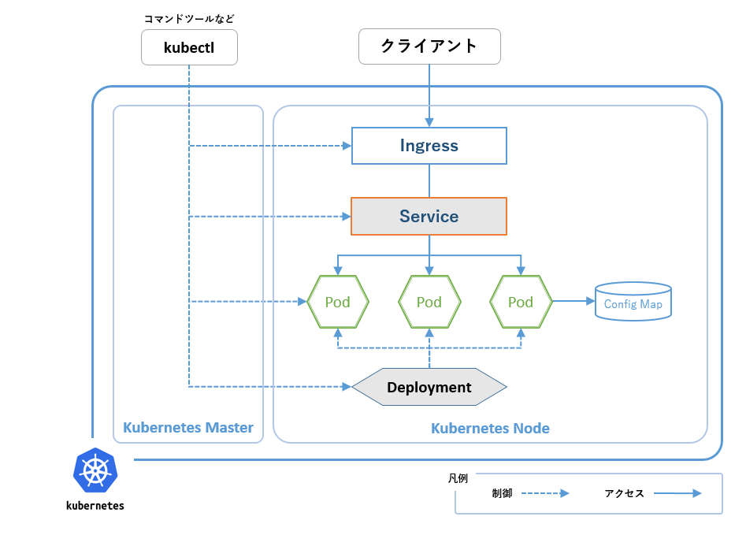
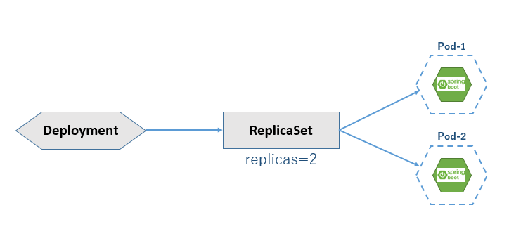
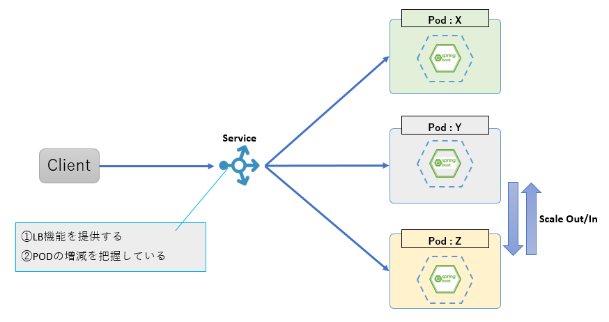
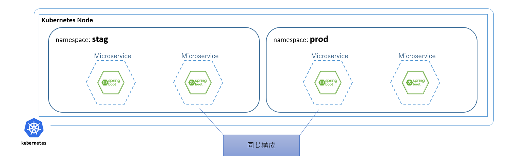
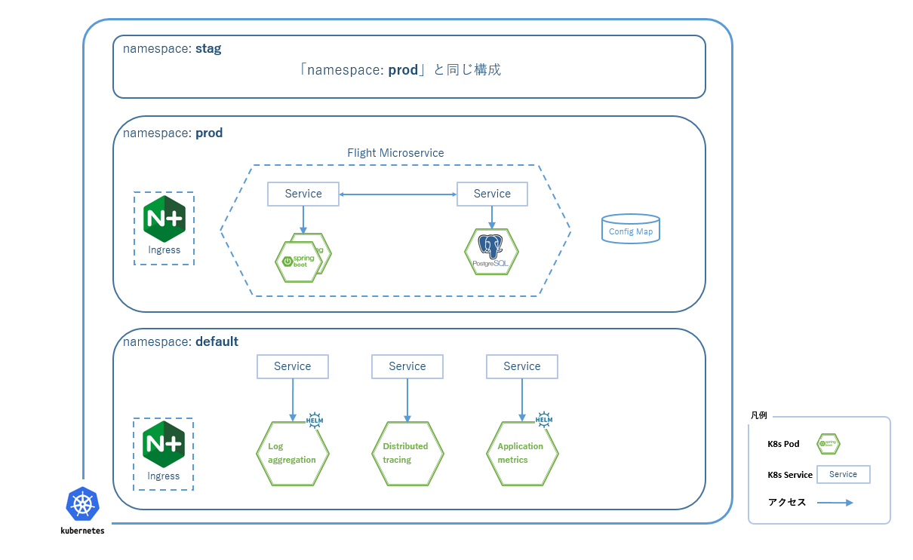

include::_include_all.adoc[]

[[kubernetes_section]]
= Kubernetes

[[kubernetes_overview]]

== Overview

KubernetesはGoogleのエンジニアによって開発および設計されたコンテナオーケストレーションシステムであり、現在はCloud Native Computing Foundationに移管されている。

コンテナはクラウド環境における基本技術の1つであり、他のプロセスから隔離されたセキュアなアプリケーション実行環境をOS上に提供する。

マイクロサービスはコンテナで実行されるよう設計・実装されることが多いが、マイクロサービスに代表されるコンテナアプリケーションが増えることにより、下記のようなコンテナの管理が煩雑、複雑になっていく。

- コンテナ間のネットワーキングやストレージ共有などの管理
- コンテナを始め、共有ストレージなどのリソースを設定、利用するための名前解決
- 日々更新されるコンテナアプリケーションのデプロイ
- スケールアウト/インといった各種運用
- 障害発生におけるコンテナの再起動

Kubernetesはこれらコンテナに対しての操作、管理を自動化、簡易化する。

また、KubernetesはDocker、CRI-Oなどいくつかのコンテナランタイムをサポートしており、本ガイドラインではデファクトスタンダードとなっているDockerを利用している。

KubernetesはAWS、GCPに代表される多数のパブリッククラウドプロバイダからマネージドサービスとして提供されており、コンテナオーケストレーションシステムとしてのデファクトスタンダードとなっている。

本章は、Kubernetesを触ったことがない方でもKubernetesの基本的なコンセプトを理解し、実際にサンプルアプリケーションの構築を実施する際の参考資料になることを目標としている。

[NOTE]
====
Kubernetesは k8s、kube と略記される場合もある。

本ガイドラインでも文脈により略称(k8s)を使用する。
====

=== 物理構成
Kuberbetesはそれぞれに役割をもつ物理サーバ、仮想サーバの集合(クラスタ)として構成される。

クラスタに含まれる物理サーバ、仮想サーバはノードと呼ばれ、Podなどの各種Kubernetesリソースにおける実行基盤となる。

Kubernetesクラスタは1つのKubernetes Masterと1つ以上のKubernetes Nodeで構成され、それぞれ下記の役割をもつ。

==== Kubernetes Master
マスターノードとも呼ばれる。 +
クラスタ全体を管理し、Kubernets Nodeを制御する。 +
コマンドツール(kubectl)の操作を受け付けるためのAPIなどもここに含まれる。 +
可用性を確保するため冗長構成をとられることが多い。

==== Kubernets Node
単にノードと呼ばれる場合はKubernets Nodeを指す。 +
各種コンテナアプリケーション(Pod)の実行を行う。

=== 論理構成

.Kubernetes概要イメージ

Kubernetesではデプロイされるアプリケーションや、アプリケーションを制御する方法、単純な設定ファイルまで、すべてオブジェクトとして定義される。
オブジェクトには様々なものが存在するが、本ガイドラインで利用しているオブジェクトを下記に説明する。

また、Kubernetesにはここであげる他にも様々な機能、オブジェクトが提供されている。
詳細はlink:https://kubernetes.io/ja/docs/home/[Kubernetesドキュメント]を参照すること。

==== Pod

Pod(ポッド)はKubernetesにおいて、アプリケーションのデプロイを行う最小単位である。コンテナはPodに含まれ、スケールアウト/インなどはPod単位で行われる。

ただし、Pod自身にデプロイやスケールに関する設定、機能は持たず、それらは次に説明するDeployment、ReplicaSetにて管理される。

[NOTE]
====
Podには複数のコンテナを含むことが可能である。

ただし、上記説明のようにデプロイ、スケールはPod単位に行われるため、通常はPodとコンテナは１：１とする。

アプリケーションによってはサイドカーパターンなどにより、緊密な連携を行う複数のコンテナ群を1つのアプリケーションとして取り扱いたい場合もあり、その場合はPod内にアプリケーションを構成する複数のコンテナを配置する。
====

==== Deployment

DeploymentはPodを制御するコントローラオブジェクトの1つである。

DeploymentはPodのデプロイに関する機能を提供するが、Podを直接管理せずReplicaSetを経由して管理する。

[NOTE]
====
Kubernetesにはオブジェクトを管理する各種のコントローラが用意されている。

DeploymentはPodを管理する代表的なコントローラの1つであり、他にStatefulSet、Jobなどがある。
====

==== ReplicaSet
ReplicaSetは指定された数の同じ仕様のPodが稼働することを保証する。

障害発生などによりPodの稼働数が指定数より減少した場合、自動的にPodを指定数まで作成する。

ReplicaSetは個別に定義、作成することも可能だが、通常はDeploymentにおける定義の一部として用意される。

.Deployment-ReplicaSet-Podのイメージ図

==== Service
ServiceはPodにアクセスするための接続情報を管理する。

ServiceとPodはラベル(Key/Value形式のタグ情報)により紐づけられており、Serviceで指定したラベルをもつPodが管理対象となる。

Podにはそれぞれに個別のIPアドレスが割り当てられ、ReplicaSetなどにより再作成されたPodにも都度新しいIPアドレスが割り当てられる。

この様にPodのIPアドレスはクラスタの稼働状況により動的に変化するので、サービス(Pod)を利用する際、**稼働しているサービス(Pod)
を見つける**事が難しくなる。

Serviceは動的に変化するPodを適切に管理し、Podにアクセスするための単一なIPアドレスを公開する。複数のPodが存在する場合にはロードバランサとしての役割も兼ね、サービスディスカバリとして機能する。

.Service-Podのイメージ図

==== Namespace

Namespaceは仮想的にKubernetesクラスタを分離する機能である。

本ガイドラインで参照しているサンプルアプリケーションでは、Namespaceを検証環境、本番環境といったアプリケーション実行環境として利用している。

.ネームスペースと実行環境のイメージ図

==== ConfigMap

ConfigMapはアプリケーションの各種設定情報をコンテナから外部化する。

ConfigMapの定義方法はファイル、環境変数の2種類が用意されている。

コンテナが起動される際、ファイルもしくは環境変数がConfigMapによりPod内に定義される。

[NOTE]
====
ユーザー名・パスワードなどの機密情報を設定する場合にはSecretを利用する。

SecretはConfigMapと同様の仕組みであるが、管理情報の暗号化など機密情報管理の為の機構が別途用意されている。
====

==== Ingress
IngressはHTTPやHTTPSによる外部からのアクセスを、クラスタ内で実行中のアプリケーションにルーティングする。

IngressはServiceへのルーティングやパス変換、ポート変換などを設定した定義情報と、定義情報を読み取り実際のルーティングを行うIngress Controllerで構成される。

Ingress Controllerにはいくつかの種類があり、よく使われるIngress ControllerとしてNginx-Ingressなどがある。

本ガイドラインでは、Ingressを<<05_api_gateaway.adoc#api_gateaway,APIゲートウェイ>>として利用している。

=== コマンドラインツール

==== kubectl

https://kubernetes.io/docs/reference/kubectl/overview/[kubectl]は、Kubernetesクラスタに対して各種操作を行うコマンドライン・ツールである。

kubectlは、通常、クラスタのマスターノードに対して操作を行う。そのため、クラスタとクラスタ内におけるすべてのノードに対して操作が可能となる。

==== helm

helmとはKubernetes用のパッケージマネージャである。

Kubernetes上で動作する各種アプリケーションの設定、導入を簡易的に行えるようにする。

Kubernetes上で動作するアプリケーションは、Kubernetesの様々なリソース(Deployment、Service、Ingress、Pod、ConfigMapなど)によって提供される。
各リソースはそれぞれに依存関係をもつため、デプロイの順序を考慮する必要もある。

helmは、そうした煩雑な設定、デプロイ作業をテンプレート化し、管理する仕組みとツールセットを提供する。

=== その他、本ガイドラインで利用している機能

==== ヘルスチェック
Kubernetesには死活監視(Liveness Probe)、状態監視(Readiness Probe)を行う機能が用意されている。

死活監視(Liveness Probe)::
Podが何らかの障害により応答不能状態となったり、Pod自体が停止した場合、Kubernetesにはこれを検知する機能が備わっている。
+
Podが継続稼働することが困難になった場合、障害のあるPodを停止し、新たなPodを作成することでサービスを継続する。(セルフヒーリング/オートヒーリング)

状態監視(Readiness Probe)::
Podに何らかの原因による遅延が発生したり、関連する他Podの障害により処理実施ができない状態にある場合、Kubernetesにはこれを検知する機能が備わっている。
+
Podが処理実施可能な状態にない場合、Serviceによる対象Podへのルーティングを処理実施可能な状態に復帰するまで一時停止し、不要なリクエストによるネットワークの輻輳を回避する。

[[application_example]]
== サンプルアプリケーション

.サンプルアプリケーションイメージ

[source, sh]
.サンプルアプリケーションにおけるKubernetesの代表的なデプロイ済みオブジェクト
----
$ kubectl get all -n prod
NAME                                                        READY   STATUS             RESTARTS   AGE # (1)
pod/account-7478867f5b-sf2mr                                1/1     Running               0       6d19h
pod/account-db-6d5c6bdb5f-48kg2                             1/1     Running               0       20d
pod/flight-6975c58977-25kns                                 1/1     Running               0       5d18h
pod/flight-db-784dfbdc94-k74rk                              1/1     Running               0       20d

# omitted

NAME                                  TYPE        CLUSTER-IP       EXTERNAL-IP   PORT(S)    AGE # (2)
service/account-db                    ClusterIP   10.100.3.33      <none>        5432/TCP   20d
service/account                       ClusterIP   10.100.3.112     <none>        80/TCP     6d19h
service/flight-db                     ClusterIP   10.100.166.225   <none>        5432/TCP   20d
service/flight                        ClusterIP   10.100.5.100     <none>        80/TCP     6d19h

# omitted

NAME                                                   READY   UP-TO-DATE   AVAILABLE   AGE # (3)
deployment.apps/account                                1/1     1            1           6d19h
deployment.apps/account-db                             1/1     1            1           20d
deployment.apps/flight                                 1/1     1            1           5d18h
deployment.apps/flight-db                              1/1     1            1           20d

# omitted

NAME                                                              DESIRED   CURRENT   READY   AGE # (4)
replicaset.apps/account-7478867f5b                                1         1         1       6d19h
replicaset.apps/account-db-6d5c6bdb5f                             1         1         1       20d
replicaset.apps/flight-6975c58977                                 1         1         1       5d18h
replicaset.apps/flight-db-6bfcb7c7d5                              1         1         1       20d

# omitted

----

[cols="1,9a"]
|====
| 項番 | 内容

| (1) | accountサービスとflightサービスのPodが確認できる。
| (2) | accountサービスとflightサービスのServiceが確認できる。
| (3) | accountサービスとflightサービスのDeploymentが確認できる。
| (4) | accountサービスとflightサービスのReplicaSetが確認できる。
|====

[source, sh]
.サンプルアプリケーションで使用しているIngress、ConfigMap、Namespaceなど、Kubernetesのオブジェクトについて
----

$ kubectl get namespace
NAME          STATUS   AGE
default       Active   29d
kube-public   Active   29d
kube-system   Active   29d
mock          Active   29d # (1)
prod          Active   29d # (1)
stag          Active   29d # (1)

$ kubectl get ingress -n prod
NAME               HOSTS                            ADDRESS         PORTS   AGE
ingress-actuator   prod.sampleapplication.xyz       52.68.xxx.xxx   80      20d # (2)
ingress-prod       prod.sampleapplication.xyz       52.68.xxx.xxx   80      20d # (2)

$ kubectl get configmap -n prod
NAME               DATA   AGE
m9amsa-configmap   20     20d # (3)

$ helm list
NAME        	REVISION	UPDATED                 	STATUS  	CHART                      	APP VERSION	NAMESPACE
m9a-e       	1       	Fri Oct 11 02:04:13 2019	DEPLOYED	elasticsearch-1.31.1       	6.8.2      	default #(4)
m9a-f       	1       	Mon Oct 28 08:11:26 2019	DEPLOYED	fluentd-elasticsearch-2.0.7	2.3.2      	default #(4)
m9a-k       	1       	Wed Oct 30 07:40:41 2019	DEPLOYED	kibana-3.2.3               	6.7.0      	default #(4)
graf        	1       	Fri Oct 18 09:53:12 2019	DEPLOYED	grafana-3.8.18             	6.3.5      	default #(4)
prom        	1       	Fri Nov  1 09:31:23 2019	DEPLOYED	prometheus-9.1.2           	2.11.1     	default #(4)
----

[cols="1,9a"]
|====
| 項番 | 内容

| (1) | Kubernetesのdefault、kube-public、kube-system以外に三つの業務用namespaceがある。
| (2) | ネームスペース：prod にingressの定義として、ingress-actuatorとingress-prod、二つの定義がデプロイされている。
| (3) | ネームスペース：prod にconfigmapとしてm9amsa-configmapがデプロイされている。
| (4) | helmでインストールしたログ収集サーバ(m9a-e、m9a-f、m9a-k)、メトリクスサーバ(graf、prom)がデプロイされている。
|====

[[kubernetes_reference]]

== Reference
* https://kubernetes.io/ja/docs/home/[Kubernetesドキュメント]
