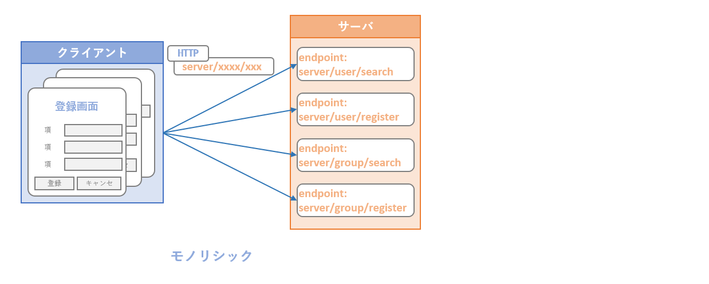
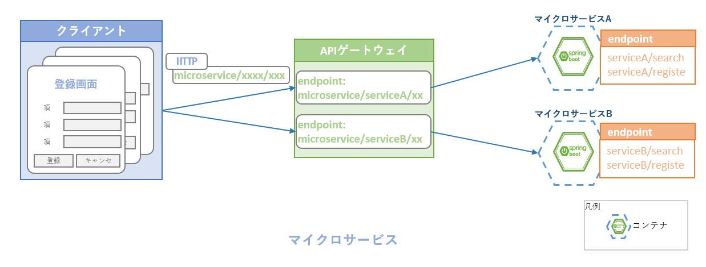
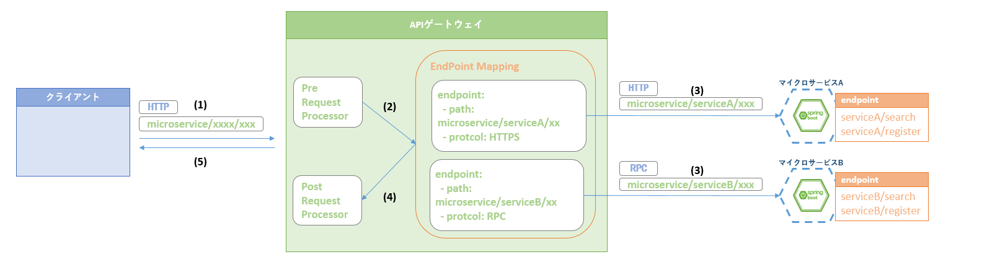
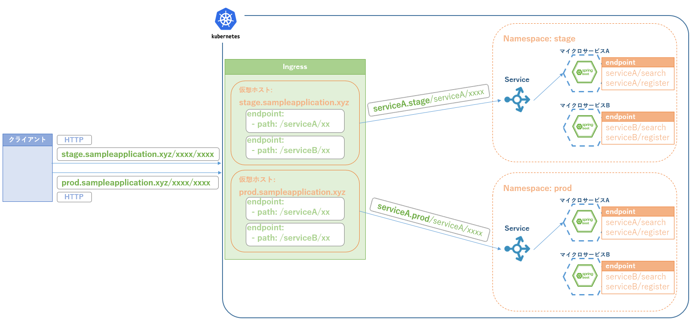
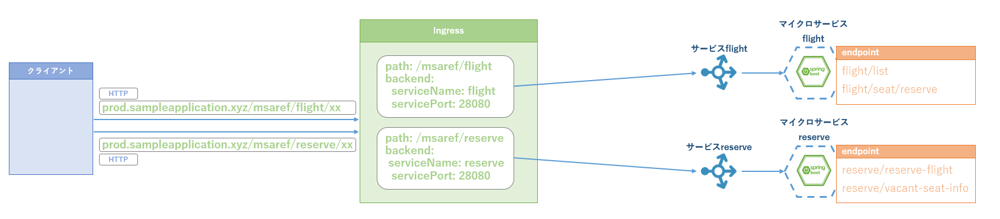
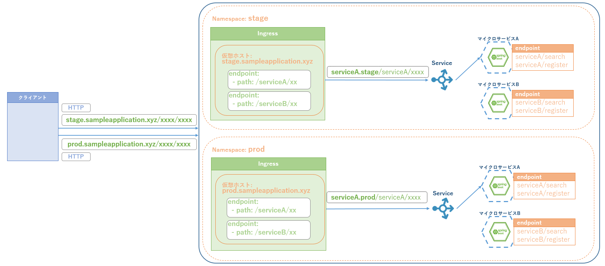

include::_include_all.adoc[]

[[api_gateaway]]
= APIゲートウェイ

[[api_gateaway_overview]]
== Overview
Webアプリケーションは、クライアントからのリクエストを受け付けるためのエンドポイントを設定し、公開する必要がある。
公開したエンドポイントで、指定したプロトコルによるリクエストを受け付け、処理結果を返却する。

モノリシックなアプリケーションでは処理を受け付けるサービスは基本的には1つであり、処理ごとにリクエスト先のサービスが異なるといったことはなかった。
したがって、リクエストの受付に際して、ロードバランシングなどを除けば特別な考慮は不要であった。

マイクロサービスアーキテクチャでは、役割に応じて分割された複数のマイクロサービスが個別の機能を担い、それぞれにエンドポイントを持ちリクエストを受け付ける。
これらを直接、外部に公開する場合、クライアントはマイクロサービスの構成とエンドポイントをすべて把握し、処理ごとにリクエスト先のサービスを設定しなければならない。
そのような複雑な設定をすべてのクライアントに要求することは現実的に難しい。

APIゲートウェイの主な役割はそうした複雑さを吸収し、バックエンド処理を行うサービス群のファサードとなることである。
APIゲートウェイはマイクロサービスのエンドポイントを集約し、アクセス方式を管理することで、単一のアプリケーションとしてのエンドポイントをクライアントに提供する。

APIゲートウェイで実現される機能として、他にリクエストの暗号化、認証・認可、アクセス制限、通信プロトコルの管理・変換などがあげられる。

=== 処理方式
上述のとおり、APIゲートウェイはエンドポイントを集約する役割をもつ。つまり、マイクロサービスアーキテクチャを採用するアプリケーション全体として、
外部に公開するエンドポイントがAPIゲートウェイに設定され、実際に処理を行うマイクロサービスとの紐づけがされることになる。

.APIゲートウェイを用いたリクエストフロー

[cols="1,9a"]
|===
| 項番 | 説明

| (1) | クライアントがAPIゲートウェイの公開するエンドポイントにリクエストを送信する。
| (2) | APIゲートウェイは前処理を実行してから、リクエストのルーティングを行う。前処理の例を下記に示す。

* 認証・認可
* ロギング(アクセスログなど)
* バリデーション(HTTPヘッダなど)

| (3) | APIゲートウェイは公開エンドポイントとマイクロサービスのマッピングを参照し、ルーティングを行う。 +
各マイクロサービスはそれぞれに通信プロトコルを選択できるため、ルーティングを行う際、必要に応じてHTTP => RCPなどの変換も行う。

| (4) | APIゲートウェイはマイクロサービスからのレスポンスを受けて後処理を行う。後処理の例を下記に示す。

* ロギング
* クライアントからの1リクエストに対して複数サービスへのリクエストが発生した場合のデータマッシュアップ

| (5) | APIゲートウェイは処理結果をクライアントに返却する。
|===

==== 主なOSSプロダクト
APIゲートウェイを実現するメジャーなOSSプロダクトがいくつかあるので、ここで簡単に紹介する。

Spring Cloud Gateway::
Spring MVCに則ってAPIゲートウェイを構築するためのフレームワークであり、パスベースのルーティング、アクセス制限、リトライ、サーキットブレーカなどAPIゲートウェイとしての機能を一とおり揃えている。 +
アプリケーション開発にSpringフレームワークを採用する場合には、実装を統一できるため選択しやすい。 +
また、Spring Bootアプリケーションとして動作するため、プラットフォームを選ばないという特徴もある。

Kong::
Cloud Nativeを前提としたAPIゲートウェイ。link:https://landscape.cncf.io/[CNCFのlandscape]に含まれており、採用事例が多い。 +
OSSとしても必要な機能を備えているが、有償のサポートを受けることで管理GUIやカスタマイズ性を高めたルーティング機能なども使用可能である。

Kubernetes Ingress::
簡易な設定でルーティングやパス変換などの機能を使用できるAPIゲートウェイ。Kubernetesが公式にサポートしており、導入が容易である。
下記に説明するIngress Controllerにはさまざまな実装(Nginx、Contour、HAProxy、等)があり、ニーズに合わせて選択することができる。

サンプルアプリケーションでは、認証・認可の機能などはAPIゲートウェイから分離させており、必要とするのはエンドポイント集約・ルーティングの機能となる。
そこで、導入・設定が容易であり、十分な機能を備えたKubernetes Ingress(Nginx Ingress)を採用している。

==== Kubernetes Ingress
IngressはKubernetesクラスタ外部からのHTTP/HTTPSリクエストに対し、Ingressに定義されたルールに基づいてクラスタ内部へのルーティングを行う。

クラスタ外部に公開するエンドポイントを設定し、ホスト名による仮想ホスティングを行うことができる。
サンプルアプリケーションでは、Kuberbetes上にNamespaceを利用して検証環境、本番環境を構築しており、ホスト名解決によってアクセスする環境を振り分ける設定をしている(Code exampleで説明する)

.Kubernetes Ingress概要

===== Ingress Controllerについて
Kubernetesにyamlファイルを用いて作成するIngressオブジェクトはルーティングなどの設定要素であり、これを定義してもAPIゲートウェイとして動作する実体が生成されるわけではない。
別途、APIゲートウェイとして動作するPodを用意する必要がある。

本ガイドラインの検証では、特別な設定を必要としないことからhelmを使用してNginx Ingressのインストールを行っている。

[source, sh]
.Ingress Controller導入手順
----
# クラスタ内で共有するためnamespaceにはkube-systemを指定
$ helm install --name ni --namespace kube-system stable/nginx-ingress

# インストールログが表示される

# Ingressのpodが作成され、正常に動作している
$ kubectl get po -n kube-system | grep -E '(NAME|nginx)'
NAME                                               READY   STATUS    RESTARTS   AGE
ni-nginx-ingress-controller-788fd6c4b9-scqpz       1/1     Running   0          37d
ni-nginx-ingress-default-backend-98d766665-fmgmd   1/1     Running   0          37d

# Ingressのserviceが作成される。EKSでは導入時に公開用のホスト名が設定される。
$ kubectl get svc -n kube-system | grep -E '(NAME|nginx)'
NAME                               TYPE           CLUSTER-IP       EXTERNAL-IP                                                         PORT(S)                      AGE
ni-nginx-ingress-controller        LoadBalancer   10.100.72.241    xxx123.ap-northeast-1.elb.amazonaws.com   80:32009/TCP,443:31155/TCP   37d
ni-nginx-ingress-default-backend   ClusterIP      10.100.64.133    <none>                                                              80/TCP                       37d
----

[[api_gateaway_code_example]]
== Code example

Ingressは定義されたルールに従って、クライアントからの要求リクエストを下図のように変換し、クラスタ内部へのルーティングを行う。

.クラスタ内部へのルーティング

また、サンプルアプリケーションでは、Namespaceによる環境管理を行っており、今回はドメイン名(ホスト名)で各Namespaceへのルーティングを行う設定をIngressに行っている。

.クラスタ内部へのルーティング(Namespace単位)

=== Ingress設定ファイルの説明

[source, yaml]
.ingress_prod.yml
----
apiVersion: extensions/v1beta1
kind: Ingress
metadata:
  name: ingress-prod
  namespace: prod # (1)
  annotations:
    kubernetes.io/ingress.class: nginx
spec:
  rules:
  - host: prod.sampleapplication.xyz # (2)
    http:
      paths:
      - path: /msaref/flight # (3)
        backend:
          serviceName: flight # (4)
          servicePort: 80 # (4)
      - path: /msaref/airplane
        backend:
          serviceName: flight
          servicePort: 80
      - path: /msaref/airport
        backend:
          serviceName: flight
          servicePort: 80
      - path: /msaref/basic-fare
        backend:
          serviceName: flight
          servicePort: 80
      - path: /msaref/reserve
        backend:
          serviceName: reserve
          servicePort: 80
      - path: /msaref/account
        backend:
          serviceName: account
          servicePort: 80
      - path: /msaref/purchase
        backend:
          serviceName: purchase
          servicePort: 80
      - path: /msaref/flight-ticket-fare
        backend:
          serviceName: flight-ticket-fare-calculation
          servicePort: 80
      - path: /msaref/reserve-notice
        backend:
          serviceName: reserve-notice
          servicePort: 80
      - path: /msaref/purchase-notice
        backend:
          serviceName: purchase-notice
          servicePort: 80
----

[cols="1,10"]
|===
| 項番 | 説明

| (1) | namespaceを指定する。本ガイドラインでは、環境をnamespaceで分けているので、namespaceごとにIngressの設定を行う必要がある。
| (2) | サーバの外部公開するドメインを設定する。ドメインhttp://prod.sampleapplication.xyzで受け付けられたリクエストは(1)で指定されたnamespaceのprodにルーティングする。
| (3) | マイクロサービスごとに、要求リクエストURLを設定する。受け付けるURLはhttp://prod.sampleapplication.xyz/msaref/flight/xxになる。
| (4) | マイクロサービスごとに、リダイレクトのサービス名とサービスポートを設定する。リダイレクトURLはhttp://flight:80/xxになる。
|===

[[api_gateaway_reference]]
== Reference

* https://microservices.io/patterns/apigateway.html[API Gateway]
  - Microservice IOによるAPIゲートウェイパターンの説明

* https://kubernetes.io/docs/concepts/services-networking/ingress[Kubernetes Ingress]
  - Kubernetesの公式ドキュメント

* https://spring.io/projects/spring-cloud-gateway[Spring Cloud Gateway]
  - Springの公式ドキュメント

* https://konghq.com/kong[Kong]
  - Kong Gatewayの公式ページ
