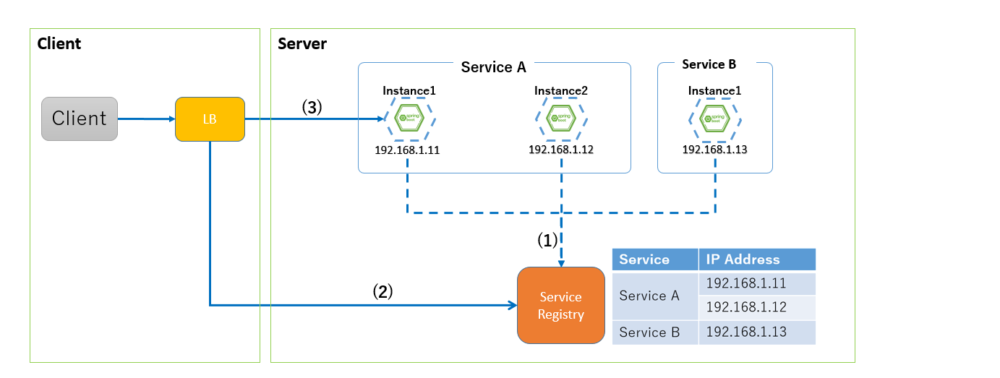
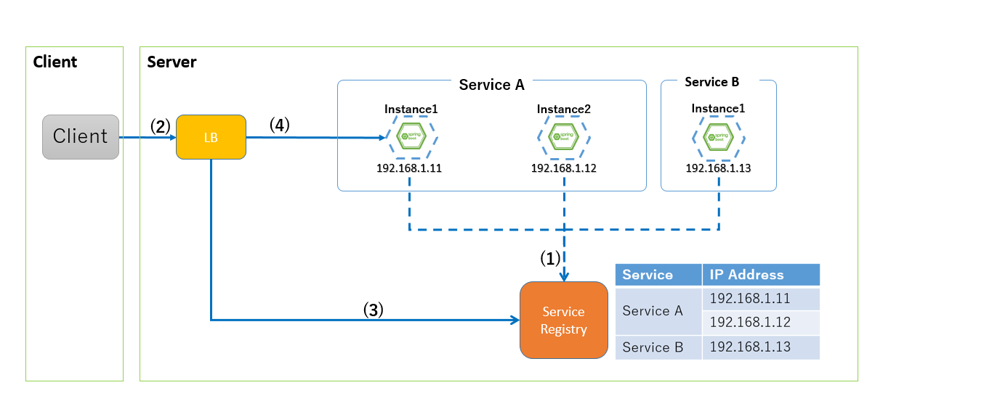
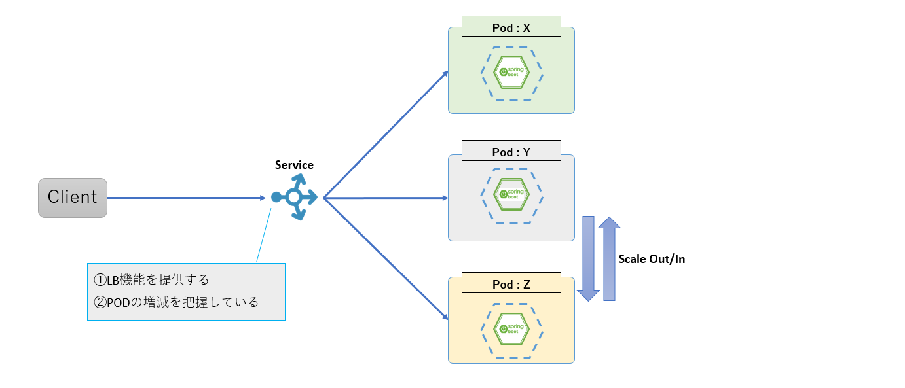
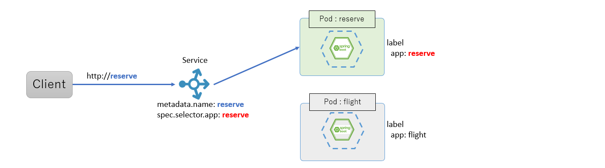
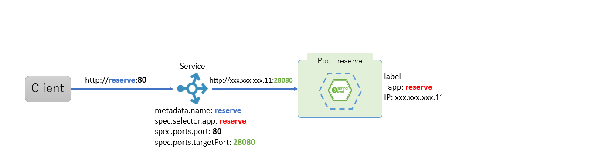
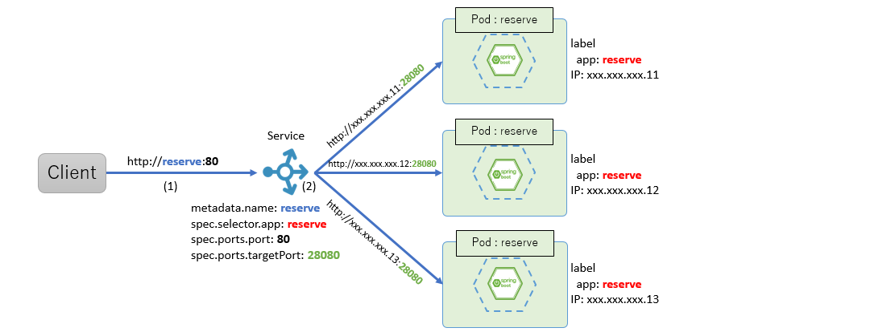

include::_include_all.adoc[]

[[service_discovery]]
= サービスディスカバリ

[[service_discovery_overview]]
== Overview
マイクロサービスアーキテクチャでは、オートスケール、オートヒーリングなどの操作により動的に接続先が増減するため、サービス名から動的に変化する物理的な接続先(IPアドレス/ポート)を解決する仕組みが必要となる。さらに、動的に増減するサービスインスタンスに対し、適切にロードバランシングする仕組みも併せて必要となる。

また、モノリシックなアプリケーションの場合は、接続先が動的に変化することはないため、単一のロードバランサなどを配置することで、複数の接続先に対応できた。したがって、マイクロサービスアーキテクチャでは、動的に増減するサービスに対して適切に接続するため、稼働中のサービスと接続先情報を管理する仕組みが必要となる。

image:../images/06_service_discovery/overview.png[width="800"]

サービスディスカバリは、動的に増減するサービスの接続先を管理し、適切に接続を分散する仕組みを提供する。サービスディスカバリの仕組みを利用することで、接続元は接続先サービス名を知っているだけでよく、サービスインスタンス数の増減といった接続情報の動的な変更にも柔軟に対応することが可能となる。

=== 処理方式

サービスディスカバリはサービスレジストリとロードバランシングにより実現される。

サービスレジストリ::
サービスレジストリはシステムを構成する各サービスの名前とサービスインスタンスごとの接続情報を紐づけて管理する。
+
サービスインスタンス起動時に各サービスインスタンスの接続情報をサービスレジストリに追加し、サービスインスタンス停止時に削除する。
ロードバランシング::
ロードバランシングは接続先のサービスへの処理を振り分けることで負荷を分散させる。
+
サービスディスカバリでは接続先のサービス名を元にサービスレジストリへ問い合わせ、取得したIPアドレスなどの接続情報に基きロードバランシングを行いサービスへの接続を行う。

サービスディスカバリの処理方式として、クライアントサイドで実現する方式とサーバサイドで実現する方式の2つがあげられる

==== クライアントサイドサービスディスカバリ
クライアントでは、サービスレジストリから接続情報の取得を行い、直接接続先サービスに接続する。 +
代表的なプロダクトとしてはRibbonとEurekaを使った方法が挙げられる。

[cols="1,9"]
.クライアントサイドサービスディスカバリ
|===
| 項番 | 説明

| (1) | 各サービスインスタンスの接続情報をサービスレジストリに登録し、サービスレジストリは各サービスインスタンスの接続情報を保持する。
| (2) | 他サービスの接続情報をサービスレジストリに問い合わせ、その結果をキャッシュする。
| (3) | サービスレジストリから取得した接続情報を利用し、利用可能なサービスインスタンスにロードバランシングを行い接続する。
|===

==== サーバサイドサービスディスカバリ
クライアントはロードバランサに接続し、ロードバランサにてサービスレジストリから接続情報の取得を行い、接続先サービスへの接続を行う。 +
代表的なプロダクトとしてはKubernetesのServiceオブジェクトが挙げられる。

[cols="1,9"]
.サーバサイドサービスディスカバリ
|===
| 項番 | 説明

| (1) | 各サービスインスタンスの接続情報をサービスレジストリに登録し、サービスレジストリは各サービスインスタンスの接続情報を保持する。
| (2) | 他サービスへの接続をロードバランサに要求する。
| (3) | ロードバランサは、サービスの接続情報をサービスレジストリに問い合わせし、その結果をキャッシュする。
| (4) | ロードバランサは、サービスレジストリから取得した接続情報を利用し、利用可能なサービスインスタンスにロードバランシングを行い接続する。
|===

=== Kubernetes機能との関連
KubernetesのServiceオブジェクトは、動的に変化するPodを適切に管理し、Podにアクセスするための単一なIPアドレスを公開する。複数のPodが存在する場合にはロードバランサとしての役割も兼ね、サーバサイドサービスディスカバリとして機能する。

本ガイドラインでは、KubernetesのServiceオブジェクトを利用し、名前解決を行う。

KubernetesにてServiceを利用し名前解決を行う際には、サービス名でServiceへ接続を行い、Serviceより各Podに接続を振り分ける。

[[service_discovery_code_example]]
== Code example
KubernetesのServiceを用いた名前解決における設定について記載する。

=== サンプルコード一覧
Code exampleでは下記のファイルを使用する。

[cols="4,6a"]
.msa-reserve(予約サービス)
|===
| ファイル名 | 内容

| service.yml | マニフェストファイル。
| deployment.yml | マニフェストファイル。
|===

=== 接続先情報の設定

KubernetesのServiceを利用しサービスディスカバリを実現する方法を説明する。

[source, yaml]
.msa-reserve: manifest/service.yml
----
apiVersion: v1
kind: Service
metadata:
  name: reserve # (1)
  labels:
    role: ${TARGET_ROLE}
spec:
  type: ClusterIP # (4)
  selector:
    app: reserve # (2)
    role: ${TARGET_ROLE}
  ports:
  - port: 80 # (3)
    targetPort: 28080 # (3)
----

[source, yaml]
.msa-reserve: manifest/deployment.yml
----
apiVersion: apps/v1
kind: Deployment
metadata:
  name: reserve-${TARGET_ROLE}
  labels:
    app: reserve # (2)
    role: ${TARGET_ROLE}
  annotations:
    prometheus.io/scrape: 'true'
    prometheus.io/path: '/actuator/prometheus'
spec:
  replicas: 1
  selector:
    matchLabels:
      app: reserve
  template:
    metadata:
      labels:
        app: reserve
        role: ${TARGET_ROLE}
    spec:
      containers:
      - name: reserve
        image: ${TARGET_IMAGE}
        imagePullPolicy: IfNotPresent
        ports:
        - containerPort: 28080 # (3)
        envFrom:
        - configMapRef:
            name: m9amsa-configmap
        livenessProbe:
          httpGet:
            path: /actuator/health
            port: 28080
          initialDelaySeconds: 25
          periodSeconds: 10
        readinessProbe:
          httpGet:
            path: /actuator/ready
            port: 28080
          initialDelaySeconds: 25
          periodSeconds: 10
----

サービス名とPodとの紐づけ::
+
[cols="1,10"]
|===
| 項番 | 説明
| (1) | metadata.nameに指定したサービス名がKubernetesネットワーク内でのホスト名となる。
この名前はサービスディスカバリとしてのサービス名となっており、サービス名でアクセスすることによりPodへの紐づけを行う。
| (2) | spec.selector.appはdeployment.yml(Deployment)のmetadata.labels.appと対応することで、app:reserveのラベルがついたPodへの紐づけを行う。
|===
+

接続ポート変換::
+
[cols="1,10"]
|===
| 項番 | 説明
| (3) | spec.ports.portにサービスとしての受付ポート(80)を指定する。spec.ports.targetPortにPodへの接続ポート(28080)を設定する。これで、app:reserveのラベルをついたPodを接続先として、Serviceの80番ポートから接続先Podの28080番ポートへのマッピングを行う。
|===
+

ロードバランサの設定::
+
[cols="1,10"]
|===
| 項番 | 説明
| (4) | spec.typeにServiceでのロードバランサ種類を指定する。本ガイドラインではClusterIPに指定する。
|===
+
[NOTE]
====
Serviceでのロードバランサは四つの種類がある。

ClusterIP::
クラスタ内のIPアドレスでServiceを作成する。このServiceはクラスタ内部からのみアクセス可能になる。

NodePort::
各ノードのIPアドレスにて、静的なポート(NodePort)上でServiceを作成する。そのNodePort のServiceが転送する先のClusterIP Serviceが自動的に作成される。<NodeIP>:<NodePort>にアクセスすることで、外部からNodePort Serviceにアクセスできる。

LoadBalancer::
クラウドプロバイダがサポートする外部のロードバランサを使用して、Serviceを外部に公開する。外部ロードバランサが転送する先のNodePortとClusterIP Serviceは自動的に作成される。

ExternalName::
クラスタのDNS Serviceが返したCNAMEレコードで、ServiceがexternalNameフィールドに指定したコンテンツにマッピングする。このタイプを使用するのはCoreDNSのバージョン1.7以上が必要となる。

詳細は下記のドキュメントを参照すること。 +
https://kubernetes.io/docs/concepts/services-networking/service/#publishing-services-service-types[Publishing Services (ServiceTypes)]

====

=== サービスディスカバリとしての連携動作を説明

[cols="1,10"]
|===
| 項番 | 説明
| (1) | クライアントからサービス名を指定したアクセス (http://reserve) を行う。
| (2) | サービスオブジェクトが指定された定義(app:reserve, port:80, targetPort:28080)に従って、Pod(app:reserve, containerPort:28080)に接続し、ロードバランサの設定に従い適宜ロードバランシングされる。
|===

[[service_discovery_reference]]
== Reference
* https://microservices.io/microservices/news/2015/03/01/service-discovery-patterns.html[service discovery patterns]
** サービスディスカバリ パターン一覧 – Microservice Architecture

* https://microservices.io/patterns/server-side-discovery.html[server side discovery]
** サーバサイドサービスディスカバリ – Microservice Architecture

* https://microservices.io/patterns/client-side-discovery.html[client side discovery]
** クライアントサイドサービスディスカバリ – Microservice Architecture

* https://kubernetes.io/docs/concepts/services-networking/service/#publishing-services-service-types[Publishing Services (ServiceTypes)]
** Kubernetes Serviceの公式ドキュメント

== Appendix
名前解決の手段として解決策はいくつか考えられる。ここでは、その1つにEurekaとRibbonを用いた方法が挙げられる。

* Eurekaはサービスの接続情報を集中管理するサーバとして機能し、サービスレジストリを実現するEureka Serverと、 Eureka Serverのクライアントとして、サービス情報のEureka Serverへの登録や、サーバリストの取得を行うEureka Clientsで構成される。

* RibbonはEureka Serverから取得したサーバリストを利用し、設定された情報に基くロードバランシングを実現する。Ribbonは単体での動作も可能だが、Eurekaと連携させて利用する場合、おおよその設定をデフォルトのまま利用することができる。

Eurekaは各サービスの論理名とホスト名、ポートを紐付けて管理している。また、RibbonはEurekaから取得した接続情報を利用し、ロードバランシングを行っている。そのため、EurekaとRibbonを組み合わせることで、クライアントサイドサービスディスカバリとして、名前解決ができる。
