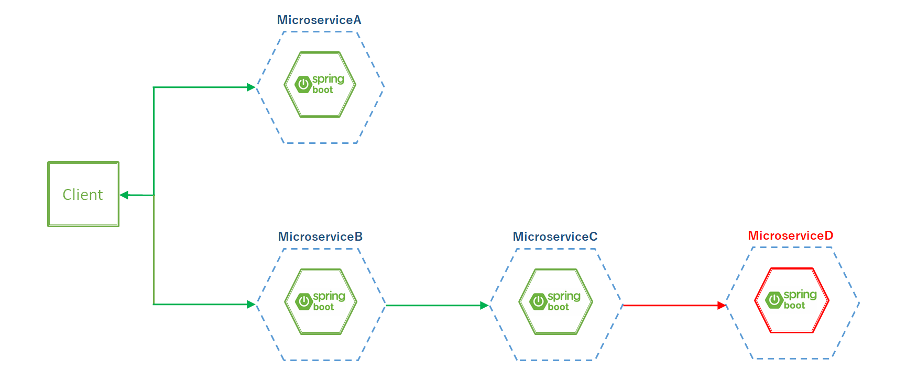
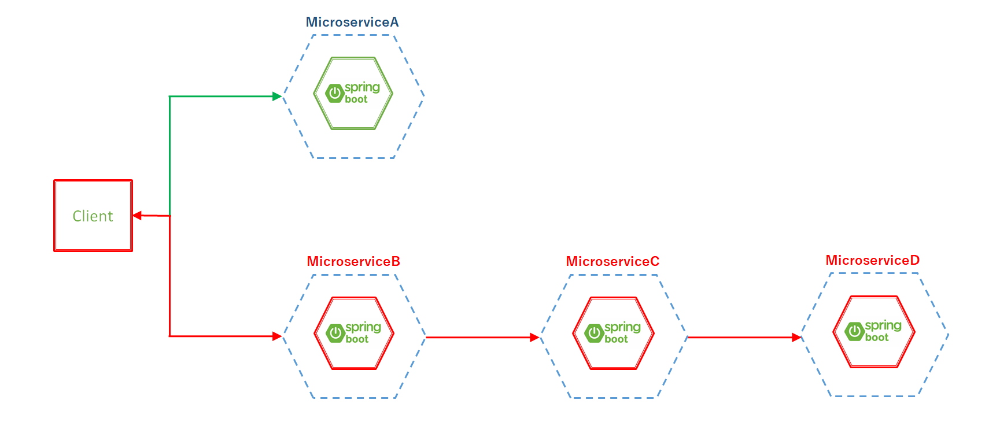
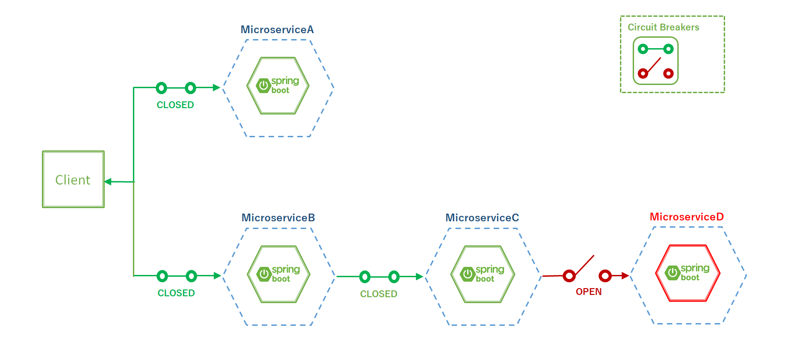
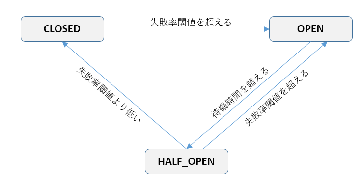
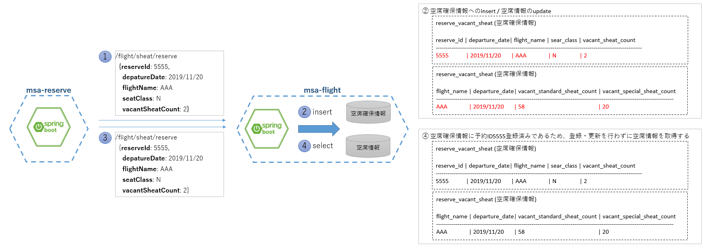

include::_include_all.adoc[]

[[circuit_breaker]]
= サーキットブレーカ

[[circuit_breaker_overview]]
== Overview

この章ではマイクロサービスにおけるサーキットブレーカについて説明する。

マイクロサービス間の同期連携時、連携先のマイクロサービスへはリクエスト/レスポンス形式で通信を行う。 +
その際、通信先のマイクロサービスが利用不可状態、応答遅延状態にある場合、通信元サービスのスレッドやメモリといった有用なリソースが待機状態のまま消費されてしまう。 +
そのような状態では、通信元サービス自体も応答不可状態となり、通信先に発生した障害が通信元サービスへ伝搬している状態となる。
この様に、あるマイクロサービスに発生した障害が他のマイクロサービスへ伝搬し、それがシステムの広範囲に及んでしまうと、システム全体が正常に応答できない状態になりかねない。 +

下図は同期連携によるマイクロサービスの関連を表している。
MicroserviceBは同期連携によりMicroserviceCを経由しMicroserviceDへアクセスする。

[[circuit_breaker_image1]]

MicroserviceDに障害が発生した場合、継続的にクライアントからのリクエストが発生し続けると、処理がMicroserviceCに滞留してしまう。
処理の滞留により、MicroserviceCはリソース枯渇による処理遅延の発生や、サービスダウンといった障害が発生する。 +
MicroserviceCの障害によりMicroserviceBも同様の障害が発生し、MicroserviceDで発生した障害が上流のサービスへ徐々に伝搬していく。

結果として下図のように、一部のサービスに発生した障害が上流サービスへ伝搬し、システムの広範囲にわたり応答ができなくなってしまう。
[[circuit_breaker_image2]]

マイクロサービスの同期連携において、このような障害の伝搬を防ぐ仕組みとしてサーキットブレーカの導入が必要となる。

サーキットブレーカとは日本語で遮断器の意味となるが、遮断器が電力回路・電力機器において事故発生時に事故電流が上流への波及を防止する閉塞器として機能するように、
あるマイクロサービスで発生した障害が上流へ波及することを防止する仕組みをサーキットブレーカという。

たとえば、MicroserviceDに障害が発生した場合、MicroserviceCとMicroserviceDの間にあるサーキットブレーカがOPEN状態となり、MicroserviceCからMicroserviceDへの同期連携が制限され、
MicroserviceCへ障害が伝搬することを防ぐ。MicroserviceDの障害が解消されると、サーキットブレーカはCLOSED状態に戻り、システムが正常状態に復帰する。
[[circuit_breaker_image3]]

さらにサーキットブレーカにはフォールバック処理(代替処理)を組み合わせる場合もある。 +
サーキットブレーカではサービスの障害を検知した際、対象サービスへのアクセスを遮断するが、
アクセス遮断時の挙動として単にエラーとして処理を中断させるのではなく、フォールバック処理(代替処理)を実施することにより処理を継続実行させるようにする。
システムの一部に障害が発生しても、リクエストに対して極力エラーを返却せず正常応答を行うよう設計することで、システムの可用性を高めることが可能となる。

=== 処理方式
サーキットブレーカは直近に発生した障害の数を監視し、その情報に基づいて操作を続行するか、すぐに例外を返すかを決定する。 +
また、サーキットブレーカはCLOSED、OPEN、HALF_OPENという3つの状態を管理する。

CLOSED:: 正常状態ですべてのアクセスを遮断しない。 +
HALF_OPEN状態で一定以上の処理が成功した場合にはCLOSED状態となる。
OPEN:: 遮断状態ですべてのアクセスを遮断する。 +
CLOSED状態、HALF_OPEN状態で一定以上の処理が失敗した場合にはOPEN状態となる。
HALF_OPEN:: この状態でアクセスが行われた場合、状態が正常化されたかどうかの試行として扱われる。 +
一定回数の成功でCLOSE状態へ移行し、処理が失敗した場合はOPEN状態となる。 +
OPEN状態で一定時間経過すると、HALF_OPEN状態となる。

サーキットブレーカの状態遷移図
[[circuitBreaker_state_machine_image]]

本ガイドラインでは、Spring Bootアプリケーションと組み合わせて利用することができるResilience4jを用いてサーキットブレーカを実現している。

Resilience4jとは、Netflix Hystrixにヒントを得た軽量で使いやすいフォールトトレランスライブラリであり、Java8以降および関数型プログラミング向けに設計されている。 +

なお、Resilience4jでは必要に応じてリトライ、キャッシュなどの機能を追加することができる。
その他の機能に関しては https://resilience4j.readme.io/docs#section-modularization[Resilience4jのドキュメント]を参照すること。

[[circuit_breaker_code_example]]
== Code example
サンプルアプリケーションでは、同期通信時、サーキットブレーカ(Resilience4j-CircuitBreaker)に加え、リトライ(Resilience4j-Retry)の設定も行っている。

下記2つの同期連携を例にサーキットブレーカ、リトライを説明する。

. 予約サービスからフライトサービスへ空席確保処理を依頼する同期連携
  - サーキットブレーカ、リトライの設定、実装について
. 予約通知サービスからフライトサービスへ空港名取得処理を依頼する同期連携
  - サーキットブレーカに関連して、フォールバック処理の設定、実装について

また、リトライ処理について特に注意すべき点としてべき等性の確保を説明するため、フライトサービスの空席確保処理を例示する。

=== サンプルコード一覧
Code exampleでは下記のファイルを使用する。

[cols="4,6"]
.msa-reserve(予約サービス)
|===
| ファイル名 | 内容

| pom.xml | 依存ライブラリの追加。
| FlightExternalMicroService.java | フライトサービスへの同期連携を行うFeignクライアント。
| FeignClientExceptionPredicate.java | 同期連携の例外処理を行うクラス。
| application.yml | Resilience4jの設定を記述する設定ファイル。
|===

[cols="4,6"]
.msa-flight(フライトサービス)
|===
| ファイル名 | 内容

| ReserveVacantSeatService.java | 空席確保処理を行うサービス。
|===

[cols="4,6"]
.msa-reserve-notice(予約通知サービス)
|===
| ファイル名 | 内容

| pom.xml | 依存ライブラリの追加。
| FlightExternalMicroService.java | フライトサービスへの同期連携を行うFeignクライアント。
| FlightExternalMicroServiceWithFallBack.java | フォールバック処理を行うためのFlightExternalMicroService実装クラス。
| application.yml | Resilience4jの設定を記述する設定ファイル。
|===

=== 依存ライブラリの追加
Resilience4jのサーキットブレーカ(CircuitBreaker)とリトライ(Retry)を使用するにあたっては下記の依存を追加する必要がある。

サーキットブレーカ、リトライの実装、設定を行うmsa-reserve(予約サービス)、msa-reserve-notice(予約通知サービス)が依存追加の対象となる。

[source, xml]
.pom.xml
----
<dependency>
    <groupId>io.github.resilience4j</groupId>
    <artifactId>resilience4j-spring-boot2</artifactId> <!-- (1) -->
    <version>1.0.0</version>
</dependency>
<dependency>
    <groupId>org.springframework.boot</groupId>
    <artifactId>spring-boot-starter-actuator</artifactId> <!-- (2) -->
</dependency>
<dependency>
    <groupId>org.springframework.boot</groupId>
    <artifactId>spring-boot-starter-aop</artifactId> <!-- (2) -->
</dependency>
----

[cols="1,10a"]
|===
| 項番 | 説明

| (1)
| Resilience4jが提供するライブラリの中から、Spring Boot向けのスタータを追加する。 +
これによって、Resilience4jのアノテーションやAOPが有効となる。

| (2)
| resilience4j-spring-boot2は、spring-boot-starter-actuatorとspring-boot-starter-aopの依存追加を前提としているため、
これらも併せて追加する必要がある。
|===

=== 空席確保処理を例としたサーキットブレーカ、リトライの設定・実装
予約サービス、フライトサービスを例にサーキットブレーカ、リトライの設定、実装を説明する。

==== サーキットブレーカ、リトライの定義
Resilience4jの設定をapplication.ymlに対して行う。

===== サーキットブレーカの定義
サーキットブレーカの定義例を下記に示す。

個々の同期連携処理に対してサーキットブレーカを適用するための定義名や、サーキットブレーカの動作に関する設定を記述する。

[source,yaml]
.msa-reserve: src/main/resources/application.yml
----
  resilience4j:
    circuitbreaker:
      configs:
        default: ## (1)
          sliding-window-size: 5 ## (2)
          permitted-number-of-calls-in-half-open-state: 3 ## (3)
          wait-duration-in-open-state: 60000 ## (4)
          failure-rate-threshold: 50 ## (5)
          automatic-transition-from-open-to-half-open-enabled: true ## (6)
          record-failure-predicate: com.example.m9amsa.reserve.circuitbreaker.FeignClientExceptionPredicate ## (7)
          register-health-indicator: true ## (8)
      instances:
        calculateFareCircuitBreaker: ## (9)
          baseConfig: default ## (10)
        flightCircuitBreaker:
          baseConfig: default
        purchaseCircuitBreaker:
          baseConfig: default
        calculateFareCircuitBreakerForHealth:
          baseConfig: default
          sliding-window-size: 1 ## (11)
          permitted-number-of-calls-in-half-open-state: 1
          wait-duration-in-open-state: 3000

          # omitted
----

[cols="1,10a"]
|===
| 項番 | 説明

| (1)
| configs下記に、instancesの定義から参照可能な共通定義を設定することができる。 +
デフォルト設定として `default` という設定名の定義を行っている。

| (2)
| CLOSED状態で実行したリクエストの結果を保持するためにsliding windowという仕組みを用意している。 +
ここで定義するのはsliding windowが保持できるリクエスト結果の件数である。

| (3)
| HALF_OPEN状態でリクエストを実行できる回数を設定する。 +
3回以内に成功しない場合、OPEN状態に移行するという設定を行っている。

| (4)
| OPEN状態からHALF_OPEN状態に移行するまでの待機時間(ms)を設定する。

| (5)
| 失敗率の閾値を設定する。 +
sliding windowに保持したリクエスト結果の失敗率がこの閾値以上となった場合にOPEN状態に移行する。

| (6)
| OPEN状態からHALF_OPEN状態への移行を自動で行うか否かを設定する。 +
ここではtrueを設定して有効としている。

| (7)
| ここに指定したPredicate実装クラスに対して失敗(例外発生)の判定を行う。 +
FeignClientExceptionPredicateに関しては別途、説明する。

| (8)
| サーキットブレーカのヘルスチェックの有効/無効を設定する。 +
trueを設定することで、Spring Boot Actuatorのヘルスチェック結果にサーキットブレーカの状態が追加される。

| (9)
| 個別の同期処理にサーキットブレーカを適用するための設定名を定義している。 +
ここで定義した名前を使用して、実装クラスの設定を行う。これについては下記に説明する。

| (10)
| 共通定義の指定を行う。

| (11)
| ここでは、共通定義を指定した上で、独自の設定が必要なパラメータの定義を行っている。
|===

===== リトライの定義
リトライの定義例を下記に示す。

個々の同期連携処理に対してリトライ処理を適用するための定義名や、リトライの動作に関する設定を記述する。

[source,yaml]
.msa-reserve: src/main/resources/application.yml
----
  resilience4j:
    circuitbreaker:

      # omitted

    retry:
      configs:
        default: # (1)
          max-retry-attempts: 3 # (2)
          wait-duration: 500ms # (3)
          enable-exponential-backoff: true # (4)
          exponential-backoff-multiplier: 2 # (5)
          retry-exception-predicate: com.example.m9amsa.reserve.circuitbreaker.FeignClientExceptionPredicate # (6)
      instances:
        calculateFareRetry: # (7)
          base-config: default # (8)
        flightRetry:
          base-config: default
        purchaseRetry:
          base-config: default

          # omitted
----

[cols="1,10a"]
|===
| 項番 | 説明

| (1)
| configs下記に、instancesの定義から参照可能な共通定義を設定することができる。 +
デフォルト設定として `default` という設定名の定義を行っている。

| (2)
| リトライの最大試行回数を設定する。 +
最大試行回数までのリトライを1セットとして、サーキットブレーカの1回分をカウントする。

| (3)
| 再試行までの待機時間(ms)を設定する。

| (4)
| リトライ間隔を指数関数的に増大させるための設定。 +
連携先サービスが一時的に応答できなくなっている状況を想定し、復帰を待つために試行ごとにリトライ感覚を延ばしている。

| (5)
| (4)の設定に関連して、リトライの延伸間隔を設定する。下記のように計算される。 +
`(3)に指定した待機時間 * (5)に指定した指数^リトライ回数` +
e.g. リトライ2回目の場合: 500ms * 2^2 = 2000ms

| (6)
| ここに指定したPredicate実装クラスに対して失敗(例外発生)の判定を行う。 +
サーキットブレーカと同じく、FeignClientExceptionPredicateに関しては別途、説明する。

| (7)
| 個別の同期処理にリトライを適用するための設定名を定義している。 +
ここで定義した名前を使用して、実装クラスの設定を行う。これについてもサーキットブレーカと同じく下記に説明する。

| (8)
| 共通定義の指定を行う。
|===

==== 例外ハンドラの実装(Predicate実装クラスの作成)
サーキットブレーカ、リトライの定義で指定したPredicate実装クラスについて説明する。

同期連携で発生した例外をハンドリングし、同期失敗と判定する例外と、同期成功と判定する例外の切り分けを行う処理を実装する。

[source,java]
.msa-reserve: com.example.m9amsa.reserve.circuitbreaker.FeignClientExceptionPredicate.java
----
// omitted

/**
 * FeignClient呼び出し用のpredicateクラス。
 */
@Slf4j
public class FeignClientExceptionPredicate implements Predicate<Throwable> { // (1)

    @Override
    public boolean test(Throwable throwable) {
        log.debug("FeignClientExceptionPredicateのthrowable", throwable);
        if (throwable instanceof FeignException) { // (2)
            FeignException feignException = (FeignException) throwable;
            Optional<HttpStatus> httpStatus = Optional.ofNullable(HttpStatus.resolve(feignException.status()));

            // 400系コードをエラーとしません
            if (httpStatus.isPresent() && httpStatus.get().is4xxClientError()) { // (3)
                return false; // (4)
            }
        }
        return true; // (4)
    }
}
----

[cols="1,10a"]
|===
| 項番 | 説明

| (1)
| java.util.function.Predicateの実装クラスとしてクラス宣言を記述する。 +
また、すべての例外がこのクラスの処理を通過するよう、Throwableを指定している。

| (2)
| サンプルアプリケーションでは同期処理にFeignを使用している。 +
そのため、Feignの例外について判定処理を実装する。

| (3)
| HTTPステータスが4xxである場合は、通常の例外処理で連携先設定の誤りを通知する必要があるため、サーキットブレーカ、リトライの対象としない。

| (4)
| この処理の返り値によって、サーキットブレーカ、リトライの処理に入るかを判定される。 +
falseであれば同期失敗とし、サーキットブレーカ、リトライの処理が実行される。
|===

==== 同期連携への設定追加
フライトサービスへの空席確保処理を依頼するFeignクライアントを例に、同期処理へのResilience4j設定を追加する方法を説明する。

下記に示したFlightExternalMicroServiceでは、フライトサービスへの同期処理が3つ定義されており、それぞれにサーキットブレーカ、リトライの定義をする必要があるため、
メソッドごとに設定を行っている。

フライトサービスへの同期処理に対して一括して設定を行う場合は、インターフェースにアノテーションを追加して設定を行うことができる。

Feignクライアントについては<<10_synchronization.adoc#synchronization,同期連携>>を参照すること。

[source, java]
.msa-reserve: com.example.m9amsa.reserve.externalmicroservice.service.FlightExternalMicroService.java
----
// omitted

/**
 * フライト空席確保サービスのFeignクライアント。
 */
@FeignClient("flight")
public interface FlightExternalMicroService {

    /**
     * フライト空席確保の同期処理リクエスト。
     *
     * @param reservationInfo フライト空席確保情報。
     * @return フライト空席情報。
     */
    @Retry(name = "flightRetry") // (1)
    @CircuitBreaker(name = "flightCircuitBreaker") // (2)
    @PostMapping("${info.url.root-path}/flight/seat/reserve")
    VacantSeatForEx secureVacantSeat(ReserveVacantSeatForEx reservationInfo);

// omitted
----

[cols="1,10a"]
|===
| 項番 | 説明

| (1)
| @Retryアノテーションを追加し、リトライ定義の適用を行う。 +
引数に指定した"flightRetry"はapplication.ymlに設定するリトライ定義名である。

| (2)
| @CircuitBreakerアノテーションを追加し、サーキットブレーカ定義の適用を行う。 +
引数には@Retryと同じく、application.ymlに定義するサーキットブレーカ定義名を指定する。
|===

==== リトライ処理の注意点
更新、登録、削除といった状態変更を行う処理に対してリトライを設定する際には、べき等性を考慮する必要がある。

[NOTE]
====
べき等性::
同じ操作を繰り返し行った際に、常に同じ結果が得られるという性質。 +
ECサイトの購入処理などで、リクエストが2重送信された場合を考慮して、同じ購入リクエストが登録されないよう、2回目以降のリクエストを空振りさせるといった処理が行われることが多い。 +
このような、操作による結果の妥当性を確保するために、アプリケーションに求めらる性質がべき等性である。
====

フライトサービスの空席確保処理では、下記のようにしてべき等性を確保している。

.空席確保処理

[cols="1,10a"]
|===
| 項番 | 説明

| (1)
| 予約サービスからフライトサービスへ空席確保処理をリクエストする。

* 一意なIDとして<<12_distributed_tracing.adoc#distributed_tracing,分散トレーシング>>が採番するTraceIDを予約IDとして使用する

| (2)
| フライトサービスは空席確保情報にリクエストされた予約IDと予約席数を登録する。

* 予約IDをキーとして蓄積する空席確保情報を元に、空席情報が作成・更新される

| (3)
| フライトサービスからの応答が遅延するなどした場合、予約サービスはタイムアウトと判断してリトライを行う。

| (4)
| フライトサービスが、予約サービスからのリトライによる2度目のリクエストを受け付ける。

* (2)の処理を正常終了させているため、空席確保情報にはすでにリクエストされた予約IDは登録済みである
* フライトサービスは2度目のリクエストを2重登録と判断し、空席確保処理を行わず、正常時の応答として空席情報を取得して返却する
|===

下記に、図の(2)、(4)に当たる処理を行うフライトサービスのServiceクラスを記載する。

[source,java]
.msa-flight: com.example.m9amsa.flight.service.ReserveVacantSeatService.java
----
// omitted

/**
 * 空席確保サービス。
 *
 */
@Service
public class ReserveVacantSeatService {

  /**
   * 空席確保情報レポジトリ。
   */
  @Autowired
  private ReserveVacantSeatRepository reserveVacantSeatRepository;

// omitted

  /**
   * 空席確保を行います。
   *
   * <pre>
   * べき等性を持っています。
   * </pre>
   *
   * @param reserveVacantSeat 空席確保情報。
   *
   * @return 空席情報。
   *
   */
  @Transactional
  public VacantSeat reserveVacantSeat(ReserveVacantSeatInfo reserveVacantSeat) {

      boolean isFirstTime = !reserveVacantSeatRepository.existsById(reserveVacantSeat.getReserveId()); // (1)

      if (isFirstTime) {
          return reserveVacantSeatAtFirstTime(reserveVacantSeat.asEntity()); // (2)
      } else {
          return reserveVacantSeatAfterFirstTime(reserveVacantSeat.asEntity()); // (3)
      }

  }

// omitted
----

[cols="1,10a"]
|===
| 項番 | 説明

| (1)
| 空席確保情報テーブルに対して、予約IDの存在チェックを行う。 +
予約IDの状態(未登録、登録済み)にかかわらず正常に処理されるよう実装している。

| (2)
| 予約IDが登録済みでない場合、空席確保情報テーブルと空席情報テーブルの更新処理を行い、空席情報を返却する。

| (3)
| 予約IDが登録済みである場合、更新処理は実施せず、空席情報を取得して返却する。
|===

=== 空港名取得処理を例としたフォールバック処理の設定・実装
予約通知サービスを例に、フォールバック処理の設定、実装を説明する。

予約通知サービスではユーザが予約を行った際に、予約内容をRSSで通知する機能が実装されている。
この通知機能でフライトサービスへ空港名取得処理を依頼する同期連携を行っており、ここにサーキットブレーカを設定している。

何らかの原因でフライトサービスが応答できない場合、予約通知サービスは空港名を空文字として処理するためのフォールバック処理を実装している。

==== サーキットブレーカ、リトライの定義
Resilience4jの設定をapplication.ymlに対して行う。

予約サービスで説明した設定と基本的には同じものであるため、特に説明を要する点のみ説明する。

[source,yaml]
.msa-reserve-notice: src/main/resources/application.yml
----
# omitted

resilience4j:
  ## サーキットブレーカ
  circuitbreaker:
    configs:
      default:
        sliding-window-size: 1 # (1)
        permitted-number-of-calls-in-half-open-state: 1
        wait-duration-in-open-state: 60000
        failure-rate-threshold: 100
        automatic-transition-from-open-to-half-open-enabled: true
        record-failure-predicate: com.example.m9amsa.reserveNotice.circuitbreaker.FeignClientExceptionPredicate
        register-health-indicator: true
    instances:
      flightCircuitBreaker:
        baseConfig: default
  ## リトライ
  retry:
    configs:
      default:
        max-retry-attempts: 3
        wait-duration: 500ms
        enable-exponential-backoff: true
        exponential-backoff-multiplier: 2
        retry-exception-predicate: com.example.m9amsa.reserveNotice.circuitbreaker.FeignClientExceptionPredicate
    instances:
      flightRetry:
        base-config: default

        #omitted
----

[cols="1,10a"]
|===
| 項番 | 説明

| (1)
| サーキットブレーカを同期連携失敗時に即座にOPEN状態にするための設定。
接続処理履歴のサイズを1とし、失敗率１００％で(つまり１度の失敗で即座に)OPEN状態に移行する。

* permitted-number-of-calls-in-half-open-state、failure-rate-thresholdについても、これに合わせた設定を行っている

|===

==== 例外ハンドラの実装(Predicate実装クラスの作成)
予約サービスと全く同様の実装を行っているため、ここでは説明を割愛する。

==== 同期連携への設定追加(フォールバック処理)
まず、フライトサービスへ同期連携を行うFeignクライアントを下記に示す。

こちらではResilience4jのアノテーションが追加されていないことに注意されたい。

[source,java]
.msa-reserve-notice: com.example.m9amsa.reserveNotice.externalmicroservice.service.FlightExternalMicroService.java
----
// omitted

/**
 * 空港情報取得のFeignクライアント。
 */
@FeignClient("flight")
public interface FlightExternalMicroService {

    /**
     * 空港情報取得の同期処理リクエスト。
     *
     * @param airportId 空港Id。
     * @return AirportForEx 空港。
     */
    @GetMapping("${info.url.root-path}/airport/{airportId}")
    AirportForEx getAirport(@PathVariable @Size(min = 3, max = 3) String airportId);
}
----

次に、フォールバック処理の実装クラスを示す。

Spring Cloud OpenFeignでは、FeignClientインターフェースへのdefaultメソッドによるフォールバック処理の定義に現時点では対応していないため、
FeignClientを継承した実クラスを作成する必要がある。

予約通知サービスでは、FlightExternalMicroServiceの実装クラスとしてFlightExternalMicroServiceWithFallBackを作成し、
これにResilience4jの設定を行った。

[source,java]
.msa-reserve-notice: com.example.m9amsa.reserveNotice.externalmicroservice.service.FlightExternalMicroServiceWithFallBack.java
----
// omitted

/**
 * 空港情報取得のFeignクライアントの実現クラス。
 *
 * <pre>
 * サーキットブレーカとエラー時の代替処理(フォールバック処理)を実現します。
 * FeignClientではフォールバック処理の実装ができない為、本クラスで実装します。
 * </pre>
 */
@Component
@Slf4j
public class FlightExternalMicroServiceWithFallBack implements FlightExternalMicroService {

    @Autowired
    private FlightExternalMicroService flightExternalMicroService;

    @Retry(name = "flightRetry") // (1)
    @CircuitBreaker(name = "flightCircuitBreaker", fallbackMethod = "getAirportFallBack") // (2)
    @Override
    public AirportForEx getAirport(String airportId) {
        // delegate to feign interface
        return flightExternalMicroService.getAirport(airportId);
    }

    /**
     * 空港情報取得のサーキットブレーカのフォールバック処理。
     *
     * <pre>
     * フライトサービスへの接続ができない場合、空港名を空白とした空港情報を使用します。
     * </pre>
     *
     * @param airportId      空港Id。
     * @param feignException Feign例外。
     * @return 空港情報。
     */
    public AirportForEx getAirportFallBack(String airportId, FeignException feignException) { // (3)
        log.warn("call FlightExternalMicroServiceWithFallBack.getAirportFallBack(airportId = {})", airportId, feignException);
        return AirportForEx.builder().id(airportId).name("").build();
    }
}
----

[cols="1,10a"]
|===
| 項番 | 説明

| (1)
| @Retryアノテーションを追加し、リトライ定義の適用を行う。

| (2)
| @CircuitBreakerアノテーションを追加し、サーキットブレーカ定義の適用を行う。 +
予約サービスとの相違点として、fallbackMethodにフォールバック処理を行うメソッド名の指定を行っている。

| (3)
| フォールバック処理の実装がこのメソッドになる。 +
業務仕様として、ユーザへの通知をできるだけ遅滞なく行うため、空港名は取得できた場合のみRSSに含めることとしている。 +
そこで、同期連携に失敗した場合は、例外とリクエストした空港IDをログに出力し、空港名取得処理のデフォルト値として空港名に空文字を設定している。
|===

[[circuit_breaker_reference]]
== Reference
* サーキットブレーカ パターン
** Pattern: Circuit Breaker – Microservice Architecture
*** https://microservices.io/patterns/reliability/circuit-breaker.html
** CircuitBreaker
*** https://martinfowler.com/bliki/CircuitBreaker.html
** サーキットブレーカ パターン
*** https://docs.microsoft.com/ja-jp/azure/architecture/patterns/circuit-breaker
* Resilience4j Guides
** https://resilience4j.readme.io/docs/getting-started
** https://github.com/resilience4j/resilience4j
* ほかのサーキットブレーカ製品
** Netflix/Hystrix
*** https://github.com/Netflix/Hystrix/
** Akka
*** https://doc.akka.io/docs/akka/current/common/circuitbreaker.html
