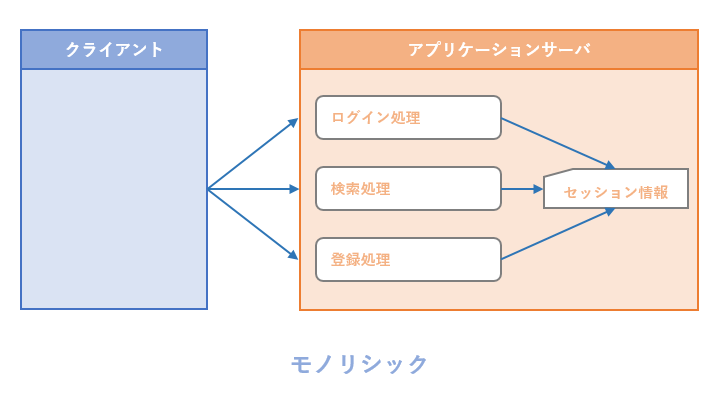
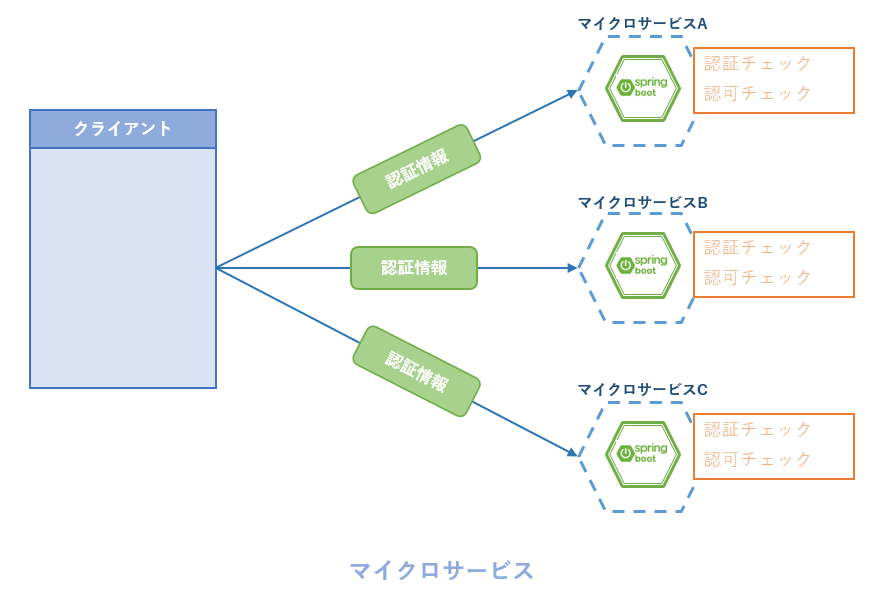
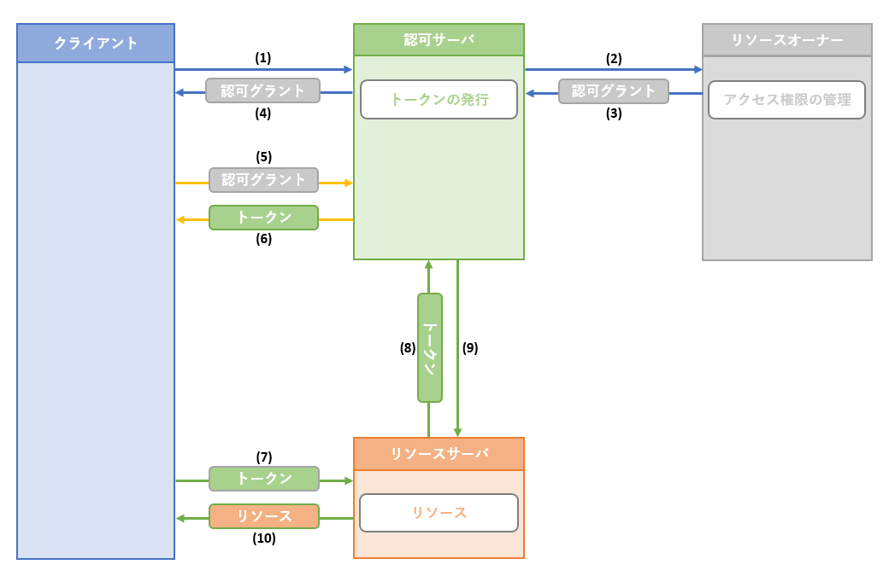
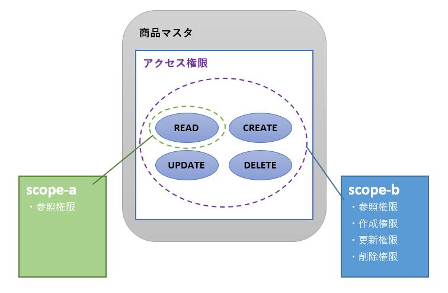
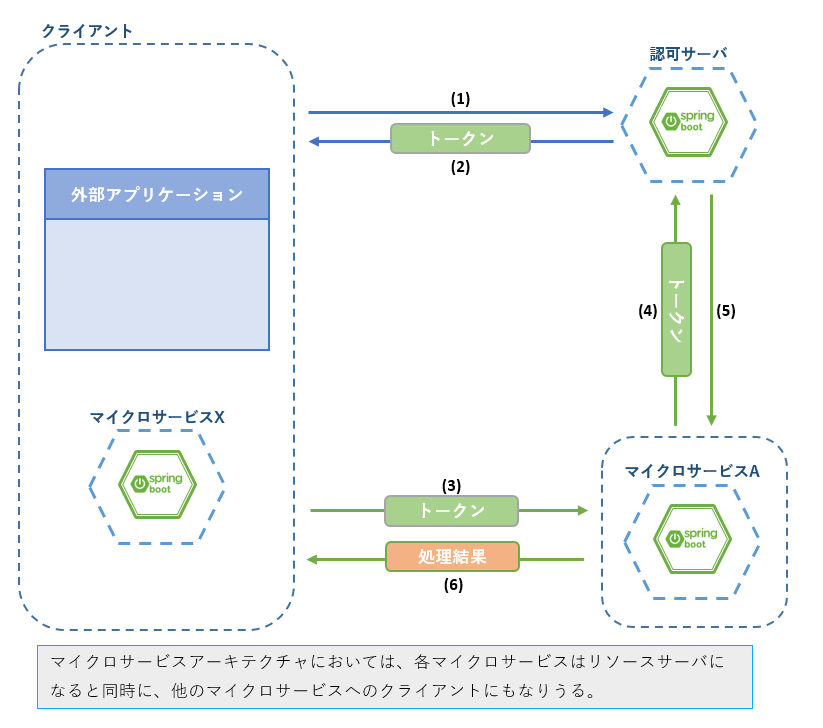
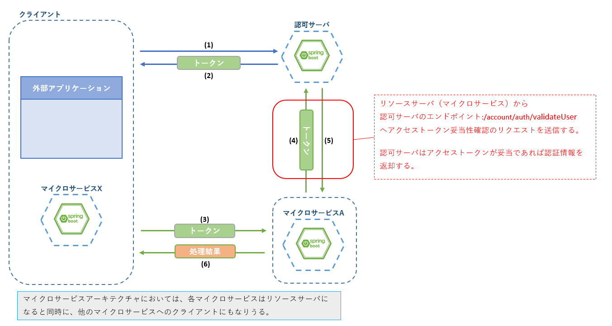

include::_include_all.adoc[]

[[access_control]]
= アクセス制御

[[access_control_overview]]
== Overview
アクセス制御とは、サービスにアクセスするクライアントに対してアクセス許可を与えるための機能である。アクセス制御には2つの段階がある。

* 認証(Authentication)
  - アクセスしているクライアントの正当性を確認する
* 認可(Authorization)
  - 認証されたクライアントに与えられたアクセス権限の有効性を確認する
  - アクセス権限とはアクセスしたいリソースへの操作権限(参照、更新、削除など)を指す

モノリシックなアプリケーションでは、一般的にセッションとクッキーを利用して認証・認可が行われる。

.モノリシックなアプリケーションの認証・認可概念図

しかし、こうした方式はシステム全体で使用できる共有メモリが必要であり、多数のマイクロサービスが連携するマイクロサービスアーキテクチャでは実現することが難しい。

さらに、マイクロサービスアーキテクチャにおいては、下記の問題点を考慮する必要がある。

* 認証が必要な通信が発生する度にIDやパスワードなどのセキュリティ情報を通知する方式では、十分なセキュリティ確保が困難
* 個々のマイクロサービスごとにアクセス権を付与する仕組みを用意することの複雑さ、煩雑さ

.マイクロサービスアーキテクチャにおける問題点

これらの問題を解決する代表的な方式としてOAuth2.0があげられる。

OAuth2.0は、保護されたリソースについて、直接的な認証情報を用いずにシステムを利用するための認証とアクセス範囲を限定する認可を行うセキュアな仕組みを提供しており、従来のクライアントサーバ型認証モデルと比較して、より柔軟なアクセス制御を実現している。

マイクロサービスアーキテクチャではOAuth2.0を採用することで、十分にセキュアであり、共通化された利用しやすい認証と認可を実現することができる。

=== 処理方式
==== OAuth2.0
OAuth2.0は、外部アプリケーションからのサービス利用に対して認可を行い、設定した範囲でのアクセスを可能にするためのフレームワークである。

マイクロサービスアーキテクチャが必要とする認証・認可の仕組みとして十分な仕様を備えているため、マイクロサービスアーキテクチャに基づいたアプリケーションでも採用事例が多い。

.OAuth2.0概要

.OAuth2.0フロー
[cols="1,9a"]
|====
| 項番 | 内容

| (1) | クライアントが認可サーバに認可グラントを要求する。
| (2) | 認可サーバはクライアントの要求を受けてリソースオーナに認可グラントを要求する。
| (3) | リソースオーナは認可サーバに認可グラントを返却する。
| (4) | 認可サーバはクライアントに認可グラントを返却する。
| (5) | クライアントは認可グラントを用いて認可サーバにアクセストークンを要求する。
| (6) | 認可サーバは認可グラントが正しければアクセストークンを発行する。
| (7) | クライアントはアクセストークンを用いてリソースサーバにリソースの送信を要求する。
| (8) | リソースサーバはアクセストークンが正当であることを認可サーバに確認する。
| (9) | 認可サーバはリソースサーバにアクセストークンの正当性について応答する。
| (10) | リソースサーバはアクセストークンが正しければクライアントにリソースを返却する。
|====

下記に上図に関連するOAuth2.0の構成要素について、OAuth2.0 RFC仕様ドキュメントから抜粋して記載する。
より詳細な内容は<<access_control_reference,Reference>>のリンク先を参照すること。

===== リソースオーナ
リソースオーナとは、保護されたリソースへのアクセス権限を管理する役割をもつ。アクセスの許可を判断、設定するエンドユーザなど。

===== リソースサーバ
リソースサーバとは、リソースをホストし、保護されたリソースについてはアクセストークンを用いたリクエストを受理して、リソースを返すサーバである。

===== 認可サーバ
認可サーバとは、リソースオーナを通じて認証、認可を取得し、認可取得が成功した場合にアクセストークンを発行するサーバである。

===== クライアント
クライアントとは、UIアプリケーションやサードパーティ製アプリケーションなど、認可サーバとリソースサーバが保護するリソースへのアクセスを行う外部インスタンスを指す。

クライアントはOAuth2の認証・認可フローに参加するために、事前にクライアント自身を認可サーバに登録する必要がある。 +
認可サーバはリクエストを送信してきたクライアントが認証・認可のフローに参加していることを確認したうえで、リソースサーバへのアクセスを要求するアカウントの認証・認可を行う。

===== アクセストークン
アクセストークンとは、認可サーバが発行する認可を表す文字列。一般的に、クライアントから見た場合に単体で意味をなさないランダムな文字列でしかないものを使用する。

アクセストークンにはスコープを含むことができ、これによってアクセス可能なリソースの範囲を表す。リソースサーバと認可サーバはこれを元に、クライアントにリソースを開示してよいかを判断する。

====== スコープについて
スコープは保護されたリソースに対する更新権限、参照権限といったアクセス権の範囲を表す。

.スコープのイメージ

認可サーバはクライアントからの要求に対し、認可サーバまたはリソースオーナの設定に従ってアクセストークンにスコープを含めることができる。

====== ロールを用いた認可について
認可をユーザに与えるための方法として、ロールがある。ロールとは、リソースに対するアクセス権限のセットである。

下記にECサイトの運用アプリケーションをイメージした、簡単な例を示す。

.ロールのイメージ
[cols="2,1,1,1,1,1,1,1,1",width="60%"]
|====
.2+| ロール名 4+^|　商品マスタ管理 4+^| 商品在庫管理
| 参照 | 追加 | 更新 | 削除 | 参照 | 追加 | 更新 | 削除

| 商品管理担当者 | 〇 | 〇 | 〇 | 〇 | 〇 | 〇 | 〇 | 〇
| 在庫管理担当者 | 〇 | | | | 〇 | 〇 | 〇 | 〇
| 営業担当者 | 〇 | | | | 〇 | | 〇 |

|====

====== JWTについて
JSON Web Token(JWT)とはJSON形式を使用したアクセストークンである。

JWTは暗号化と署名によって保護される。認証・認可の他、安全な情報の送信手段としても用いられる。

詳細は<<access_control_reference,Reference>>のリンク先よりJWTのドキュメントを参照すること。

==== マイクロサービスアーキテクチャへのOAuth2.0適用

OAuth2.0の機能を利用することでOverviewで上げたマイクロサービスの認証・認可に関する問題点を解消することができる。

* クライアント～サービスやサービス間の通信に、直接的に認証情報に紐づかないアクセストークンを使用することでセキュリティを高めることができる
* 認可サーバとアクセストークンを導入することで、共通化された柔軟な認証・認可の仕組みを実現できる

[[access_control_msa_oauth2_flow]]
.マイクロサービスアーキテクチャへの適用イメージ

.フローイメージ
[cols="1,9a"]
|====
| 項番 | 内容

| (1) | クライアントが認可サーバに認証情報を送信してアクセストークンを要求する。
| (2) | 認可サーバは認証情報が正しければクライアントにアクセストークンを発行する。
| (3) | クライアントはマイクロサービスにトークンを用いて処理を要求する。
| (4) | マイクロサービスはアクセストークンが正当であることを認可サーバに確認する。
| (5) | 認可サーバはマイクロサービスにアクセストークンの正当性について応答する。
| (6) | マイクロサービスはアクセストークンが正しければクライアントに処理結果を返却する。
|====

===== Spring Security OAuth
Spring Security OAuthは、OAuth 2.0が定義する認可サーバ、リソースサーバ、クライアントをSpringアプリケーションとして構築する際に必要となる機能を提供するライブラリである。
Spring FrameworkやSpring Securityと連携して認証・認可を実現する仕組みが提供されており、簡単な設定で認可サーバ、リソースサーバ、クライアントをSprnigアプリケーションとして構築できる。

ただし、ロールを用いた認可についてはSpring Securityが機能を提供しているため、Spring Security OAuthとは別に設定が必要となる。

サンプルアプリケーションはSpring Bootアプリケーションとして作成されているため、Spring Security OAuthを利用してOAuth2.0の仕組みを取り入れている。

[[access_control_code_example]]
== Code example
本ガイドラインではアカウントサービス、購入サービスを例にとり、Spring Security OAuthを利用してOAuth2.0の仕組みを取り入れたアクセス制御を説明する。
ここでは認可サーバおよびリソースサーバとしての実装について説明する。クライアントとしての実装については<<10_synchronization.adoc#synchronization,同期連携>>を参照すること。

=== サンプルコード一覧
Code exampleでは下記のファイルを使用する。

[cols="4,6a"]
.msa-account(認可サーバ : アカウントサービス)
|===
| ファイル名 | 内容

| pom.xml | 依存ライブラリの追加。
| OAuth2ServerConfig.java | OAuth2認証サーバの設定。
| M9ATokenService.java | OAuth2トークン発行、ログインステータスの更新。
| AuthController.java | ログアウト処理を行うコントローラ。
| OAuth2ResourceConfig.java | エンドポイント、ロールの設定。
| OAuth2SecurityConfig.java | SpringSecurityの設定。

* 下記に説明する業務仕様に基づいた認証・認可情報テーブルからID、パスワード、認可情報を取得するためのカスタムクエリを定義している。
* OAuth2との直接的な関連がないためガイドライン中では説明しない。必要に応じてソースファイルを参照すること。

| M9AUserDetailsServiceImpl.java | 認証・認可のカスタムクエリの処理。

* 下記に説明する業務仕様に基づいた認証・認可情報テーブルを処理するため、Spring SecurityのJdbcDaoImplを拡張している。
* OAuth2との直接的な関連がないためガイドライン中では説明しないが、ソースファイルに拡張ポイントについてコメントが記載されている。必要に応じて参照すること。
|===

[cols="4,6"]
.msa-purchase(リソースサーバ : 購入サービス)
|===
| ファイル名 | 内容

| pom.xml | 依存ライブラリの追加。
| SecurityConfig.java | エンドポイント、ロールの設定。
| application.yml | Spring Security OAuthの設定を含む設定ファイル。
| PurchaseController.java | 購入情報の登録、購入状況照会。
|===

=== 認可サーバ
アカウントサービスを例に、認可サーバ側の実装を説明する。

認可サーバに持たせる機能としてはアクセストークンの発行、リソースサーバへアクセストークンの正当性を確認することが挙げられる。

アクセストークンの発行を実現する方法としては、OAuth2がデフォルトで用意しているエンドポイントを使用する方法がある。 +
`/oauth/token` はOAuth2がデフォルトで用意しているエンドポイントであり、特別な実装なしにID、パスワードによる認証済みトークン発行の機能を利用することができる。

サンプルアプリケーションでは、業務要件に従って下記の拡張を行っている。

* Spring Security OAuthの定義するデフォルトのID、パスワード、認可情報を管理するテーブルを業務要件に沿ったものに置き換える
* ログイン処理としてアクセストークンの発行とログインステータスの更新を行うため、ログイン処理の拡張を行う
* 公開するエンドポイントとして、`/oauth/token` ではなく `/account/auth/login` を使用する

==== 依存ライブラリの追加
Spring Security OAuthを使用するにあたっては下記の依存を追加する必要がある。
[source, xml]
.msa-account: pom.xml
----
<dependency>
    <groupId>org.springframework.security.oauth</groupId>
    <artifactId>spring-security-oauth2</artifactId>
</dependency>
----

==== 認可サーバのエンドポイント
下記にサンプルアプリケーションが公開する、認証・認可を行うためのエンドポイントを記載する。

[cols="4,6a"]
.認可サーバエンドポイント
|===
| エンドポイント | 内容

| /account/auth/login | ログイン処理を行うためのエンドポイント。 +
`/oauth/token` を拡張し、アクセストークンの発行に加えてログインステータスを更新する。 +
業務仕様として必要でなければ、デフォルトのエンドポイントを使用可能である。
| /account/auth/logout | ログアウト処理を行うためのエンドポイント。 +
アクセストークンを破棄しログインステータスを更新する。
Spring Security OAuthではトークン破棄を行うためのエンドポイントは用意されていないため、独自に実装する必要がある。
| /account/auth/validateUser | トークン妥当性チェック処理を行うためのエンドポイント。 +
リソースサーバがアクセストークンの正当性を確認するための処理を提供する。 +
Spring Security OAuthではトークン妥当性チェックを行うためのエンドポイントは用意されていないため、独自に実装する必要がある。
|===

==== ログイン処理
ログインでは `/account/auth/login` をエンドポイントとし、下記の3処理を実行する。

. ID、パスワードを用いた認証処理(Spring Security)
. 認証されたアカウントに対するアクセストークンの発行(Spring Security OAuth)
. ログインステータスの更新(業務仕様による拡張処理)

サンプルアプリケーションでは、アクセストークンの発行までを実質的なログイン処理としている。

さらに、ログインステータスを管理するという業務仕様に従ってDB更新処理を実装するため、Spring Security OAuthデフォルトのトークン発行処理であるDefaultTokenServicesを継承し、独自の拡張処理を追加している。

[source, java]
.msa-account: com.example.m9amsa.account.service.M9ATokenService.java
----
// omitted

@Setter
@Slf4j
public class M9ATokenService extends DefaultTokenServices {

    /**
     * アカウント情報。
     */
    private AccountRepository accountRepository;

    @Override
    @Transactional
    public OAuth2AccessToken createAccessToken(OAuth2Authentication authentication) throws AuthenticationException {

        OAuth2AccessToken token = super.createAccessToken(authentication); // (1)

        // tokenが正常に発行されたらログイン関連テーブルの更新を行う
        Account account = accountRepository.findById(Long.valueOf(authentication.getName())).get();

        account.setLoginStatus(LoginStatus.builder().memberId(account.getMemberId()).build()); // (2)
        account.getLastLogins().add(LastLogin.builder().build()); // (3)

        log.info("** login : {}", account);
        accountRepository.saveAndFlush(account); // (4)

        return token;
    }

}
----

[cols="1,10"]
|===
| 項番 | 説明

| (1) | リクエストパラメータとして、クライアントが入力するIDとパスワードを受け取り、Spring Security OAuthのデフォルト実装によって認証とアクセストークンの発行を行う。
| (2) | ログイン状態を表すオブジェクトを生成する。
| (3) | 最終ログイン日時を表すオブジェクトを生成する。
| (4) | DBの更新を行う。
|===

==== ログアウト処理
ログアウトでは `/account/auth/logout` をエンドポイントとし、下記の2処理を実行する。

. アクセストークンの破棄(Spring Security OAuth)
. ログインステータスの更新(業務仕様)

サンプルアプリケーションでは、アクセストークンの破棄をもって実質的なログアウト処理とし、さらにログインステータスを管理するという業務仕様に従ってDB更新処理を実装している。

先に述べたとおり、ログアウト処理はアプリケーションによる独自の実装となる。

[source, java]
.msa-account: com.example.m9amsa.account.controller.AuthController.java
----
// omitted

@RestController
@RequestMapping("/${info.url.root-path}/account/auth")
@Validated
public class AuthController {

    /**
     * ログアウトサービス。
     */
    @Autowired
    private LogoutService logoutService;

    /**
     * トークン管理クラス。
     */
    @Autowired
    private TokenStore tokenStore;

    /**
     * M9AMSA拡張トークンサービス。
     */
    @Autowired
    private M9ATokenService tokenServices;

// omitted

    @PostMapping("/logout")
    public void logout(OAuth2Authentication authentication) {

        tokenServices.revokeToken(tokenStore.getAccessToken(authentication).getValue()); // (1)

        logoutService.logout(Long.valueOf(authentication.getName())); // (2)
    }
}
----

[cols="1,10"]
|===
| 項番 | 説明

| (1) | Spring Security OAuthのアクセストークン破棄処理を実行する。 `tokenServices.revokeToken` の実行結果による分岐処理の実装も可能であるが、サンプルアプリケーションでは結果にかかわらずログインステータスの更新を行う。
| (2) | 業務仕様に基づき、会員IDをキーとしてログインステータスの更新を行う。
|===

==== トークン妥当性チェック処理
認可サーバ(アカウントサービス)は、リソースサーバからの認可要求を `/account/auth/validateUser` で受け付けている。

リソースサーバはアクセストークンをこのエンドポイントに送信し、認可サーバ(アカウントサービス)はアクセストークンの妥当性を確認する。
妥当性確認処理は、認証情報を返却することで妥当性確認済みの応答としている。

下記に<<access_control_msa_oauth2_flow,マイクロサービスアーキテクチャへのOAuth2.0適用で示した図>> を用いて、アクセストークン妥当性チェック処理が
認可処理のどの部分で実行されるかを図示する。

.アクセストークン妥当性チェック処理

妥当性確認処理自体は、認可サーバの設定を有効にしておくことでSpring Security OAuthが実行するため、特別な実装は行っていない。

[source, java]
.msa-account: com.example.m9amsa.account.controller.AuthController.java
----
// omitted

@RestController
@RequestMapping("/${info.url.root-path}/account/auth")
@Validated
public class AuthController {

// omitted

    @RequestMapping("/validateUser")
    public Principal user(Principal user) { // (1)
        return user;
    }

// omitted

}
----

[cols="1,10"]
|===
| 項番 | 説明

| (1) | `/account/auth/validateUser` へのリクエストを受け付けるコントローラメソッド。
|===

==== OAuth2認可サーバの設定
OAuth2認可サーバに各種設定を追加する方法を説明する。

認可サーバとして、Spring Security OAuthを有効にするための設定をJava Configで行っている。

[source, java]
.msa-account: com.example.m9amsa.account.config.OAuth2ServerConfig.java
----

// omitted

@Configuration
@EnableAuthorizationServer // (1)
public class OAuth2ServerConfig extends AuthorizationServerConfigurerAdapter {

// omitted

    /**
     * 認証処理マネージャ。
     */
    @Autowired
    @Qualifier("authenticationManagerBean")
    private AuthenticationManager authenticationManager; // (2)

    /**
     * アカウントリポジトリ。
     */
    @Autowired
    private AccountRepository accountRepository;

// omitted

    @Override
    public void configure(AuthorizationServerSecurityConfigurer security) throws Exception {
        security.passwordEncoder(this.passwordEncoder());　 // (3)
    }

// omitted

    @Override
    public void configure(AuthorizationServerEndpointsConfigurer endpoints) throws Exception {

        endpoints.pathMapping("/oauth/token", String.format("/%s/account/auth/login", rootPath))
                .authenticationManager(authenticationManager).tokenServices(tokenServices()); // (4)
    }

// omitted

    @Override
    public void configure(ClientDetailsServiceConfigurer clients) throws Exception {
        clients.jdbc(dataSource); // (5)
    }

// omitted

    @Bean
    public TokenStore tokenStore() {
        return new JdbcTokenStore(dataSource); // (6)
    }

// omitted

    @Bean
    public M9ATokenService tokenServices() {

        M9ATokenService tokenService = new M9ATokenService();
        tokenService.setTokenStore(tokenStore());
        tokenService.setSupportRefreshToken(true);
        tokenService.setAccountRepository(accountRepository);
        return tokenService; // (7)
    }

// omitted

    @Bean
    public PasswordEncoder passwordEncoder() {
        return new BCryptPasswordEncoder();
    }

}

// omitted

----

[cols="1,10a"]
|===
| 項番 | 説明

| (1) | 認可サーバとして必要なBean定義と、トークン発行などSpring Security OAuthのエンドポイントを有効にするアノテーション。
| (2) | (1)でBean定義されるSpring Security OAuthのAuthenticationManager。
| (3) | パスワードのエンコード設定と入力パスワード、登録パスワードの一致チェックを行うためのPasswordEncoderを設定する。 +
Spring Securityでの設定と同様であるが、Spring Security OAuthのクラスAuthorizationServerSecurityConfigurerを使用して設定している。
| (4) | 認可サーバのエンドポイント設定を行う。

* `/oauth/token` を `/account/auth/login` に置き換え
* (2)で取得したauthenticationManagerをエンドポイント処理にセット
* トークン発行処理を拡張するため、サンプルアプリケーションで作成した拡張サービスクラスをセット

| (5) | 認可サーバを利用するクライアントに関する設定をもつコンフィグクラスのカスタマイズを行う。 +
認可サーバとしてアクセスを許可しているクライアントであるかをチェックするためのリソースとして、DBを利用する設定をしている。  +
本ガイドラインではクライアントアプリケーションを説明対象としないため、詳述はしない。<<access_control_reference,Reference>>よりSpring Security OAuthのドキュメントを参照すること。

| (6) | アクセストークンを管理するためにDBを使用する設定を行っている。 +
デフォルトではメモリ管理されるが、サンプルアプリケーションではアカウントや認可の設定をDB管理としているため、合わせてDBを設定した。

| (7) | トークン発行処理を業務要件に従って拡張したサービスクラスをBean定義している。 +
(4)のエンドポイント設定にて、拡張処理を有効にしている。
|===

==== 認可情報の設定
認可サーバとして公開するエンドポイントを保護するため、Spring Securityを用いてエンドポイントの認可設定を行う。

認可サーバであるアカウントサービスは業務処理も受け付けるため、業務処理を行うためのエンドポイントについてもここで設定を行っている。

[source, java]
.msa-account: com.example.m9amsa.account.config.OAuth2ResourceConfig.java
----

// omitted

@Configuration
@EnableResourceServer
public class OAuth2ResourceConfig extends ResourceServerConfigurerAdapter {

// omitted

    @Override
    public void configure(HttpSecurity http) throws Exception {

        http.csrf().disable() // 認証トークンの正統性チェックが実行されるのでCSRFチェックは行わない。画面遷移を含むトランザクションチェックが必要であればBFFに任せます。
        .httpBasic().disable() // ベーシック認証は使用しません。
        .formLogin().disable() // アカウントサービスとしてフォームログインを提供しません。
        .logout().disable() // アカウントサービスとしてSpring Securityのログアウト処理を提供しません。
        .authorizeRequests()//
        .antMatchers(String.format("/%s/account/auth/logout", rootPath)).authenticated()// (1)
        .antMatchers(HttpMethod.GET, String.format("/%s/account/member", rootPath)).authenticated()// (2)
        .antMatchers(HttpMethod.PUT, String.format("/%s/account/member", rootPath)).hasAuthority("USER")// (3)
        .antMatchers(HttpMethod.POST, String.format("/%s/account/admission", rootPath)).authenticated()// (4)
        .antMatchers(String.format("/%s/account/auth/login", rootPath)).permitAll()// (5)
        .antMatchers(String.format("/%s/account/auth/validateUser", rootPath)).authenticated()// (6)
        .antMatchers("/actuator", "/actuator/**").permitAll() // (7)
        .anyRequest().denyAll();// (8)
    }

}
----

[cols="1,10"]
|===
| 項番 | 説明

| (1) | ログアウト処理のエンドポイント。認証済みユーザに対してアクセスを許可する。
| (2) | 会員情報を取得する業務処理のエンドポイント。認証済みユーザに対してアクセスを許可する。
| (3) | 会員情報を更新する業務処理のエンドポイント。USERロールを持ったユーザアカウントのみアクセスを許可する。
| (4) | 入会処理を行う業務処理のエンドポイント。認証済みユーザに対してアクセスを許可する。 [red]#※#
| (5) | ログイン処理のエンドポイント。すべてのアクセスに対して処理を行う。
| (6) | リソースサーバ向けの認可処理を行うためのエンドポイント。アクセストークンの送信を前提とするため、認証済みユーザに対してのアクセス許可を設定している。
| (7) | Spring Boot Actuatorが公開するエンドポイントへの保護設定。 +
Kubernetesクラスタ外からのリクエストによるルーティングを設定しない想定で、すべてのアクセスを受け付ける設定としている。
| (8) | denyAll()はあらゆるアクセスを拒否する設定である。パーミッション設定は上から順番に処理されるため、最後に設定することで意図しないリソースへのアクセスを遮断している。
|===

[NOTE]
====
[red]#※# サンプルアプリケーションはロールによる認可の区別を必要とする仕様を持っていないが、サンプル実装としてロールの設定を行うため、
ユーザの初回アクセス時に仮のトークンを発行するよう実装されている。
業務仕様としてのログインを行った場合、USERロールを設定したアクセストークンを発行することで、ログイン済みユーザを識別している。
====

==== クライアントの認証について
処理方式で述べたとおり、認可サーバはクライアントの認証を行うための情報も管理している。

サンプルアプリケーションでは、Spring Security OAuthがサンプルを提供しているDBテーブルを使用してクライアントのID、Secretを管理している。

本来はシステムに接続するクライアントごとに認証情報を管理するが、サンプルアプリケーションでは下記のクライアント情報をサンプルとして、oauth_client_detailsテーブルにレコードを追加している。

[cols="3,3,4a"]
.oauth_client_details
|===
| 項目名 | 値 | 内容

| client_id | my-client | クライアントに付与するID。
| secret | 1 | パスワードに当たるクライアントの認証情報。
|===

=== リソースサーバ
サンプルアプリケーションにおいては、各マイクロサービスがリソースサーバに該当する。ここでは購入サービスを例に、リソースサーバ側の実装を例示する。

リソースサーバとして考えた場合、大きく分けて下記2種類の設定が必要となる。

. 業務処理(リソース)に対する認可の設定
  - application.ymlによる設定
. 認可の必要なリクエストを受け付けた際に、認可サーバへアクセストークンの妥当性確認を行う設定
  - Java Configによる設定

購入サービスとして公開するエンドポイントを下記に示す。

[cols="4,6"]
.リソースサーバエンドポイント
|===
| エンドポイント | 内容

| /purchase/find/{予約ID} | 予約IDを元に購入状況を照会する業務処理のエンドポイント。
| /purchase/register | 購入情報登録を実行する業務処理のエンドポイント。
| /purchase/delete/{予約ID} | 購入情報削除を実行する業務処理のエンドポイント。
|===

==== 依存ライブラリの追加
Spring Security OAuthを使用するにあたっては下記の依存を追加する必要がある。
[source, xml]
.msa-purchase: pom.xml
----
<dependency>
    <groupId>org.springframework.security.oauth</groupId>
    <artifactId>spring-security-oauth2</artifactId>
</dependency>
<dependency>
    <groupId>org.springframework.security.oauth.boot</groupId>
    <artifactId>spring-security-oauth2-autoconfigure</artifactId>
</dependency>
----

==== 認可情報の設定
購入サービスとして公開するエンドポイントに対する認可設定を、Spring Securityを用いて行う。

[source, java]
.msa-purchase: com.example.m9amsa.purchase.config.SecurityConfig.java
----

// omitted

@Configuration
@EnableResourceServer
public class SecurityConfig extends ResourceServerConfigurerAdapter {

// omitted

    @Override
    public void configure(HttpSecurity http) throws Exception {
        http.csrf().disable()//
                .httpBasic().disable()//
                .formLogin().disable()//
                .logout().disable()//
                .authorizeRequests()//
                .antMatchers(String.format("/%s/purchase/register", rootPath)).authenticated()// (1)
                .antMatchers(String.format("/%s/purchase/find/*", rootPath)).hasAnyAuthority("USER")// (2)
                .antMatchers("/actuator", "/actuator/**").permitAll() // (3)
                .anyRequest().denyAll(); //(4)

    }

// omitted

----

[cols="1,10"]
|===
| 項番 | 説明

| (1) | 購入情報登録を実行する業務処理のエンドポイント。認証済みユーザに対してアクセスを許可する。
| (2) | 予約IDを元に購入状況を照会する業務処理のエンドポイント。USERロールを持ったユーザアカウントのみアクセスを許可する。
| (3) | Spring Boot Actuatorが公開するエンドポイントへの保護設定。 +
Kubernetesクラスタ外からのリクエストによるルーティングを設定しない想定で、すべてのアクセスを受け付ける設定としている。
| (4) | denyAll()はあらゆるアクセスを拒否する設定である。パーミッション設定は上から順番に処理されるため、最後に設定することで意図しないリソースへのアクセスを遮断している。
|===

==== 認可サーバへのアクセストークン妥当性確認
認可サーバへアクセストークンの妥当性確認をリクエストするための設定について説明する。

application.ymlに設定した認可サーバのエンドポイントに対してアクセストークンの妥当性確認をリクエストする。
妥当性確認のとれたアクセストークンに基づいて、SecurityConfig.javaで設定した認可権限を参照し、リクエストに対してアクセスの許可を行う。

[source, yaml]
.msa-purchase: src/main/resources/application.yml
----
#omitted

security:
  oauth2:
    resource:
      id: purchase-resource
      userInfoUri: http://${HOSTNAME_ACCOUNT}/${URL_ROOT}/account/auth/validateUser # (1)

# omitted
----

[cols="1,10"]
|===
| 項番 | 説明

| (1) | 認可サーバが公開しているアクセストークンの妥当性確認を受け付けるエンドポイントを設定する。
|===

==== アプリケーションでの認証情報取得

コントローラメソッドの引数に認証情報を指定することで、業務処理中で認証情報を取得することが可能である。

購入状況照会処理を例に説明する。

[source, java]
.msa-purchase: com.example.m9amsa.purchase.controller.PurchaseController.java
----

// omitted

@GetMapping("/find/{reserveId}")
public Purchase findPurchase(OAuth2Authentication authentication, @PathVariable Long reserveId) { // (1)
    Optional<Purchase> purchase = findPurchaseService.findPurchase(reserveId);

    // 認証済み会員IDと購入時会員IDが違う場合、認証エラーとします。
    return purchase.filter(p -> p.getPurchaseMemberId().equals(Long.valueOf(authentication.getName())))
            .orElseThrow(HttpStatus401Exception::new); // (2)
}

// omitted
----

[cols="1,10"]
|===
| 項番 | 説明

| (1) | 引数に認証情報を指定する。
| (2) | 認証情報に含まれる会員IDと購入時会員IDを比較し、一致する場合には予約IDをキーとした検索結果を返却する。 +
会員IDが不一致の場合には401エラーを返却する。 +
このような実装をすることにより、購入者は自身の購入情報を参照できる、という業務仕様を実現している。
|===

[[access_control_reference]]
== Reference
* link:https://oauth.net/2/[OAuth 2.0]
  - OAuth2.0公式ページ
[[access_control_reference_oauth2_rfc]]
* link:https://tools.ietf.org/html/rfc6749[The OAuth 2.0 Authorization Framework]
  - OAuth 2.0の基本的な仕様が記載されたRFCドキュメント
* link:https://projects.spring.io/spring-security-oauth/docs/Home.html[Spring Security OAuth]
  - Spring Security OAuthのユーザガイド
* link:https://spring.io/projects/spring-security#overview[Spring Security]
  - Spring Securityの公式ドキュメント
* link:https://jwt.io/introduction/[JWT]
  - JWT公式ページ
* link:https://openid.net/connect/[OpenID Connect]
  - OpenID Connect公式ページ
