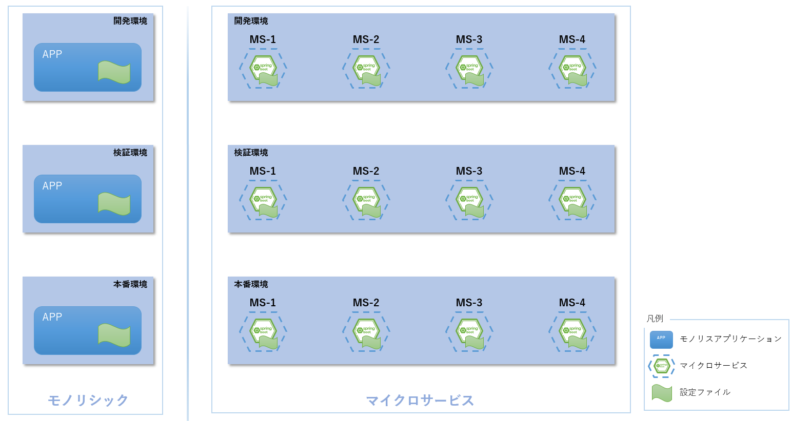
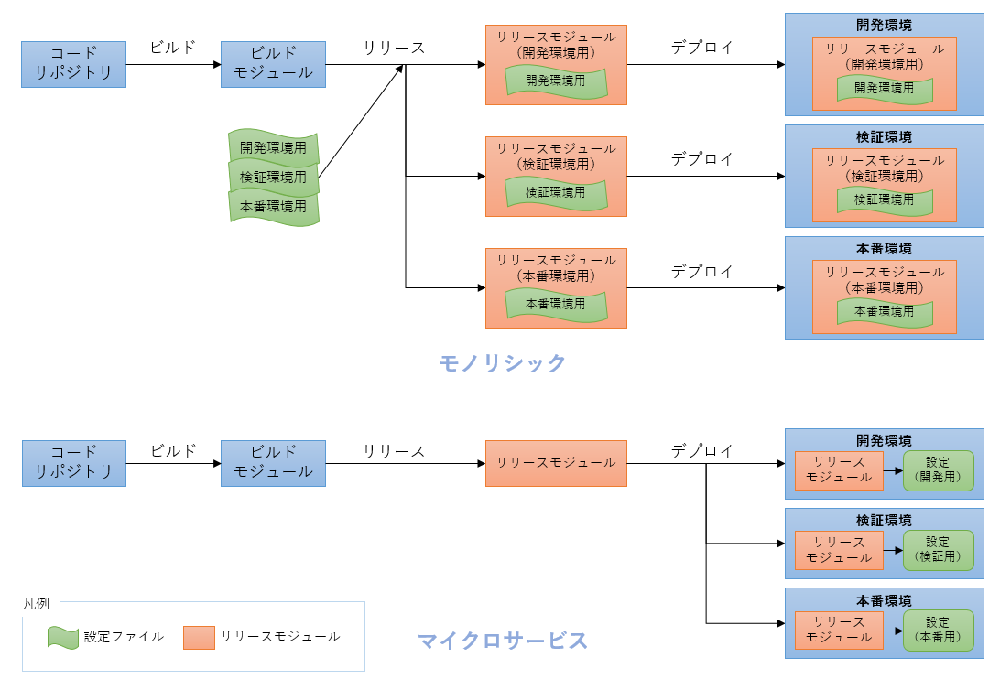
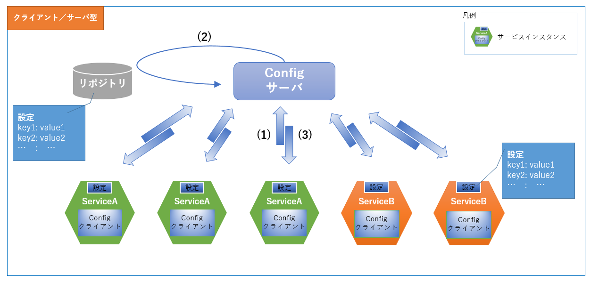
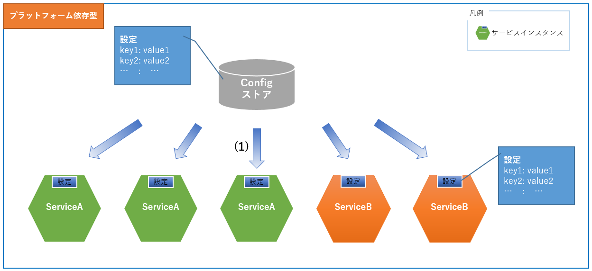

include::_include_all.adoc[]

[[property_external_manage]]
= 設定の外部化

[[property_external_manage_overview]]
== Overview

マイクロサービスにおいては、下記の理由で、設定をアプリケーションの外部で集中管理することが適切となる。

オートスケール、オートヒーリングなどコンテナ基盤の操作により、自動的にマイクロサービスが増減し、再起動が行われるため、コンテナ上で稼働するマイクロサービスは基本的にイミュータブルかつステートレスでなければならない。そのため、phpのコンフィグ変更といったモジュールデプロイ後に設定を変更する運用を行う場合など、デプロイ後に設定ファイルを手作業で変更する運用は行ってはいけない。

また、マイクロサービスアーキテクチャでは、1つのシステムにおいて多数のマイクロサービスが稼働するため、モノリシックなアプリケーションと同様の管理を行うと、設定ファイルをマイクロサービスごとに用意する必要があり、管理が煩雑になってしまう。

さらに、アプリケーションの開発にあたっては一般的に、開発環境、検証環境、本番環境など、複数の環境が用意される。そのため、先に述べた複数の設定ファイルを管理することに加え、環境ごとに設定値の管理を行う必要も発生する。それぞれ個別に管理すると膨大な数の設定ファイルが必要になり、マイクロサービスごと、デプロイ環境ごとに使い分ける必要も生まれる。

.モノリシックとマイクロサービスの対比図

上記の理由で、マイクロサービスアーキテクチャでは設定の外部化を図り、コンテナに配置するリリースモジュールから個別の設定を分離する。
設定の外部化を行うと、どの環境でも同一のビルド成果物(Dockerイメージ)を使用でき、設定を環境ごとに用意することで管理の煩雑さ、複雑さを低減できる。

.設定の外部化効果図

=== 処理方式
設定外部化の概念アーキテクチャパターンはクライアント/サーバ型とプラットフォーム依存型の2つがあげられる。

==== クライアント/サーバ型
アプリケーションはConfigクライアントとして、Configサーバに設定値取得を要求する。Configサーバは設定値を管理するリポジトリから設定値を取得してConfigクライアントに返却する

.クライアント/サーバ型概念図

[cols="1,9", options="header"]
.クライアント/サーバ型
|===
|項番
|説明

|(1)
|サービス起動時または設定変更時に、ConfigクライアントがConfigサーバに設定値の問合せを行う。

|(2)
|Configサーバがリポジトリから設定値を取得する。

|(3)
|ConfigサーバがConfigクライアントに設定値を返却する。
|===

==== プラットフォーム依存型
サービスが稼働するプラットフォームは設定値の登録・変更を行うConfigストアを提供する。Configストアを元にサービスに設定を反映する。

.プラットフォーム依存型概念図

[cols="1,9", options="header"]
.プラットフォーム依存型
|===
|項番
|説明

|(1)
|サービス起動時または設定変更時に、Configストアを元にサービスに設定を反映する。

|===

==== 概念アーキテクチャ比較
クライアント/サーバ型とプラットフォーム依存型の特徴を下記に示す。 +
どちらも一長一短あるが、本ガイドラインでは、プラットフォーム依存型を採用する。

[cols="2,5,5,3", options="header"]
|===
|方式
|メリット
|デメリット
|実装アーキテクチャ例

|クライアント/サーバ型
|プロパティの設定・取得方式はプラットフォームに関係なく統一できる。
|採用する実装アーキテクチャによっては、使用言語に依存してしまう。 +
構成クライアントの設定が必要になる。
|Spring Cloud Config

|プラットフォーム依存型
|使用言語に依存しない。 +
マイクロサービス側にカスタマイズは必要ない。
|環境変数の設定・取得方法がプラットフォームに依存してしまう。
|
Kubernetes (ConfigMap)
|===

=== Kubernetes機能との関連

==== ConfigMap
ConfigMapを使用すると、アプリケーションの設定をコンテナイメージから分離することができる。 +
コンテナ化されたアプリケーションの移植性が維持され、設定の変更や管理が容易になる。

ConfigMapは設定値を環境変数や設定ファイルとしてPodに連携する。

* 環境変数
** Pod内環境に環境変数が定義され、Pod内のアプリケーションからは環境変数を使用することで設定にアクセスする

* ファイル
** Pod内環境にファイルが作成され、Pod内のアプリケーションからはファイルを使用することで設定にアクセスする

本ガイドラインではKubernetesのConfigMapを利用して、環境変数を使用した設定の外部化を実現する。

==== Secret
ConfigMap以外は、KubernetesのSecretも設定の外部化を実現できる。 +
KubernetesのSecretはパスワード、OAuthトークン、sshキーなどの機密情報を保存および管理できるオブジェクトである。 +
Secretには設定値を暗号化する機構が用意されているなど、機密情報の保存に適している。

なお、本ガイドラインでは機密情報に値する設定値を取り扱わないため、Secretは利用しない。

[[property_external_code_example]]
== Code example
Code exampleでは下記のファイルを使用する。
本ガイドラインでは予約サービスのSecurityConfig.javaを例にとり、環境変数を用いたConfigMapの設定について説明する。

=== サンプルコード一覧

[cols="4,6"]
.msa-env
|===
| ファイル名 | 内容

| configmap_local.yml | ローカル環境用のConfigMap。
| configmap_stag.yml | 検証環境用意のConfigMap。
| configmap_prod.yml | 本番環境用のConfigMap。

|===

[cols="4,6"]
.msa-reserve(予約サービス)
|===
| ファイル名 | 内容

| application.yml | Spring Bootアプリケーションの設定ファイル。
| SecurityConfig.java | マイクロサービスの認可処理を行うソースコード。
|===

=== ConfigMapの作成

Manifestファイルの作成例として、下記にローカル環境でのConfigMapを示す。

[source, yaml]
.msa-env: configmap.configmap_local.yml
----
kind: ConfigMap
apiVersion: v1
metadata:
  name: m9amsa-configmap # (1)
  namespace: local # (2)
data:
  # URLのベース文字列
  URL_ROOT: msaref # (3)

 # omitted

  # JAEGERへ通知するサービス名称
  JAEGER_SERVICENAME_ACCOUNT: local-msa-account
  JAEGER_SERVICENAME_FLIGHT: local-msa-flight
  JAEGER_SERVICENAME_RESERVE: local-msa-reserve
  JAEGER_SERVICENAME_PURCHASE: local-msa-purchase
  JAEGER_SERVICENAME_CALCULATE_FARE: local-msa-flight-ticket-fare-calculation
  JAEGER_SERVICENAME_RESERVE_NOTICE: local-msa-reserve-notice
  JAEGER_SERVICENAME_PURCHASE_NOTICE: local-msa-purchase-notice

  #omitted
----

[cols="1,10"]
|===
| 項番 | 説明

| (1) | ConfigMapの名前を指定する。
| (2) | 本ガイドラインでは、Namespaceによって環境を分けているため、ローカル環境用の設定としてlocalを設定している。同様に検証環境、本番環境の場合はそれぞれstag、prodをNamespaceに指定する。
| (3) | 環境変数としての設定を定義する。
|===

上記ファイルをkubectl applyコマンドを用いて適用させることでConfigMapが作成される。
この時、-n localによりNamespaceにlocalを指定している。

[source, bash]
----
$ kubectl apply -f configmap/configmap_local.yml -n local
configmap/m9amsa-configmap configured # (1)
----

[cols="1,10"]
|===
| 項番 | 説明

| (1) | Manifestファイルにて指定した名前でConfigMapが作成されていることが確認できる。
|===

=== コンテナへのConfigMap適用
コンテナからConfigMapで定義した環境変数を参照する方法を記載する。

[source, yaml]
.msa-reserve: manifest/deployment.yml
----
apiVersion: apps/v1
kind: Deployment
metadata:
  name: reserve-${TARGET_ROLE}
  labels:
    app: reserve
    role: ${TARGET_ROLE}

    # omitted

spec:
  replicas: 1
  selector:
    matchLabels:
      app: reserve
  template:
    metadata:
      labels:
        app: reserve
        role: ${TARGET_ROLE}
    spec:
      containers:
      - name: reserve
        image: ${TARGET_IMAGE}
        imagePullPolicy: IfNotPresent
        ports:
        - containerPort: 28080
        envFrom:
        - configMapRef:
            name: m9amsa-configmap # (1)

            # omitted
----

[cols="1,10"]
|===
| 項番 | 説明

| (1) | 作成したConfigMapの名前を指定することでConfigMapで定義した環境変数を適用することができる。
|===

[NOTE]
====
ConfigMapには環境変数を使用する方法と設定ファイルをコンテナに配置する方法の2種類が存在する。
環境変数を使用する方法には定義したConfigMapをすべてPodに反映する方法と、定義したConfigMapからKeyを限定してPodに反映する方法の2種類が存在する。

なお、サンプルアプリケーションでは、すべての環境変数をPodに反映する方法を選択している。

また、環境変数をPodに反映する方法にはConfigMapを使用せず、Pod定義で直接指定する方法もある。

詳細は下記のKubernetesドキュメントを参照すること。

* link:https://kubernetes.io/docs/tasks/configure-pod-container/configure-pod-configmap/[Configure a Pod to Use a ConfigMap]
* link:https://kubernetes.io/docs/tasks/inject-data-application/define-environment-variable-container/[Define Environment Variables for a Container]
====

=== ConfigMapの適用を確認
コンテナの起動後、ConfigMapで定義した環境変数が適用されていることを確認する。

[source, bash]
----
$ kubectl exec -it reserve-79765b49c7-wtcbf -n local sh
/# env  # (1)
PATH=/opt/java/openjdk/bin:/usr/local/sbin:/usr/local/bin:/usr/sbin:/usr/bin:/sbin:/bin
HOSTNAME=reserve-79765b49c7-wtcbf

# omitted

JAEGER_SERVICENAME_CALCULATE_FARE=local-msa-flight-ticket-fare-calculation # (2)
JAEGER_SERVICENAME_PURCHASE=local-msa-purchase
JAEGER_SERVICENAME_PURCHASE_NOTICE=local-msa-purchase-notice
JAEGER_SERVICENAME_FLIGHT=local-msa-flight
JAEGER_SERVICENAME_RESERVE_NOTICE=local-msa-reserve-notice
JAEGER_SERVICENAME_RESERVE=local-msa-reserve
URL_ROOT=msaref
JAEGER_SERVICENAME_ACCOUNT=local-msa-account

# omitted
----

[cols="1,10"]
|===
| 項番 | 説明

| (1) | envコマンドで環境変数を表示する。
| (2) | configmap_local.ymlで定義された環境変数が反映されていることが確認できる。
|===

=== アプリケーションからの参照
アプリケーションからConfigMapで定義した環境変数を参照する方法を記載する。

[source, yaml]
.msa-reserve: src/main/resources/application.yml
----
server:
  port: 28080
info:
  url:
    root-path: ${URL_ROOT} # (1)

# omitted
----

[cols="1,10"]
|===
| 項番 | 説明

| (1) | info.url.root-pathにURL_ROOTを設定する。URL_ROOTはConfigMapで定義した環境変数の一つである。
|===

[source, java]
.msa-reserve: com.example.m9amsa.reserve.config.SecurityConfig.java
----
// omitted

@Configuration
@EnableResourceServer
public class SecurityConfig extends ResourceServerConfigurerAdapter {

// omitted

    @Value("${info.url.root-path}") // (1)
    private String rootPath;

    private ResourceServerProperties resource;

    public SecurityConfig(ResourceServerProperties resource) {
        this.resource = resource;
    }

    @Override
    public void configure(HttpSecurity http) throws Exception {
        http.csrf().disable()//
                .httpBasic().disable()//
                .formLogin().disable()//
                .logout().disable()//
                .authorizeRequests()//
                .antMatchers(String.format("/%s/reserve/**", rootPath)).authenticated()// (2)
                .antMatchers("/actuator", "/actuator/**").permitAll() //
                .anyRequest().denyAll();
    }

// omitted

}
----

[cols="1,10"]
|===
| 項番 | 説明

| (1) | @Value("${info.url.root-path}")の設定により、application.ymlを経由しConfigMapで設定した環境変数を使用する。
| (2) | ここでは "/msaref/reserve/**" に対して認可を行っている。"msaref"は環境変数「URL_ROOT」で設定されている。
|===

=== 稼働環境ごとのプロパティ管理
稼働環境(検証環境・本番環境)ごとに値の異なるプロパティ(環境依存値)の管理について記載する。
本ガイドラインではNamespaceにより環境を定義しているため、NamespaceごとのConfigMapを用意する。

[source, yaml]
.msa-env: configmap.configmap_stag.yml
----
kind: ConfigMap
apiVersion: v1
metadata:
  name: m9amsa-configmap
  namespace: stag # (1)
data:
  # URLのベース文字列
  URL_ROOT: msaref

# omitted

  # JAEGERへ通知するサービス名称
  JAEGER_SERVICENAME_ACCOUNT: stag-msa-account # (2)
  JAEGER_SERVICENAME_FLIGHT: stag-msa-flight
  JAEGER_SERVICENAME_RESERVE: stag-msa-reserve
  JAEGER_SERVICENAME_PURCHASE: stag-msa-purchase
  JAEGER_SERVICENAME_CALCULATE_FARE: stag-msa-flight-ticket-fare-calculation
  JAEGER_SERVICENAME_RESERVE_NOTICE: stag-msa-reserve-notice
  JAEGER_SERVICENAME_PURCHASE_NOTICE: stag-msa-purchase-notice

  # omitted
----

[source, yaml]
.msa-env: configmap.configmap_prod.yml
----
kind: ConfigMap
apiVersion: v1
metadata:
  name: m9amsa-configmap
  namespace: prod # (3)
data:
  # URLのベース文字列
  URL_ROOT: msaref

# omitted

  # JAEGERへ通知するサービス名称
  JAEGER_SERVICENAME_ACCOUNT: prod-msa-account # (4)
  JAEGER_SERVICENAME_FLIGHT: prod-msa-flight
  JAEGER_SERVICENAME_RESERVE: prod-msa-reserve
  JAEGER_SERVICENAME_PURCHASE: prod-msa-purchase
  JAEGER_SERVICENAME_CALCULATE_FARE: prod-msa-flight-ticket-fare-calculation
  JAEGER_SERVICENAME_RESERVE_NOTICE: prod-msa-reserve-notice
  JAEGER_SERVICENAME_PURCHASE_NOTICE: prod-msa-purchase-notice

  # omitted
----

[cols="1,10"]
|===
| 項番 | 説明

| (1) , (3) | サンプルアプリケーションでは、環境をNamespaceにより分けているため、検証環境用、本番環境用の設定としてNamespaceの設定を行っている。
| (2) , (4) | サンプルアプリケーションでは、Jaegerは環境ごとに用意しておらず、単一のサーバに各環境から分散トレーシング情報を通知する。
そのため、Jaegerへ通知するサービス名に環境情報をプレフィクスとして追加している。
|===

[NOTE]
====
これまでの説明してきたとおり、サンプルアプリケーションではConfigMapの環境変数を利用した設定の外部化をおこなっているが、設定ファイルを用いた外部化も行うことができる。
ConfigMapのファイルを使用した外部化を行う場合は、設定ファイルを `/config` フォルダやクラスパスといった適切な場所に配置されるようにする。

Spring Bootによる外部設定ファイルの読み込みについてはlink:https://docs.spring.io/spring-boot/docs/current/reference/html/spring-boot-features.html#boot-features-external-config-application-property-files[Spring Bootドキュメント]に説明がある。

ただし、設定ファイル自体を管理するとマイクロサービスごとに設定ファイルを用意しなければならない。
マイクロサービスの数が多くなるにつれ、同数の設定ファイルを管理することは必ずしも適切な管理とはならない。 +
さらに、各マイクロサービスの設定では同一となる設定内容も多数存在するため、設定値が各設定ファイルに分散する形で設定の重複も発生する。

環境変数を用いることでこれらの問題は解決するため、設定の外部化は環境変数を用いることを推奨する。

また、Spring Bootアプリケーションに関わらず、設定の外部化を行う際に環境変数を使用する方法は広く知られており、言語やOSに依存しないため、アプリケーションや環境にまたがって設定を一元管理できるメリットがある。
====

[[property_external_reference]]
== Reference
* https://kubernetes.io/docs/tasks/configure-pod-container/configure-pod-configmap/[ConfigMap]
** Kubernetes ConfigMapの公式ドキュメント

* https://12factor.net/ja/config[Twelve-Factorの設定]
** The Twelve-Factor App公式ページの設定

* https://spring.io/projects/spring-cloud-config[Spring Cloud Config]
** Spring Cloud Configの公式ドキュメント
