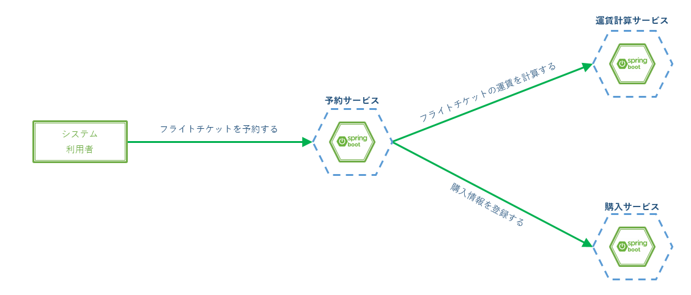
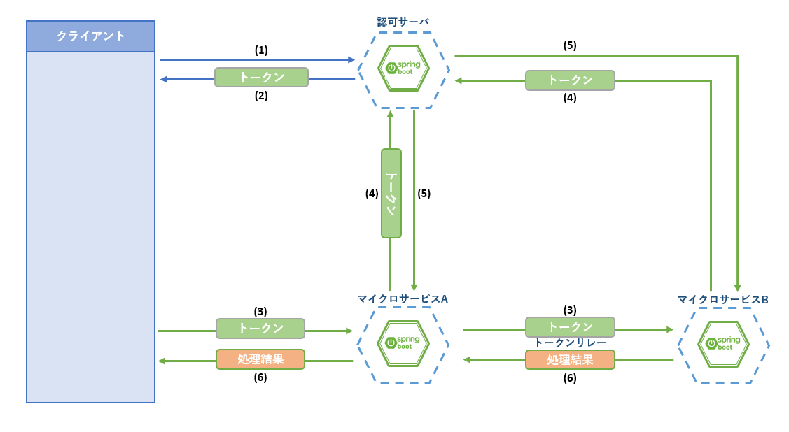

include::_include_all.adoc[]

[[synchronization]]
= 同期連携

[[synchronization_overview]]
== Overview
マイクロサービスアーキテクチャでは、複数のマイクロサービスが相互に連携して業務処理を実現する。

マイクロサービス間の連携処理方式には主に同期連携と非同期連携があるが、ここでは同期連携について説明を行う。

=== 処理方式
同期連携はHTTP通信を介して連携先サービスを呼び出す形で行う。

本リファレンスではHTTPクライアントとして採用事例が多いことからOpenFeignのSpring実装であるSpring Cloud OpenFeignを使用する。

==== Feign
Feignは、宣言的APIクライアントとも呼ばれ、HTTPクライアントの作成を容易にするためのフレームワークである。

通信処理をFeignが解決するため、簡潔で可読性の高い実装が容易に実現できる。

参考として、RestTemplateを使用した場合との比較を示す。
RestTemplateでは処理ごとに通信に関する実装をする必要があるが、Feignではシンプルで可読性の高い記述が可能になっている。

[source, java]
.RestTemplateを使用した例
----
RestTemplate restTemplate = new RestTemplate();
String uri = "http://sample/search";
HttpHeaders headers = new HttpHeaders();
headers.setAccept(Collections.singletonList(MediaType.APPLICATION_JSON));
HttpEntity<SearchCondition> entity = new HttpEntity<>(searchCondition, headers);
ResponseEntity<List<SampleSearchResult>> response = restTemplate.exchange(uri, HttpMethod.GET, entity,
      new ParameterizedTypeReference<List<SampleSearchResult>>() {
      });
----

[source, java]
.Feignを使用した例
----
@Autowired
SampleServiceClient sampleServiceClient;

public List<SampleSearchResult> getSampleSearchResult(SearchCondition searchCondition) {
  return sampleServiceClient.search(searchCondition);
}
----

[NOTE]
====
本ガイドラインではHTTP通信を使用した同期連携について説明するが、通信方式としてRPC(Remote Procedure Call)を使用することもできる。

RPCを実現するためのフレームワークとしてGoogleが開発した link:https://grpc.io/[gRPC]があり、Spring Bootでもサポートされている。

本ガイドラインでは古くから使われており知見の多い処理方式であること、クライアントアプリケーションにWebアプリケーションを想定していることからHTTP通信を採用している。
====

=== Kubernetes機能との関連
同期連携に関連するKubernetesの機能としてサービスディスカバリがあげられる。

マイクロサービスアーキテクチャを採用するアプリケーションは複数のマイクロサービスによって構成され、また、それぞれのマイクロサービスは可用性の観点からKubernetesのオートスケール機能を利用し、複数のPodで稼働する。

オートスケールによって動的に増減するPod群を各マイクロサービスが把握することはできないため、同期通信を行うための名前解決をサービスディスカバリに任せることになる。

Kubernetesの用語については<<04_kubernetes.adoc#kubernetes_section,Kubernetes>>を、サービスディスカバリの詳細は<<06_service_discovery.adoc#service_discovery,サービスディスカバリ>>を参照すること。

[[synchronization_code_example]]
== Code example
サンプルアプリケーションでは、予約サービスのフライトチケット予約処理にて同期連携処理を行っている。

. システム利用者が予約サービスにフライトチケット予約をリクエストする
. フライトチケット予約処理は運賃計算サービスにフライトチケットの運賃計算をリクエストする
. フライトチケット予約処理は購入サービスに購入情報の登録をリクエストする
. 予約サービスはシステム利用者に予約処理結果を返却する

.サンプルアプリケーションにおける同期連携処理

ここでは、予約サービス(msa-reserve)から運賃計算サービス(msa-flight-ticket-fare-calculation)への同期連携処理を実装例として説明する。

=== サンプルコード一覧
Code exampleでは下記のファイルを使用する。

[cols="4,6"]
.msa-reserve(予約サービス)
|===
| ファイル名 | 内容

| pom.xml | 依存ライブラリの追加。
| ReserveApplication.java | Feignの有効化。
| CalculateFareExternalMicroService.java | Feignクライアント。
| TicketSearchService.java | Feignクライアントの実行。
| ApiExceptionHandler.java | 例外処理。
| SecurityConfig.java | FeignとOAutn2の連携に関するBean定義。
| application.yml | OAuth2に関する設定。
|===

[cols="4,6"]
.msa-flight-ticket-fare-calculation(運賃計算サービス)
|===
| ファイル名 | 内容

| FlightTicketFareCalculationController.java | 同期処理を受け付けるコントローラ。
| service.xml | サービス名の定義。 |
|===

=== 同期処理(クライアント側)
同期処理を依頼する予約サービス(msa-reserve)側の設定、クラスについて記載する。

==== 依存ライブラリの追加
Spring Cloud OpenFeignを使用するにあたっては下記の依存を追加する必要がある。
[source, xml]
.pom.xml
----
<dependency>
    <groupId>org.springframework.cloud</groupId>
    <artifactId>spring-cloud-starter-openfeign</artifactId> <!-- (1) -->
</dependency>
<dependency>
    <groupId>org.springframework.cloud</groupId>
    <artifactId>spring-cloud-security</artifactId> <!-- (2) -->
</dependency>
----
[cols="1,10a"]
|===
| 項番 | 説明

| (1)
| 依存ライブラリには下記の理由からstarterを指定することを推奨する。

* starterには実行に必要な設定が含まれており、ライブラリの追加だけで動作させることが可能
* 追加するアーティファクトに必要な依存関係が定義されており、煩雑なライブラリ管理をする必要がなくなる

| (2)
| FeignとOAuth2.0を連携させるために必要なクラスが含まれるSpring Cloudのライブラリ。
|===

==== Feignの有効化
予約サービスにFeignを有効にする設定を行う。

[source, java]
.msa-reserve: com.example.m9amsa.reserve.ReserveApplication.java
----
// omitted

@SpringBootApplication
@EnableFeignClients // (1)
@EnableOAuth2Client // (2)
public class ReserveApplication {

    public static void main(String[] args) {
        SpringApplication.run(ReserveApplication.class, args);
    }

}
----

[cols="1,10"]
|===
| 項番 | 説明

| (1) | @EnableFeignClientsを付与してFeignを有効化する。 +
Feignを利用して他サービスへ連携するために必要な設定である。

| (2) | @EnableOAuth2Clientを付与してOAuth2クライアントとしての設定を有効化する。 +
サンプルアプリケーションではOAuth2.0による認証・認可を行っている。
Feignによる連携先機能に認証・認可の設定が行われている場合、リクエストにOAuth2.0のアクセストークンを含める必要があり、
その処理を実行するために必要なアノテーションである。 +
OAuth2.0に関しては <<08_access_control.adoc#access_control,アクセス制御>>のCode exampleを参照すること。
|===

==== 同期連携
予約サービスから運賃計算サービスへ同期処理を依頼するFeignクライアントについて記載する。

チケット予約の際、ユーザに提示する運賃の計算を運賃計算サービスに委譲し、計算結果を処理結果として受け取っている。

[source, java]
.msa-reserve: com.example.m9amsa.reserve.externalmicroservice.service.CalculateFareExternalMicroService .java
----
/**
 * 運賃計算サービスのFeignクライアント。
 */
@FeignClient("flight-ticket-fare-calculation") // (1)
public interface CalculateFareExternalMicroService { // (2)

    /**
     * 運賃計算処理の同期処理リクエスト。
     *
     * @param fareCalcInfoForEx 運賃計算リクエストパラメータ。
     * @return 運賃計算結果。
     */
    @Retry(name = "calculateFareRetry")
    @CircuitBreaker(name = "calculateFareCircuitBreaker")
    @PostMapping("${info.url.root-path}/flight-ticket-fare") // (3)
    List<FlightFareForEx> calcFare(FareCalcInfoForEx fareCalcInfoForEx);
}
----

[cols="1,10"]
|===
| 項番 | 説明

| (1) | FeignClientとして動作させるためのアノテーションを付与する。 +
@FeignClientには引数としてサービスディスカバリに登録するサービス名を指定する。 ※
| (2) | FeignClientインターフェースを定義する。リクエスト処理はFeignの実装を使用するため、実装クラスは不要。
| (3) | 運賃計算サービスがPOSTメソッドのAPIとして運賃計算処理を公開しているため、ここではSpringの@PostMappingを指定する。
|===

[NOTE]
.※ @FeignClientで指定しているサービス名について
====
FeignClientが参照するサービス名は、サービスディスカバリが管理するサービス名に依存する。

サンプルアプリケーションでは、サービスディスカバリをKubernetesの機能により実現しているため、Kubernetes上における運賃計算サービスのサービス名を指定する。

[source, yaml]
.msa-flight-ticket-fare-calculation: manifest/service.yml
----
apiVersion: v1
kind: Service
metadata:
  name: flight-ticket-fare-calculation # (1)
  labels:
    role: ${TARGET_ROLE}
spec:
  type: ClusterIP
  selector:
    app: flight-ticket-fare-calculation
    role: ${TARGET_ROLE}
  ports:
  - port: 80
    targetPort: 28080
----

[cols="1,10"]
|===
| 項番 | 説明

| (1) | ここで指定した名前がサービスディスカバリに登録される。 +
サービスディスカバリに登録する名前はapplication.ymlに設定するBootアプリケーションとしての名前とは別物である。 +
詳細は<<06_service_discovery.adoc#service_discovery,サービスディスカバリ>>を参照すること。
|===

Eurekaサーバなど、Bootアプリケーションとしての名前を登録するサービスディスカバリを利用する場合はapplication.ymlに設定するBootアプリケーション名を指定する。
====

次に、Feignクライアントの実行部分について記載する。

[source, java]
.msa-reserve: com.example.m9amsa.reserve.service.TicketSearchService.java
----
// omitted

/**
 * 空席照会サービス。
 */
@Service
public class TicketSearchService {

    /**
     * 運賃計算サービスのFeignクライアント。
     */
    @Autowired
    CalculateFareExternalMicroService calculateFareExternalMicroService; // (1)

    // omitted

    /**
     * 運賃計算サービスから照会中フライトの運賃を取得します。
     *
     * @param condition 空席照会条件。
     * @param basicFare 基本料金。
     * @return 運賃情報一覧。
     * @throws InvocationTargetException 呼び出されたメソッドによってスローされた例外。
     * @throws IllegalAccessException    現在実行中のメソッドにはアクセス権がない場合、スローされた例外。
     */
    private List<FareInfo> getFareInfo(VacantSeatQueryCondition condition, Integer basicFare)
            throws IllegalAccessException, InvocationTargetException {
        FareCalcInput calcInput = new FareCalcInput();
        BeanUtils.copyProperties(calcInput, condition);
        calcInput.setTravelDate(condition.getDepartureDate());
        calcInput.setTotalPassengers(1); // ここでは人数が入力されないのでデフォルト値を入れます
        calcInput.setBasicFare(basicFare);
        calcInput.setFlightType(condition.getFlightType().getCode());

        List<FlightFareForEx> flightFare = calculateFareExternalMicroService.calcFare(calcInput); // (2)

        List<FareInfo> fareInfo = new ArrayList<>();
        for (FlightFareForEx f : flightFare) {
            FareInfo fi = new FareInfo();
            fi.setFareCode(f.getDiscountId());
            fi.setFareType(f.getName());
            fi.setFare(f.getFare());
            fareInfo.add(fi);
        }

        return fareInfo;
    }
----
Feignクライアントに定義したメソッドを実行するための実装は通常のServiceクラスなどと違いはない。
[cols="1,10"]
|===
| 項番 | 説明

| (1) | FeignClientのインスタンスはSpringがコンテナ管理するという点では@Servceや@Componentを付与するクラスのインスタンスと同様に扱える。 +
したがって@Autowiredでインスタンス化する。
| (2) | FeignClientの実行は通常のインスタンスメソッドを実行するのと同様に実装する。 +
レスポンスのステータスが異常系(4xx, 5xx)である場合、FeignExceptionが発生する。 +
サンプルアプリケーションでは例外ハンドラでFeignExceptionを処理している。これについては次で説明する。
|===

==== 例外処理
サンプルアプリケーションでは同期処理での例外処理をコントローラに対応する例外ハンドラで行っている。

[source, java]
.msa-reserve: com.example.m9amsa.reserve.controller.ApiExceptionHandler.java
----
// omitted

/**
 * 例外ハンドラ。
 *
 */
@RestControllerAdvice
@Slf4j
public class ApiExceptionHandler extends ResponseEntityExceptionHandler {

  /**
   * FeignException用の例外ハンドリング処理です。
   *
   * <pre>
   * サービスがHTTPステータス500を返却するよう処理します。
   *
   * </pre>
   *
   * @param ex      FeignException。
   * @param request WebRequest。
   * @return HTTPレスポンス。
   */
  @ExceptionHandler // (1)
  public ResponseEntity<Object> handleFeignException(FeignException ex, WebRequest request) { // (2)
      // omitted

      /*
       * FeignExceptionは連携先サービスが何らかの例外を返した時に発生します。
       * ここでは、連携先から400系エラーが返ってきた場合も、予約サービスとしては500エラー
       * としてクライアントへ結果を返却しています。
       * 連携先から返ってくるステータスごとに予約サービスとしてクライアントに返す結果を
       * 分ける必要がある場合、ここで条件分岐させることになります。
       */
      ApiValidationErrorResponse error = new ApiValidationErrorResponse("Internal server error");
      error.addValidationErrorMessage(ex.getStackTrace());
      return super.handleExceptionInternal(ex, error, null, HttpStatus.INTERNAL_SERVER_ERROR, request); // (3)
  }

//omitted
----

[cols="1,10"]
|===
| 項番 | 説明

| (1) | 例外ハンドリング処理であることを表すアノテーション。
| (2) | 引数に処理する例外クラス(ここではFeignException)を指定する。
| (3) | 連携先サービスの処理異常はすべて内部エラーとしている。コード中のコメントを参照すること。
|===

[NOTE]
.FeignExceptionについて
====
FeignExceptionは連携先の応答ステータスが4xx、5xxの時にスローされる。

ステータスごとにスローする例外を分けたい、同期連携例外のロギング処理を共通化したい、といった場合、Feignから例外処理をカスタマイズするための仕組みが提供されている。

* link:https://github.com/OpenFeign/feign/wiki/Custom-error-handling[OpenFeign Wiki:Custom error handling]

Springで使用する場合、例外処理の拡張クラスをBean登録して使うといった対応が考えられる。
====

==== OAuth2.0との連携
先に述べたとおり、同期連携する連携先機能が認証・認可の設定をしている場合、Feignが認証情報(アクセストークン)を
連携先のマイクロサービスへのリクエストに追加し、連携できる必要がある(トークンリレー)。

.トークンリレー図

.フローイメージ
[cols="1,9a"]
|====
| 項番 | 内容

| (1) | クライアントが認可サーバに認証情報を送信してアクセストークンを要求する。
| (2) | 認可サーバは認証情報が正しければクライアントにアクセストークンを発行する。
| (3) | マイクロサービスの呼び出し元はマイクロサービスにトークンを用いて処理を要求する。
| (4) | マイクロサービスはアクセストークンが正当であることを認可サーバに確認する。
| (5) | 認可サーバはマイクロサービスにアクセストークンの正当性について応答する。
| (6) | マイクロサービスはアクセストークンが正しければマイクロサービスの呼び出し元に処理結果を返却する。
|====

Spring CloudからFeignをOAuth2.0に対応させるためのRequestInterceptorが提供されており、必要な設定を行うことで利用することができる。

まず、application.ymlに認可サーバ(アカウントサービス)と連携するための情報を定義する。

[source,yaml]
.msa-reserve: src/main/resources/application.yml
----
security:

    # omitted

    client:
      access-token-uri: http://${HOSTNAME_ACCOUNT}/auth/login # (1)
      client-id: ${OAUTH2_CLIENT_ID} # (2)
      client-secret: ${OAUTH2_CLIENT_SECRET} # (3)

      # omitted
----

[cols="1,10"]
|===
| 項番 | 説明

| (1) | 認可サーバのアクセストークン発行を行うエンドポイントを指定する。 +
サンプルアプリケーションではアクセストークン発行処理をログイン処理として使用しているため、 `/auth/login` を設定している。

| (2) | 認可サーバ側に設定する、クライアントの認証情報を設定する。 +
ここでは、有効なクライアントであることを確認するためのIDをConfig Mapを通して環境変数により設定している。

| (3) | (2)と同様にクライアントの認証情報を設定する。 +
ここでは、有効なクライアントであることを確認するためのパスワードに当たる情報を設定している。
|===

次に、RequestInterceptorのBean定義を行う。

[source,java]
.msa-reserve: com.example.m9amsa.reserve.config.SecurityConfig.java
----
// omitted

@Configuration
@EnableResourceServer
public class SecurityConfig extends ResourceServerConfigurerAdapter {

    @Value("${security.oauth2.client.access-token-uri}") // (1)
    private String oauth2ClientAccessTokenUri;

    @Value("${security.oauth2.client.client-id}") // (1)
    private String oauth2ClientId;

    @Value("${security.oauth2.client.client-secret}") // (1)
    private String oauth2ClientSecret;

    // omitted

    /**
     * Feignのリクエストに対するRequestInterceptorのBean定義
     *
     * @param context OAuth2のクライアント情報定義
     * @return クライアント情報定義を設定したOAuth2FeignRequestInterceptor
     */
    @Bean
    public RequestInterceptor oauth2feinRequestInterceptor(OAuth2ClientContext context) { // (2)
          return new OAuth2FeignRequestInterceptor(context, oAuth2ProtectedResourceDetails());
    }

    /**
     * OAuth2の保護情報リソース(ここではOAuth2のクライアント情報)を生成します
     *
     * @return OAuth2のクライアント情報を設定したリソース
     */
    private OAuth2ProtectedResourceDetails oAuth2ProtectedResourceDetails() { // (3)
        ClientCredentialsResourceDetails details = new ClientCredentialsResourceDetails();
        details.setAccessTokenUri(oauth2ClientAccessTokenUri);
        details.setClientId(oauth2ClientId);
        details.setClientSecret(oauth2ClientSecret);
        return details;
    }
}
----

[cols="1,10"]
|===
| 項番 | 説明

| (1) | application.ymlに定義した情報を取得する。
| (2) | Feignのリクエストに対してヘッダの追加を行うRequestInterceptorをBean定義する。
| (3) | OAuth2FeignRequestInterceptorの初期化に必要な、OAuth2.0のクライアント情報を保持するクラス(OAuth2ProtectedResourceDetails)
のインスタンスを生成する。 +
OAuth2ProtectedResourceDetailsに(1)で取得した情報をセットする。
|===

=== 同期処理(サービス側)
同期処理を受け付ける運賃計算サービス(msa-flight-ticket-fare-calculation)側のクラスについて記載する。

==== 同期連携
運賃計算サービスのコントローラクラス。特に同期処理を意識してやるべきことはなく、HTTPリクエストを受け付ける通常のコントローラを実装する。

[source, java]
.msa-flight-ticket-fare-calculation：com.example.m9amsa.flightTicketFareCalculation.controller.FlightTicketFareCalculationController.java
----
// omitted

/**
 * 運賃計算サービスコントローラクラス。
 *
 */
@RestController
@RequestMapping("/${info.url.root-path}/flight-ticket-fare")
@Validated
public class FlightTicketFareCalculationController {

    /**
     * フライトチケット運賃計算サービス。
     */
    @Autowired
    private FlightTicketFareCalculationService flightTicketFareCalculationService;

    /**
     * 出発/到着空港を元に運賃計算を行います。
     *
     * @param fareCalcInfo  運賃計算入力パラメータ情報。
     * @return 運賃情報一覧。
     */
    @PostMapping // (1)
    public List<FlightFareInfo> calcFare(@RequestBody @Valid FareCalcInfo fareCalcInfo) {
        return flightTicketFareCalculationService.calcFare(fareCalcInfo);
    }
}
----

[cols="1,10"]
|===
| 項番 | 説明

| (1) | ここでPOSTメソッドを指定してAPIを公開しているため、予約サービス側での呼び出しは@PostMappingで実装されている。
|===

[[synchronization_reference]]
== Reference
* https://github.com/OpenFeign/feign[OpenFeign]
  - OpenFeignのGitリポジトリ
* https://cloud.spring.io/spring-cloud-openfeign/reference/html/[Spring Cloud OpenFeign]
  - Spring Cloud OpenFeignの公式ドキュメント
