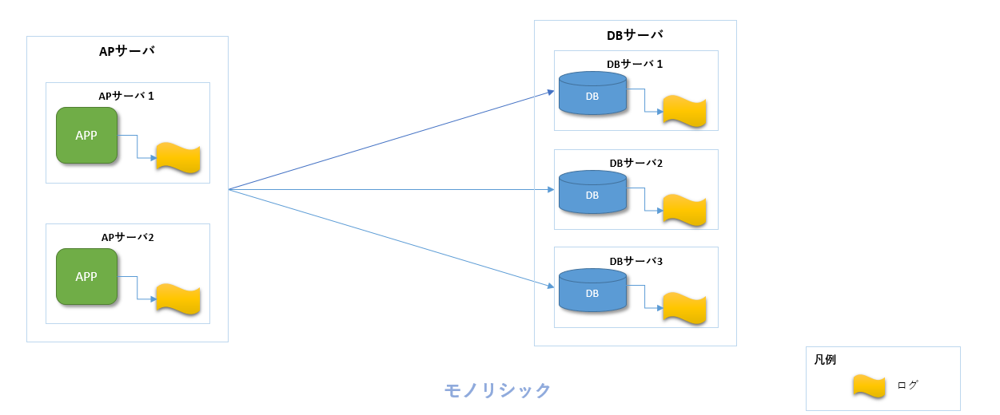
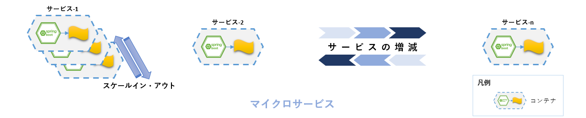
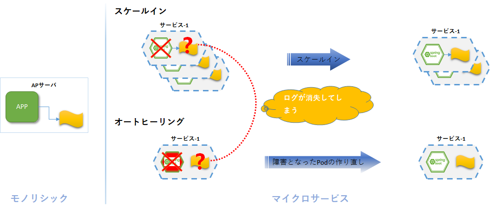
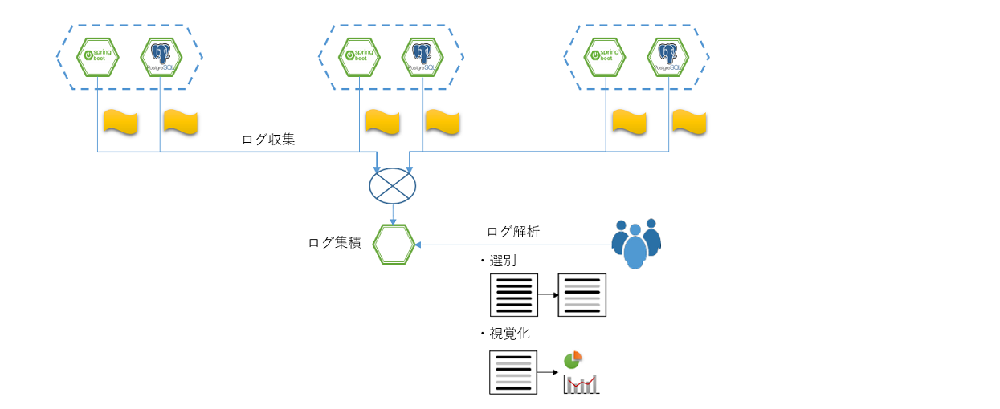
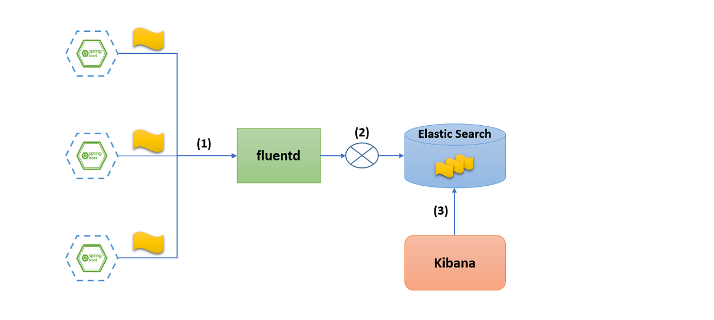
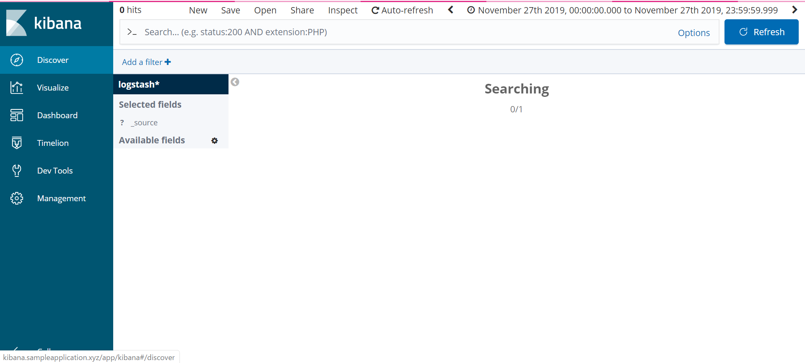
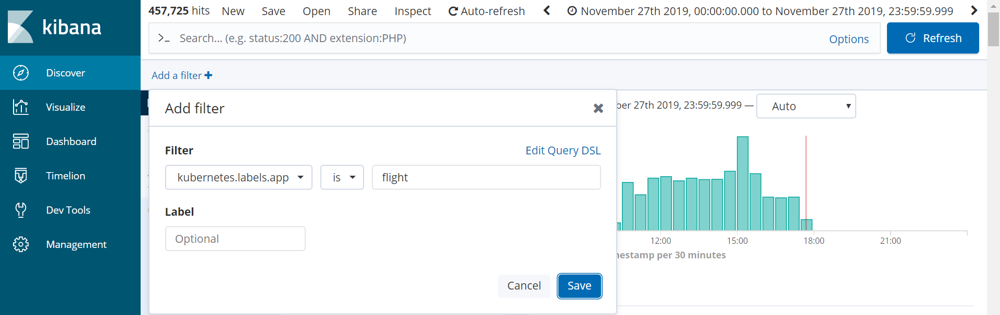
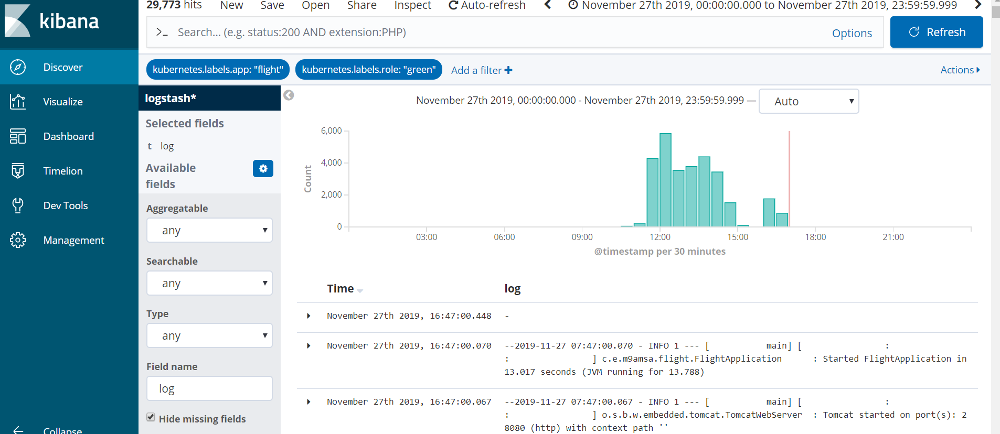

include::_include_all.adoc[]

[[log_aggregation]]
= ログ集中管理

[[log_aggregation_overview]]
== Overview

マイクロサービスアーキテクチャでは、ログ出力、ログ管理において下記の課題を抱える。

マイクロサービスが多数稼動するため、管理対象となるログ情報が多く管理が困難::
+
従来のモノリシックなアプリケーションと比べ、マイクロサービスアーキテクチャでは稼働するアプリケーション(マイクロサービス)が多数あり、管理対象となるログも多数存在する。
+
従来はアプリケーションの実行環境は仮想環境であっても動的に増減することはなかったため、ログの管理対象は固定的であり、また、対象数も比較的少なかった。
+

+
しかし、マイクロサービスアーキテクチャでは稼働するアプリケーション(マイクロサービス)が増えるだけではなく、個々のサービスがスケールアウトすることによって、ログの管理対象数が増加する。
+


オートヒーリング、オートスケールによりログの消失が発生::
+
各マイクロサービスのインスタンスを稼働させるコンテナではスケールアウト/イン、オートヒーリングによって増減したり、何かしらの原因で停止、削除されることに伴って、ログが消失してしまう。そのため、ファイル出力などコンテナ上で管理する形でログを保存することができない。
+


上記課題の解決を図るためログ集中管理アーキテクチャを導入する。



ログ集中管理アーキテクチャを導入することで、各コンテナインスタンスからログを収集、一元管理を行うとともに、柔軟なログの検索、解析を行うことが可能となる。

=== 処理方式

ログ集中管理アーキテクチャにはログ収集、ログ集積、ログ解析を行う各種OSSプロダクトが多数存在する。これらを組み合わせ利用することでログが分散するマイクロサービス環境下でのログ集中管理を実現する。

ログ収集::
ファイルや標準出力等からログデータをネットワークを介して収集し、フィルタやフォーマット変換などの機能ももつ。
+
サンプルアプリケーションではアプリケーションからのログは標準出力へ出力し、標準出力へ出力されたログを収集する。

ログ集積::
収集したログデータをデータベースなどに格納する。

ログ解析::
ログ集積により保存されているログデータを参照し、表示する。
+
洗練されたGUIなどを通して、柔軟な検索機能、グラフ化などの解析機能を提供する。


本ガイドラインでは、ログ収集、ログ集積、ログ解析を行うOSSプロダクトの中から、Kubernetes環境へ容易に導入することができるEFKスタックについて説明する。

==== EFKスタック

EFKスタックとは、Elastic Search, Fluentd, Kibana のセットであり、それぞれの頭文字を取ってこう呼ばれる。ログの収集、分析、視覚化のツール群である。

Elastic Search::
分散型RESTful検索/分析エンジンである。格納したすべてのデータへ高速にアクセスできる。
+
上述の説明におけるログ集積を担う。

Fluentd::
ログデータの収集を行うツールであり、収集したログデータを別システムへ転送する機能を提供する。
+
上述の説明におけるログ収集を担う。

Kibana::
データの可視化および調査を行うツールであり、ログ解析に使用する。
+
ヒストグラム、線グラフ、円グラフ、散布図など、様々なグラフ化機能を提供する。
+
上述の説明におけるログ解析を担う。



[cols="1,9", options="header"]
.EFKスタック
|===
|項番
|説明

|(1)
|Fluentdがすべてのコンテナからログを収集する。

|(2)
|収集されたログをElastic Searchに集積する。

|(3)
|利用者はKibanaのGUIを通して、Elastic Searchに集積されたログを解析する。
|===


[NOTE]
====
本ガイドラインではEFKスタックを使用するが、他のOSSによる組み合わせを使用することもできる。

* Elastic Stack
+
Elastic Stack(ELK Stack)は、Elasticsearch、Kibana、Beats、Logstashからなるプロダクト群である。 +
Elastic Stackを使えばあらゆるソースから、あらゆるフォーマットでデータを取得でき、リアルタイムに検索、分析、可視化することができる。 +
ロギングやAPM、セキュリティなど多くの用途に使われている。

* Amazon CloudWatch Logs
+
Amazon CloudWatch LogsはAWSのログサービスであり、Amazon EC2インスタンスやAWS CloudTrail、Route 53およびその他のソースに対してログファイルの監視、保存、アクセスを行うことができる。

* Stackdriver Logging
+
Stackdriver LoggingはGoogle Cloud Platform(GCP)のログサービスであり、GCPやAWSからのログデータやイベントを格納、検索、分析、モニタリング、通知することができる。
====

=== Kubernetes機能との関連

Kubernetesでは、コンテナ内の標準出力内容がログとして取り扱われる。 +
本ガイドラインでは、FluentdをKubernetesに導入し、Fluentdドライバを使用したコンテナで、コンテナ内の標準出力内容が指定したFluentdにログとして送信される。

[[log_aggregation_code_example]]
== Code example

=== EFKの導入

Elasticsearchのインストール::
+
下記のhelm install コマンドを使って、elastic-values.ymlを参照し、ログ集積ツールのelasticsearchをインストールする。
+
[source, sh]
----
$ helm install --name m9a-e --namespace default -f elastic-values.yml stable/elasticsearch
----
+
[source, yaml]
.elastic-values.yml
----
client:
  ingress:
    enabled: false # (1)
----
+
[cols="1,9a"]
|====
| 項番 | 内容

| (1) | サンプルアプリケーションでは、別途Ingressの設定を行っているため、helmインストールでElasticsearchのIngess設定を行わないよう設定している。
|====
+
ElasticsearchのHelm設定についてはlink:https://github.com/elastic/helm-charts/tree/master/elasticsearch[こちら]を参照すること

Fluentdのインストール::
+
下記のhelm install コマンドを使って、fluentd-values.ymlを参照し、ログ収集ツールのFluentdをインストールする。
+
[source, sh]
----
$ helm install --name m9a-f --namespace default -f fluentd-values.yml stable/fluentd-elasticsearch
----
+
[source, yaml]
.fluentd-values.yml
----
elasticsearch:
  host: m9a-e-elasticsearch-client # (1)
----
+
[cols="1,9a"]
|====
| 項番 | 内容

| (1) | elasticsearchのホスト名を指定する。
|====
+
FluentdのHelm設定についてはlink:https://github.com/helm/charts/tree/master/stable/fluentd-elasticsearch[こちら]を参照すること

Kibanaのインストール::
+
下記のhelm install コマンドを使って、kibana-values.ymlを参照し、ログ解析ツールのKibanaをインストールする。
+
[source, sh]
----
$ helm install --name m9a-k --namespace default -f kibana-values.yml --version 3.2.3 stable/kibana
----
+
[source, yaml]
.kibana-values.yml
----
env:
  ELASTICSEARCH_HOSTS: "http://m9a-e-elasticsearch-client:9200"
----
+
[cols="1,9a"]
|====
| 項番 | 内容

| (1) | elasticsearchのホスト名を指定する。
|====
+
KibanaのHelm設定についてはlink:https://github.com/helm/charts/tree/master/stable/kibana[こちら]を参照すること

=== アプリケーションのログ出力設定
サンプルアプリケーションでは、依存ライブラリに `spring-boot-starter-web` を指定しており、デフォルトで標準出力へ出力するログ設定が行われている。 +
そのためSpring bootアプリケーションとしてのログ設定は行わなくともよい。 +
Fluentdは標準出力/エラーに出力されているログが自動的に収集されるように設定されているため、特別な設定なしにKibanaによるログ確認が行える。

ただし、出力するログレベルや出力フォーマットを変更する場合は個別に設定する必要があるため、下記のように `application.yml` に設定を追記する。
[source, yaml]
.application.yml
----
# omitted

logging:
  level:
    org:
      springframework: INFO # (1)
      hibernate:
        SQL: debug # (1)
        type:
          descriptor:
            sql:
              BasicBinder: trace # (1)
          EnumType: trace # (1)
    com:
      example: INFO # (1)
      zaxxer: DEBUG # (1)
    root: ERROR # (1)
  pattern:
    # (2)
    console: '%clr(%d{${LOG_DATEFORMAT_PATTERN:-yyyy-MM-dd HH:mm:ss.SSS}}){faint}
      %clr(${LOG_LEVEL_PATTERN:-%5p}) %clr(${PID:- }){magenta} %clr(---){faint} %clr([%15.15t]){faint}
      [%16.16X{traceId}:%16.16X{parentSpanId}:%16.16X{spanId}] %clr(%-40.40logger{39}){cyan}
      %clr(:){faint} %m%n${LOG_EXCEPTION_CONVERSION_WORD:-%wEx}'

      #omitted
----

[cols="1,9a"]
|====
| 項番 | 内容

| (1) | ログ出力のエラーレベルは必要に応じて設定できる。
| (2) | ログフォーマットはカスタマイズ指定できる。本例はOpenTracingのspanId,traceIdなどをログに出力するように設定してある。
|====

=== ログの確認
Kibanaの画面を開いて、左側メニューのDiscoverボタンを押して、ログの表示画面が出る。



画面の `Add a filter` ボタンを押して、`kubernetes.labels.app` カラムを使うと、サービスを指定してログを見ることができる。



[NOTE]
====
サンプルアプリケーションでは、PodのLabelに下記の形式でサービス名を指定してある。
[source,yaml]
----
app: service name
----
上記例ではPodのLabel情報を使用してログのフィルタリングを行っている。
====

==== 削除されたPodのログを確認

スケールインなどでPodの削除に伴って消失したログも、Kibanaで表示することができる。

例として、下記ではフライトサービスの `Label role: green` のコンテナを削除し、その後削除されたコンテナのログをKibanaにて確認する。

[source, sh]
----
$ kubectl delete deployment.apps/flight-green -n stag
deployment.apps "flight-green" deleted
----

[NOTE]
====
サンプルアプリケーションでは、Blue-Greenデプロイメントを実現するため、Podのラベルは下記の設定となっている。

[source,yaml]
----
labels:
  app: service name
  role: blue or green
----

Pod名は `サービス名`-`ロール` としているため、上記コンテナは `flight` サービスの `green` ロールのコンテナを意味する。
====

下記に既に削除されたflightサービスのログを示す。



==== Kibanaで表示されるログについて

なお、Kibanaで表示されるログはFluentdによって標準出力へ出力されたログ情報であり、KubernetesのPodから取得するログ情報、ローカル環境にて実行時にコンソールに表示されるログ情報と同じ情報である。

**kubectl logs [pod name] で出力したログ**

```sh
$ kubectl logs -n stag pod/flight-green-5bb846f8f5-7t9cl
2019-11-27 07:46:16.188  INFO 1 --- [           main] trationDelegate$BeanPostProcessorChecker : Bean 'org.springframework.cloud.autoconfigure.ConfigurationPropertiesRebinderAutoConfiguration' of type [org.springframework.cloud.autoconfigure.ConfigurationPropertiesRebinderAutoConfiguration$$EnhancerBySpringCGLIB$$6c5915eb] is not eligible for getting processed by all BeanPostProcessors (for example: not eligible for auto-proxying)

  .   ____          _            __ _ _
 /\\ / ___'_ __ _ _(_)_ __  __ _ \ \ \ \
( ( )\___ | '_ | '_| | '_ \/ _` | \ \ \ \
 \\/  ___)| |_)| | | | | || (_| |  ) ) ) )
  '  |____| .__|_| |_|_| |_\__, | / / / /
 =========|_|==============|___/=/_/_/_/
 :: Spring Boot ::        (v2.1.6.RELEASE)

-2019-11-27 07:46:16.574 - INFO 1 --- [           main] [                :                :                ] c.e.m9amsa.flight.FlightApplication      : The following profiles are active: kubernetes
--2019-11-27 07:46:18.011 - INFO 1 --- [           main] [                :                :                ] .s.d.r.c.RepositoryConfigurationDelegate : Bootstrapping Spring Data repositories in DEFAULT mode.
--2019-11-27 07:46:18.257 - INFO 1 --- [           main] [                :                :                ] .s.d.r.c.RepositoryConfigurationDelegate : Finished Spring Data repository scanning in 233ms. Found 6 repository interfaces.

# omitted

--2019-11-27 07:47:00.067 - INFO 1 --- [           main] [                :                :                ] o.s.b.w.embedded.tomcat.TomcatWebServer  : Tomcat started on port(s): 28080 (http) with context path ''
--2019-11-27 07:47:00.070 - INFO 1 --- [           main] [                :                :                ] c.e.m9amsa.flight.FlightApplication      : Started FlightApplication in 13.017 seconds (JVM running for 13.788)
```

**ローカル端末でコンソール(標準出力)に出力されるログ**
```sh
2019-11-27 16:42:45.187  INFO 7960 --- [           main] trationDelegate$BeanPostProcessorChecker : Bean 'org.springframework.cloud.autoconfigure.ConfigurationPropertiesRebinderAutoConfiguration' of type [org.springframework.cloud.autoconfigure.ConfigurationPropertiesRebinderAutoConfiguration$$EnhancerBySpringCGLIB$$b5971f11] is not eligible for getting processed by all BeanPostProcessors (for example: not eligible for auto-proxying)

  .   ____          _            __ _ _
 /\\ / ___'_ __ _ _(_)_ __  __ _ \ \ \ \
( ( )\___ | '_ | '_| | '_ \/ _` | \ \ \ \
 \\/  ___)| |_)| | | | | || (_| |  ) ) ) )
  '  |____| .__|_| |_|_| |_\__, | / / / /
 =========|_|==============|___/=/_/_/_/
 :: Spring Boot ::        (v2.1.6.RELEASE)

-2019-11-27 16:42:45.658 - INFO 7960 --- [           main] [                :                :                ] c.e.m9amsa.flight.FlightApplication      : No active profile set, falling back to default profiles: default
--2019-11-27 16:42:46.485 - INFO 7960 --- [           main] [                :                :                ] .s.d.r.c.RepositoryConfigurationDelegate : Bootstrapping Spring Data repositories in DEFAULT mode.
--2019-11-27 16:42:46.572 - INFO 7960 --- [           main] [                :                :                ] .s.d.r.c.RepositoryConfigurationDelegate : Finished Spring Data repository scanning in 82ms. Found 6 repository interfaces.

# omitted

--2019-11-27 16:42:57.082 - INFO 7960 --- [           main] [                :                :                ] o.s.b.w.embedded.tomcat.TomcatWebServer  : Tomcat started on port(s): 28082 (http) with context path ''
--2019-11-27 16:42:57.085 - INFO 7960 --- [           main] [                :                :                ] c.e.m9amsa.flight.FlightApplication      : Started FlightApplication in 13.017 seconds (JVM running for 13.788)
```

[[log_aggregation_reference]]
== Reference
* https://www.fluentd.org[Fluentd]
** Fluentdの公式ページ
* https://www.elastic.co/jp/products/elasticsearch[Elastic Search]
** Elastic Searchの公式ページ
* https://www.elastic.co/jp/products/kibana[Kibana]
** Kibanaの公式ページ
* https://docs.aws.amazon.com/ja_jp/AmazonCloudWatch/latest/logs/WhatIsCloudWatchLogs.html[Amazon CloudWatch Logs(AWSのログサービス)]
** Amazon CloudWatch Logsの公式ドキュメント
* https://cloud.google.com/logging/docs/?hl=ja[Stackdriver Logging(GCPのログサービス)]
** Stackdriver Loggingの公式ドキュメント
