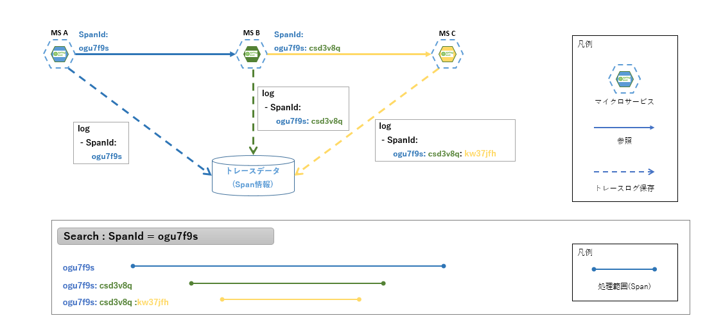
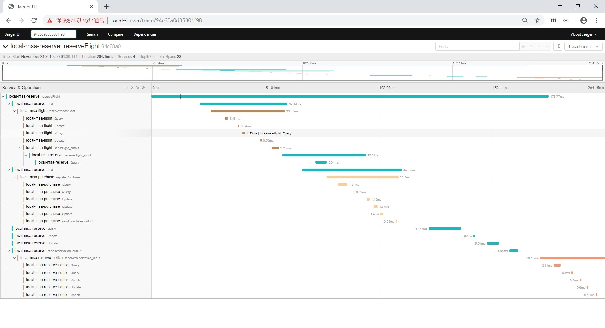

include::_include_all.adoc[]

[[distributed_tracing]]
= 分散トレーシング

[[distributed_tracing_overview]]
== Overview
アプリケーションを運用していくにあたって、障害や稼働実績の調査を行うことができるよう、一般的にログを出力し、管理する。

モノリシックなアプリケーションでは、処理をトレースするために調査するべきログファイルの出力場所、ログファイル名などは特定が容易な程度に決められており、調査対象はその限りにおいて明確であった。
また、単一のシステムで運用されるアプリケーションであれば、リクエスト単位での追跡も難しいものではなかった。

対して、複数のマイクロサービスで構成されるマイクロサービスアーキテクチャでは、クライアントからのリクエストを処理するために複数のマイクロサービスが関与し、同期・非同期連携して処理が行われる。
そのため、リクエストに対する処理状況の全体を把握するトレーサビリティの確保が難しくなる。

.トレーサビリティの比較

上図のように複雑な経路によって処理されるリクエストは、障害が発生した際、問題の特定や原因解明にかかるコストが大きくなりやすい。
また、遅延などリクエストレイテンシの悪化が発生した場合も、原因がどのサービスにあるのか、調査は困難を極める。

マイクロサービスアーキテクチャにおいて避けることのできないこうした問題に対処するための概念、仕組みが分散トレーシングである。
分散トレーシングを導入することによって、処理したリクエストをログ上で可視化し、連携して動作するマイクロサービスの実行順を明らかにし、トレーサビリティを確保する。

=== 処理方式

==== 分散トレーシングの構成
===== トレースデータ(Span情報)
SpanとTraceの概念について説明する。

. Span +
Spanとは、マイクロサービスアーキテクチャとして考える場合、リクエスト処理全体におけるマイクロサービス単位の処理範囲を表す。 +
サービスAから始まった処理をSpan-Aとする場合、連携して動作し、リクエスト処理の一部となるサービスBの処理Span-Bは、Span-A(Parent Span)の子(Child Span)という位置づけになる。

. Trace +
Traceとは、リクエスト単位の処理範囲を表す。 +
Spanで上げた例に倣うと、サービスAから始まりサービスB、サービスCと連携する処理がある場合、サービスAの処理開始からサービスB、サービスCの処理が終わり、サービスAがその処理結果を受けて自処理を終了するまでの各サービスのSpanすべてを含むのがTraceである。

.SpanとTrace

===== トレースデータ(Span情報)の収集
<<11_log_aggregation.adoc#log_aggregation,ログ集中管理>>で説明しているとおり、ログ情報は一元管理される必要があり、これはSpanId、TraceIdにも当てはまる。

トレースデータの収集にあたっては、各マイクロサービスのログをSpanId、TraceIdと紐づけて管理する機能が必要となる。
処理実行時に順次、生成されるSpanId、TraceIdの性質上、サービス側でIDを把握し、トレースデータのストアにプッシュする形になる。
また、調査に使用するためにはSpanId、TraceId、サービス名、処理が実行された時刻などをキーとした検索機能を備えている必要がある。

.トレースデータの収集

==== 分散トレーシング機能の実現

===== OpenTracing
OpenTracingとは分散トレーシングのために策定されたベンダに依存しないAPI仕様である。また、そのOSS実装として、JaegerやZipkinなどがサポートされている。

OpenTracingはトレースデータを管理するため、SpanとTraceにIDを付与するが、Spanの最上位となる開始SpanはTraceと一致することから、同じIDが付与される。

本ガイドラインでは、OpenTracingの実装として代表的なものの1つであるJaegerについて説明する。

===== Jaeger
Jaegerはトレースデータを伝搬、収集するための実装とトレースデータを可視化するUIを提供し、それによって分散トランザクションの監視、障害分析、サービスの依存関係分析などをサポートすることを目的としたOSSである。

Jaegerは下図の仕組みを用いてトレースデータを伝搬、収集し、解析ツールとしてのUIを提供している。

.Jaegerアーキテクチャ　_出典：https://www.jaegertracing.io/img/architecture-v1.png_
image:../images/12_distributed_tracing/jaeger_architecture-v1.png[width='750']

jaeger-client, jaeger-agent::
jaeger-clientはGo、Java、Pythonなど様々な言語に対応しており、jaeger-agentと協調しマイクロサービスにSpan情報を生成、伝搬する。

jaeger-agetn, jaeger-collector::
Span情報の収集を行う。

jaaeger-query, UI::
DBなどに収集したSpan情報を扱うAPIとUIを提供し、分析をサポートする。

[[distributed_tracing_code_example]]
== Code example

本アプリケーションではOpenTracingの主要な実装であるJaegerを利用し、分散トレーシングの実装を行っている。

OpenTracingにおけるSpanIdとTraceIdはリクエストごとに生成され、Jaegerサーバへトレース情報とともに送信される。
SpanIdとTraceIdはマイクロサービスのログへ自動的に出力されないため、ログ出力を行うための設定を行う必要がある。

サンプルアプリケーションではOpenTracingの動作設定に加え、障害調査、開発時のデバッグ情報確認などを目的として、SpanIdとTraceIdのログ出力を行う仕組みを追加実装している。

下記、その説明を行う。

=== サンプルコード一覧

Code exampleでは下記のファイルを使用する。

[cols="2,5"]
.msa-reserve(予約サービス)
|===
| ファイル名 | 内容

| pom.xml | 依存ライブラリの追加。
| application.yml | Jaegerサーバに関連する設定とログ出力に関する設定。
| OpenTracingConfig.java | カスタマイズMDCScopeManagerを設定するクラス。
| MDCScopeManager.java | MDCにSpanId、TraceIdを設定する処理クラス。
|===

[cols="2,5"]
.msa-env(環境設定)
|===
| ファイル名 | 内容

| env-configmap.yml | Jaegerサーバのホスト名を設定。
| jaeger-all-in-one-template.yml | Jaegerサーバ構築用のマニフェストファイル。
|===

=== 分散トレーシング設定例
==== アプリケーション側の設定例(予約サービス)
===== 依存ライブラリの追加
Spring Cloud Opentracingを使用するにあたっては下記の依存を追加する必要がある。

[source, xml]
.pom.xml
----
    <dependency>
        <groupId>io.opentracing.contrib</groupId>
        <artifactId>opentracing-spring-cloud-starter</artifactId> <!-- (1) -->
        <version>0.3.4</version>
    </dependency>
    <dependency>
        <groupId>io.opentracing.contrib</groupId>
        <artifactId>opentracing-spring-jaeger-cloud-starter</artifactId> <!-- (2) -->
        <version>2.0.3</version>
    </dependency>
----

[cols="1,10"]
|===
| 項番 | 説明

| (1) | Spring Cloud Opentracingの依存を追加する。
| (2) | tracerとしてJaegerを使用する。
|===

===== Jaegerサーバに関連する設定
Jaegerサーバのホスト名とマイクロサービスの表示名を設定する。

[source, yaml]
.msa-reserve: src/main/resources/application.yml
----
# omitted

opentracing:
  jaeger:
    service-name: ${JAEGER_SERVICENAME_RESERVE} # (1)
    udp-sender:
      host: ${JAEGER_HOST} # (2)
      port: 6831

      #omitted
----

[cols="1,10"]
|===
| 項番 | 説明

| (1) | Jaeger側は送信された分散トレーシング情報を、ここに設定されたサービス名に紐づけて管理する。(環境変数のJAEGER_SERVICENAME_RESERVEを参照)
| (2) | Jaegerサーバのホスト名を設定する。(環境変数のJAEGER_HOSTを参照)
|===

===== 環境変数の定義
環境変数のホスト名とマイクロサービスの表示名を設定する。

[source, yaml]
.msa-env: configmap.configmap_prod.yml
----
kind: ConfigMap
apiVersion: v1
metadata:
  name: m9amsa-configmap
  namespace: prod
data:
  # URLのベース文字列
  URL_ROOT: msaref

# omitted

  # JARGER情報
  JAEGER_HOST: jaeger-agent.default # (1)
  # JAEGERへ通知するサービス名称
  # (2)
  JAEGER_SERVICENAME_ACCOUNT: prod-msa-account
  JAEGER_SERVICENAME_FLIGHT: prod-msa-flight
  JAEGER_SERVICENAME_RESERVE: prod-msa-reserve

# omitted

----

[cols="1,10"]
|===
| 項番 | 説明

| (1) | Jaegerサーバのホスト名を定義する。
| (2) | Jaegerが分散トレーシング情報を識別するためのサービス名称を定義する。
|===

上記の依存追加、及び設定を行うことで、マイクロサービスはJaegerサーバと連携する。

==== SpanId、TraceIdのログ出力
MDCにSpanId、TraceIdを追加するために、カスタマイズMDCScopeManagerクラスを作成する。

[NOTE]
====
MDC(Mapped Diagnostic Context)はLogbackにおいて、ログにカスタマイズ情報を追加する仕組みである。

詳細は下記を参照すること。

link:http://www.intra-mart.jp/apidoc/v70/doclet/entire/jp/co/intra_mart/common/platform/log/MDC.html[MDCについて]

link:http://logback.qos.ch/manual/mdc.html[MDCクラス]
====

[source, java]
.msa-reserve: com.example.m9amsa.reserve.opentracing.MDCScopeManager.java
----
package com.example.m9amsa.reserve.opentracing;

import org.slf4j.MDC;

import io.jaegertracing.internal.JaegerSpanContext;
import io.opentracing.Scope;
import io.opentracing.Span;
import io.opentracing.util.ThreadLocalScopeManager;

public class MDCScopeManager extends ThreadLocalScopeManager { // (1)

    @Override // (2)
    public Scope activate(Span span, boolean finishOnClose) {
        return new ScopeWrapper(super.activate(span, finishOnClose), span);
    }

    @Override // (2)
    public Scope activate(Span span) {
        return new ScopeWrapper(super.activate(span), span);
    }

    // (3)
    private static class ScopeWrapper implements Scope {

        private final Scope scope;
        private final Span span;
        private final String previousTraceId;
        private final String previousSpanId;
        private final String previousParentSpanId;

        ScopeWrapper(Scope scope, Span span) {
            this.scope = scope;
            this.span = span;
            this.previousTraceId = lookup("traceId");
            this.previousSpanId = lookup("spanId");
            this.previousParentSpanId = lookup("parentSpanId");

            JaegerSpanContext ctx = (JaegerSpanContext) span.context();
            String traceId = ctx.getTraceId();
            String spanId = Long.toHexString(ctx.getSpanId());
            String parentSpanId = Long.toHexString(ctx.getParentId());

            replace("traceId", traceId);
            replace("spanId", spanId);
            replace("parentSpanId", parentSpanId);
        }

        @Override
        public void close() {
            this.scope.close();
            replace("traceId", previousTraceId);
            replace("spanId", previousSpanId);
            replace("parentSpanId", previousParentSpanId);
        }

        @Override
        public Span span() {
            return this.span;
        }
    }

    private static String lookup(String key) {
        return MDC.get(key);
    }

    private static void replace(String key, String value) {
        if (value == null) {
            MDC.remove(key);
        } else {
            MDC.put(key, value);
        }
    }
}

----

[cols="1,10"]
|===
| 項番 | 説明

| (1) | activate関数をカスタマイズするために、ThreadLocalScopeManagerクラスを継承する。 +
activate関数は、リクエストを受け付けてからコントローラ処理に入るまでの間に実行され、SpanID、TraceIDがMDCに追加される。
| (2) | activate関数をオーバーライドし、SpanId、TraceIdを追加されたScopeWrapperクラスを生成して返す。
| (3) | SpanId、TraceIdをMDCに追加するクラスである。
|===

OpenTracingの機能を利用するためのMDC設定としてMDCScopeManagerをBean定義するために、OpenTracingConfigクラスを作成する。

[source, java]
.msa-reserve: com.example.m9amsa.reserve.config.OpenTracingConfig.java
----
package com.example.m9amsa.reserve.config;

import org.springframework.context.annotation.Bean;
import org.springframework.context.annotation.Configuration;

import com.example.m9amsa.reserve.opentracing.MDCScopeManager;

import io.opentracing.contrib.java.spring.jaeger.starter.TracerBuilderCustomizer;

@Configuration
public class OpenTracingConfig {

    @Bean
    public TracerBuilderCustomizer mdcBuilderCustomizer() {
        return builder -> builder.withScopeManager(new MDCScopeManager()); // (1)
    }
}

----

[cols="1,10"]
|===
| 項番 | 説明

| (1) | カスタマイズMDCScopeManagerを指定する。
|===

コンソール出力のログパターンにSpanId、TraceId、ParentIDを設定する。

[source, yml]
.msa-reserve: src/main/resources/application.yml
----
# omitted

logging:
  level:
    org:
      springframework: INFO
      hibernate:
        SQL: debug
        type:
          descriptor:
            sql:
              BasicBinder: trace
          EnumType: trace
    com:
      example: INFO
      zaxxer: DEBUG
    root: ERROR
  pattern:
  # (1)
    console: "%clr(%d{${LOG_DATEFORMAT_PATTERN:-yyyy-MM-dd HH:mm:ss.SSS}}){faint} %clr(${LOG_LEVEL_PATTERN:-%5p}) %clr(${PID:- }){magenta} %clr(---){faint} %clr([%15.15t]){faint} [%16.16X{traceId}:%16.16X{parentSpanId}:%16.16X{spanId}] %clr(%-40.40logger{39}){cyan} %clr(:){faint} %m%n${LOG_EXCEPTION_CONVERSION_WORD:-%wEx}"

# omitted
----

[cols="1,10"]
|===
| 項番 | 説明

| (1) | ログパターン部分の [%16.16X{traceId}:%16.16X{parentSpanId}:%16.16X{spanId}] はMDCScopeManager.javaに設定されたものである。
|===

下記に、予約サービスで出力されるログの例を記載する。

[source,log]
----
 [           main] [7f4b7f6ca2c9e911:               0:7f4b7f6ca2c9e911] org.hibernate.SQL                        : // omitted
 [           main] [7f4b7f6ca2c9e911:               0:7f4b7f6ca2c9e911] o.h.type.descriptor.sql.BasicBinder      : binding parameter [1] as [VARCHAR] - [HND]
 [           main] [7f4b7f6ca2c9e911:               0:7f4b7f6ca2c9e911] org.hibernate.SQL                        : insert into airport (name, id) values (?, ?)
----

ログ中の `[7f4b7f6ca2c9e911:               0:7f4b7f6ca2c9e911]` と出力されている部分がマイクロサービスのログに出力されるトレーシング情報である。

`[TraceId: ParentSpanId: ChildSpanId]` のフォーマットで出力される。
例は同期連携元のログであるため、ParentSpanId=0となり、TraceIdとChildSpanIdが一致している。

=== Jaegerサーバ構築
Jaegerサーバの構築はjaeger-all-in-one-templateを使って構築する。 +
jaeger-all-in-one-template.ymlはJaeger公式サイトで提供し、Kubernetes上でJaegerサーバを構築するためのマニフェストファイルである。 +
提供されるymlファイルを使用することで簡単にJaegerサーバを構築できるため、本ガイドラインではHelmではなくjaeger-all-in-one-template.ymlを使用し、Jaegerサーバをインストールする。

[source, yaml]
.msa-env: jaeger.jaeger-all-in-one-template.yml
----
# omitted

apiVersion: v1
kind: List
items:
- apiVersion: extensions/v1beta1
  kind: Deployment
  metadata:
    name: jaeger
    labels:
      app: jaeger
      app.kubernetes.io/name: jaeger
      app.kubernetes.io/component: all-in-one
  spec:
    replicas: 1
    strategy:
      type: Recreate
    template:
      metadata:
        labels:
          app: jaeger
          app.kubernetes.io/name: jaeger
          app.kubernetes.io/component: all-in-one
        annotations:
          prometheus.io/scrape: "true"
          prometheus.io/port: "16686"
      spec:
          containers:
          -   env:
              - name: COLLECTOR_ZIPKIN_HTTP_PORT
                value: "9411"
              image: jaegertracing/all-in-one # (1)
              name: jaeger
              ports:
                - containerPort: 5775
                  protocol: UDP
                - containerPort: 6831
                  protocol: UDP
                - containerPort: 6832
                  protocol: UDP
                - containerPort: 5778
                  protocol: TCP
                - containerPort: 16686
                  protocol: TCP
                - containerPort: 9411
                  protocol: TCP
              readinessProbe:
                httpGet:
                  path: "/"
                  port: 14269
                initialDelaySeconds: 5
- apiVersion: v1
  kind: Service
  metadata:
    name: jaeger-query # (2)
    labels:
      app: jaeger
      app.kubernetes.io/name: jaeger
      app.kubernetes.io/component: query
  spec:
    ports:
      - name: query-http
        port: 80
        protocol: TCP
        targetPort: 16686
    selector:
      app.kubernetes.io/name: jaeger
      app.kubernetes.io/component: all-in-one
    type: ClusterIP
- apiVersion: v1
  kind: Service
  metadata:
    name: jaeger-collector
    labels:
      app: jaeger
      app.kubernetes.io/name: jaeger
      app.kubernetes.io/component: collector
  spec:
    ports:
    - name: jaeger-collector-tchannel
      port: 14267
      protocol: TCP
      targetPort: 14267
    - name: jaeger-collector-http
      port: 14268
      protocol: TCP
      targetPort: 14268
    - name: jaeger-collector-zipkin
      port: 9411
      protocol: TCP
      targetPort: 9411
    selector:
      app.kubernetes.io/name: jaeger
      app.kubernetes.io/component: all-in-one
    type: ClusterIP
- apiVersion: v1
  kind: Service
  metadata:
    name: jaeger-agent # (3)
    labels:
      app: jaeger
      app.kubernetes.io/name: jaeger
      app.kubernetes.io/component: agent
  spec:
    ports:
    - name: agent-zipkin-thrift
      port: 5775
      protocol: UDP
      targetPort: 5775
    - name: agent-compact
      port: 6831
      protocol: UDP
      targetPort: 6831
    - name: agent-binary
      port: 6832
      protocol: UDP
      targetPort: 6832
    - name: agent-configs
      port: 5778
      protocol: TCP
      targetPort: 5778
    clusterIP: None
    selector:
      app.kubernetes.io/name: jaeger
      app.kubernetes.io/component: all-in-one
- apiVersion: v1
  kind: Service
  metadata:
    name: zipkin
    labels:
      app: jaeger
      app.kubernetes.io/name: jaeger
      app.kubernetes.io/component: zipkin
  spec:
    ports:
    - name: jaeger-collector-zipkin
      port: 9411
      protocol: TCP
      targetPort: 9411
    clusterIP: None
    selector:
      app.kubernetes.io/name: jaeger
      app.kubernetes.io/component: all-in-one

----

[cols="1,10"]
|===
| 項番 | 説明

| (1) | jaegerのall-in-one Dockerイメージであり、このイメージを使って、コンテナを作成する。
| (2) | Jaeger UIのサービス定義である。
| (3) | Jaeger agentのサービス定義である。各マイクロサービスはこのサービス経由し、Jaegerへメッセージを送信する。
|===

=== 分散トレーシング運用例
参考情報として、JaegerUIに実際に表示されるトレーシング情報の画像を掲載する。

下記のように収集されたトレーシング情報が処理を実行したサービスごとに表示され、処理の親子関係が可視化される。

.Jaegerの画面サンプル

[[distributed_tracing_reference]]
== Reference
* https://opentracing.io[OpenTracing]
** OpenTracing公式ドキュメント
* https://www.jaegertracing.io/[Jaeger]
** Jaeger公式ドキュメント
* https://zipkin.io/[Zipkin]
** Zipkin公式ドキュメント
