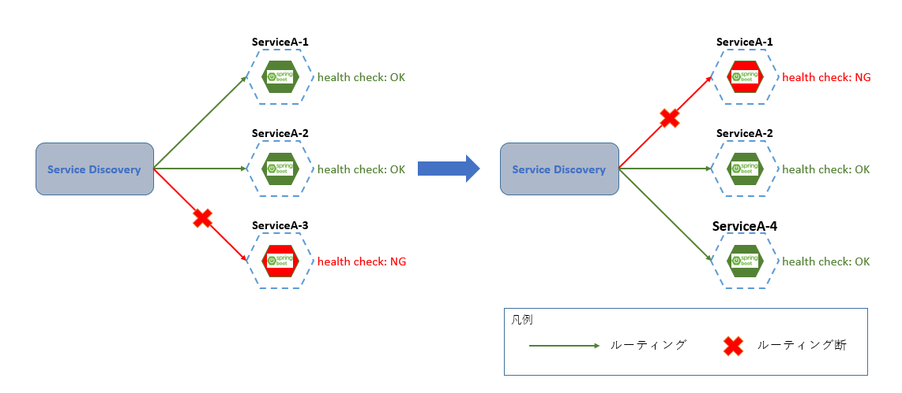
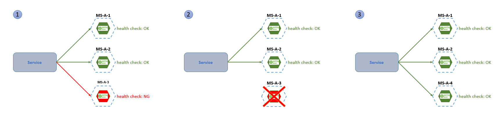
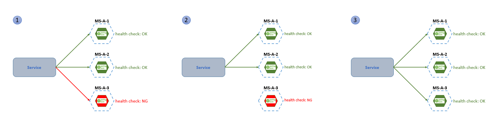
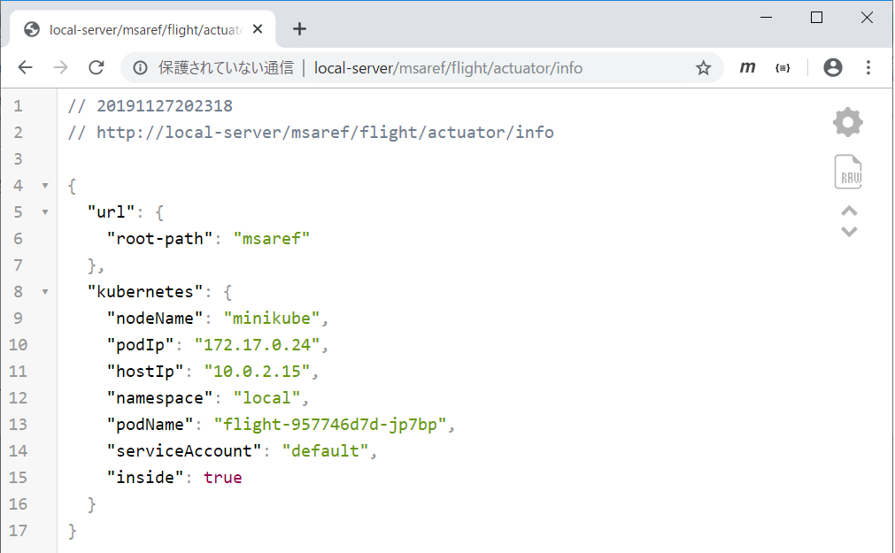
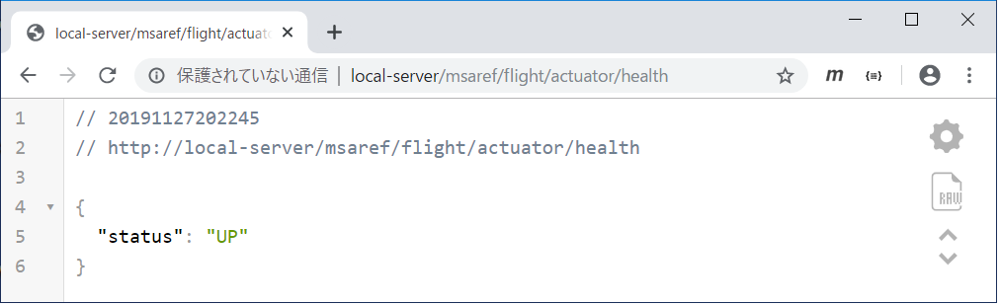
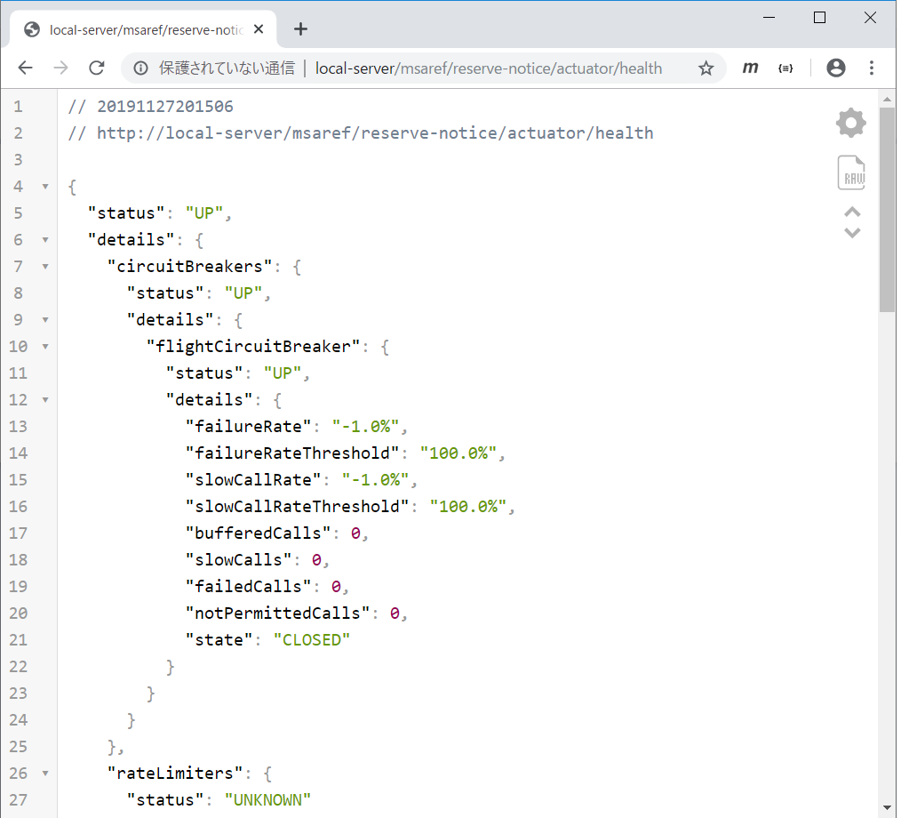
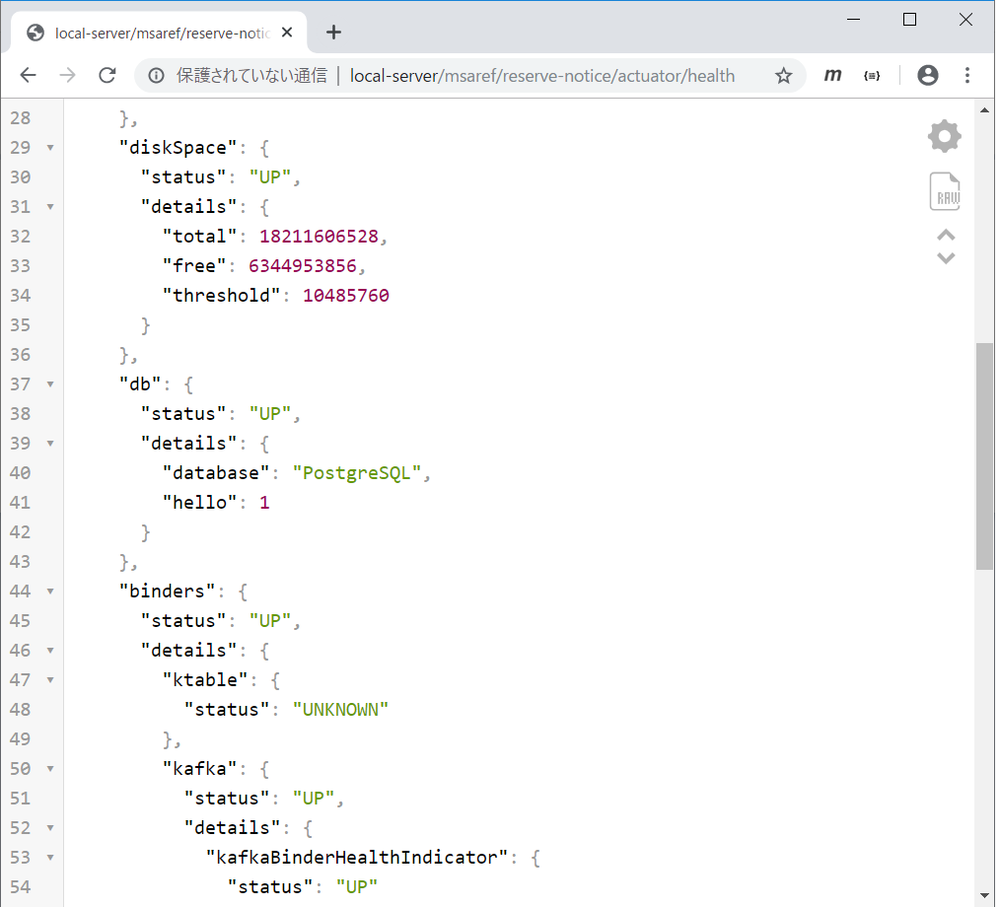
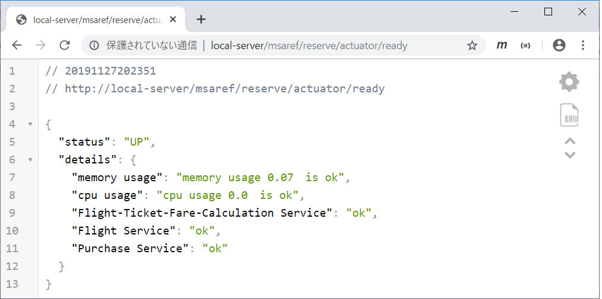

include::_include_all.adoc[]

[[healthcheck]]
= ヘルスチェック

[[healthcheck_overview]]
== Overview
アプリケーションには、運用監視を目的としてヘルスチェック機能を持たせることが多い。
アプリケーションが稼働状態にあるかどうかというステータスを返す機能を持たせることで、サービスの公開や非公開の判定が行われる。

マイクロサービスアーキテクチャでは、各マイクロサービスが配備するインスタンスへのルーティングを行う<<06_service_discovery.adoc#service_discovery,サービスディスカバリ>>がそうした稼働状況のチェックを行える必要がある。

マイクロサービスは可用性の確保を目的として複数のインスタンスを持ち、さらに、
単純に複数のインスタンスを稼働させるというだけではなく、負荷状況に応じてインスタンスを増減させたり、何らかの原因で正常に応答できなくなったインスタンスを削除、再配備するといった操作を自動化することが一般的である。

クライアントからのリクエストを処理する際、起動中、終了中のインスタンスや、過負荷で遅延しているようなインスタンスに処理を受け渡す事はサービスの可用性を低下させてしまう。

そのためにヘルスチェックを利用した適切なルーティングを行う。

.ヘルスチェックイメージ

. ヘルスチェックの結果がNGとなったServiceA-3をルーティングから外す
. 再配備したServiceA-4のヘルスチェックがOKであることを確認してルーティングを行う
. この間に過負荷などでヘルスチェックがNGとなったServcieA-1がルーティングから外れる

=== 処理方式
連携処理を行う他サービスやDBなどのデータストアとのコネクションを保持できているか、CPU使用率やメモリ使用状況などの負荷状況が適当な範囲内であるか、
といったインスタンスの状態を参照して、リクエストに対して正常に応答できるか否かを知らせる機能をマイクロサービスに実装する。

サービスディスカバリなどが、マイクロサービスが用意したヘルスチェック用のエンドポイントにリクエストを送信し、その応答を判定してルーティングの変更などを行う。

サンプルアプリケーションでは、マイクロサービスへの実装としてSpring BootアプリケーションであることからSpring Boot Actuatorを、
サービスディスカバリ側の設定としてKubernetesを前提としていることからLiveness Probe、Readiness Probeを採用している。

[[healthcheck_overview_springbootsctuator]]
==== Spring Boot Actuator
Spring Bootアプリケーションでは、ヘルスチェックなどをサポートする機能としてSpring Boot Actuatorが提供されている。

Spring Boot Actuatorでは様々な情報を取得できるエンドポイントが用意されており、アプリケーションのヘルス情報や設定したバージョン情報などが取得できる。
例として、デフォルトで有効となるエンドポイントを挙げる。

* health
  - ヘルス情報を返却する。デフォルト設定ではOK/NGのみを返すが、設定により詳細情報を返却させるなど拡張することが可能
* info
  - 任意に設定したアプリケーション情報を返却する

その他のエンドポイントについては https://docs.spring.io/spring-boot/docs/current/reference/html/production-ready-features.html#production-ready-endpoints[Spring Boot Actuatorのドキュメント]を参照すること。

=== Kubernetes機能との関連
Kubernetesではヘルスチェック機能としてLiveness ProbeとReadiness Probeが提供されている。

コンテナオーケストレーションプラットフォームとしてのヘルスチェックがLiveness Probe、サービスディスカバリとしてのヘルスチェックがReadiness Probeである。
それぞれ、ヘルスチェックを実施する方法として下記の3種類が用意されている。

exec::
コンテナ上でヘルスチェック用のコマンドを実行する方法。返り値が0であれば成功と判定される。

httpGet::
設定したパスにHTTPリクエストを送信し、レスポンスのステータスが200～399であれば成功と判定される。

tcpSocket::
ポート番号を指定してコンテナとのTCP通信を行う。コネクションが取得できれば成功と判定される。

httpGetにSpring Boot Actuatorのエンドポイントを指定することで、アプリケーションのヘルスチェック機能を利用する事ができる。
これにより、DBや同期連携先サービスのステータスを含んだ判定が可能となる。

==== Liveness Probe
Podの死活監視を行うための機能。このヘルスチェックが失敗した場合、オートヒーリングによるPodの再配備を実行する。

デッドロックや過負荷で応答を返せなくなっているPodをこれによって破棄することで、アプリケーション全体の可用性を向上させる。

.Liveness Probeイメージ

. Liveness Probeの死活監視にMS-A-3がNGを返す
. ServiceがMS-A-3をルーティングから外し、MS-A-3のPodが破棄される
. MS-A-3に替わってMS-A-4が配備され、Serviceは稼働状態のMS-A-4へルーティングを行う

==== Readiness Probe
Podの状態監視を行うための機能。このヘルスチェックが失敗したPodは、Serviceによるルーティングの対象から外される。

Liveness Probeと違い失敗してもPodの破棄は行われず、設定に従って定期的にチェックが実行される。一時的な負荷上昇などで応答できなくなっている間、他のPodに処理を振り分けるための設定である。
ヘルスチェックの結果が正常に戻ると、再びルーティングの対象に含まれる。

.Readiness Probeイメージ

. Readiness Probeの状態監視にMS-A-3がNGを返す
. ServiceがMS-A-3をルーティングから外す
. 正常に復帰したMS-A-3がReadiness Probeの状態監視にOKを返し、ServiceがMS-A-3へのルーティングを再開する

[[healthcheck_code_example]]
== Code example
サンプルアプリケーションでは、各サービスでヘルスチェックが行われている。

ここでは、Spring Boot ActuatorとKubernetesのLiveness Probe、Readiness Probeを用いたヘルスチェックについて説明する。

=== サンプルコード一覧
Code exampleでは下記のファイルを使用する。

[cols="4,6"]
.msa-reserve(予約サービス)
|===
| ファイル名 | 内容

| application.yml | 設定ファイル。
| deployment.yml | マニフェストファイル。
| deployment-db.yml | DBのマニフェストファイル。
| additional-spring-configuration-metadata.json | メタデータファイル。
| CustomReadyIndicator.java | メモリ・cpu使用率、連携処理を行う他サービスへの同期連携処理を確認するヘルスチェック。
|===

[cols="4,6"]
.msa-reserve-notice(予約通知サービス)
|===
| ファイル名 | 内容

| application.yml | 設定ファイル。
|===

[cols="4,6"]
.msa-flight(フライトサービス)
|===
| ファイル名 | 内容

| pom.xml | 依存ライブラリの追加。
|===

=== Spring Boot Actuatorの設定とカスタマイズについて
==== デフォルトのエンドポイント
Spring Boot Actuatorを使用するにあたって、下記の依存を追加する。
[source, xml]
.msa-flight: pom.xml
----
<dependency>
    <groupId>org.springframework.boot</groupId>
    <artifactId>spring-boot-starter-actuator</artifactId>
</dependency>
----

上記に示した依存を追加することで、デフォルトで `/actuator/info` と `/actuator/health` のエンドポイントが公開される。
それぞれの機能については<<healthcheck_overview_springbootsctuator,処理方式(Spring Boot Actuator)>>に記述したとおりである。

特別な実装を行わなくても `/actuator/info`、`/actuator/health` のエンドポイントが公開されるため、基本的なヘルスチェックはコードレスに実現できる。下記に実行結果を示す。

.デフォルト実装での/actuator/info実行結果

[[healthcheck_code_example_default_healthendpoint]]

.デフォルト実装での/actuator/health実行結果

==== エンドポイントのカスタマイズ
Spring Boot Actuatorには `/actuator/info` と `/actuator/health` 以外にも多くのエンドポイントが用意されている。
application.ymlに設定を追加することで、デフォルト設定では公開されていないこれらのエンドポイントを使用したり、`/actuator/health` エンドポイントのレスポンスからより詳細な情報を得ることもできる。
下記に設定方法を説明する。

[source, yml]
.msa-reserve-notice: src/main/resources/application.yml
----
server:
  port: 28080

# omitted

management:
  endpoint:
    health:
      show-details: always # (1)
  endpoints:
    web:
      exposure:
        include: "*" # (2)
----

[cols="1,10a"]
|===
| 項番 | 説明

| (1) | <<healthcheck_code_example_default_healthendpoint,デフォルトのエンドポイント(デフォルト実装での/actuator/health実行結果)>>で示したようにデフォルトでは `/actuator/health` を実行した際にUPまたはDOWNのみをレスポンスとして取得する。 +
サンプルアプリケーションでは、`management.endpoint.health.show-details` にalwaysを指定することで、より詳細な情報をユーザが取得できるようにカスタマイズしている。
| (2) |  `management.endpoints.web.exposure.include` に `*` を設定することで、公開指定されているエンドポイントをすべて公開することができる。
|===

.カスタマイズした/actuator/health実行結果_1

.カスタマイズした/actuator/health実行結果_2

ヘルスチェックをカスタマイズした結果、statusの他にdetailsが表示されていたり、他のヘルスチェック対象における詳細な情報も取得できており、デフォルト実装での `/actuator/health` 実行結果と比べ詳細な情報を取得できていることが確認できる。

==== Javaを用いたカスタマイズ
Spring Boot Actuatorのヘルスチェックではデフォルトでディスクの空き容量やメールサーバが稼働しているかなどを対象にヘルスチェックを行っており、`/actuator/health` エンドポイントにリクエストすることでこれらのヘルスチェックを行うことができる。
その他のヘルスチェック対象に関しては https://docs.spring.io/spring-boot/docs/current/reference/html/production-ready-features.html#auto-configured-healthindicators[Spring Boot Actuatorのドキュメント]を参照すること。

サンプルアプリケーションでは、 `/actuator/ready` エンドポイントを追加することでデフォルトで使用できるヘルスチェックに加えて、下記のヘルスチェックを追加実装している。

* 連携処理を行う他サービスとの疎通確認
* 負荷状況チェックとして、CPU、メモリ使用状況の参照

下記に、`/actuator/ready` エンドポイントの追加方法について説明する。

/actuator/readyエンドポイントの追加::
+
新たに `/actuator/ready` エンドポイントを追加する。
+
`/actuator/ready` エンドポイントでは下記のチェックを行い、サービスが実施可能かどうかを判定する。
+
* 連携先の `/actuator/health` エンドポイントを確認する事により、連携処理を行う他サービスとの疎通確認を行う
* 負荷状況チェックとして、Micrometer API を使用しCPU、メモリ使用状況を取得、計算し、基準を超えていないか確認する

[source, java]
.msa-reserve: com/example/m9amsa/reserve/actuate/CustomReadyIndicator.java
----
//omitted

@WebEndpoint(id = "ready") // (1)
@Component
public class CustomReadyIndicator {

    /**
     * 運賃計算サービスのFeignクライアント。
     */
    @Autowired
    private CalculateFareExternalMicroService calculateFareExternalMicroService; // (2)

    /**
     * フライトサービスのFeignクライアント。
     */
    @Autowired
    private FlightExternalMicroService flightExternalMicroService;

    /**
     * 購入サービスのFeignクライアント。
     */
    @Autowired
    private PurchaseExternalMicroService purchaseExternalMicroService;

    /**
     * メモリ使用率、cpu使用率を取得するクラス。
     */
    @Autowired
    private MeterRegistry meterRegistry;

    /**
     * メモリ使用率の閾値。
     */
    @Value("${m9amsa.actuator.health.threshold.memory}")
    private double memoryThreshold; // (3)

    /**
     * cpu使用率の閾値。
     */
    @Value("${m9amsa.actuator.health.threshold.cpu}")
    private double cpuThreshold; // (3)

// omitted

    @ReadOperation
    public Health ready() {
        Health.Builder builder = new Health.Builder();

        // for cpu and memory
        try {
            doHealthCheck(builder); // (4)
        } catch (Exception e) {
            builder.down(e); // (5)
        }

        // for Flight Ticket Fare Calculate
        try {
            doHealthCheckCalculateFare(builder); // (6)
        } catch (Exception e) {
            builder.down(e); // (7)
        }

// omitted

        return builder.build();
    }

    private void doHealthCheck(Builder builder) throws Exception {

        double memoryUsage = sumValues("jvm.memory.used") / sumValues("jvm.memory.max"); // (8)
        double cpuUsage = sumValues("system.cpu.usage"); // (9)

        boolean memoryIsOk = (memoryUsage <= memoryThreshold);
        boolean cpuIsOk = (cpuUsage <= cpuThreshold);

        if (memoryIsOk && cpuIsOk) {
            builder.up()//
                    .withDetail("memory usage", "memory usage " + decimalFormat.format(memoryUsage) + "　is ok")//
                    .withDetail("cpu usage", "cpu usage " + cpuUsage + "　is ok"); // (10)
        } else {
            builder.down(); // (11)
            // memory使用率が閾値を超えた場合のディテール情報
            if (!memoryIsOk) {
                builder.withDetail("memory usage",
                        "memory usage " + decimalFormat.format(memoryUsage) + " is over " + memoryThreshold);
            }
            // cpu使用率が閾値を超えた場合のディテール情報
            if (!cpuIsOk) {
                builder.withDetail("cpu usage", "cpu usage " + cpuUsage + " is over " + cpuThreshold);
            }
        }

    }

   private void doHealthCheckCalculateFare(Builder builder) throws Exception {

        try {

            HealthCheckStatusForEx healthCheckStatusForEx = calculateFareExternalMicroService.actuactorHealth(); // (12)

            if (healthCheckStatusForEx.getStatus().equals("UP")) {
                builder.up().withDetail("Flight-Ticket-Fare-Calculation Service", "ok"); // (13)
            } else {
                builder.down(); // (14)
                builder.withDetail("Flight-Ticket-Fare-Calculation Service", "DOWN");
                builder.withException(new Exception("FlightTopic-Ticket-Fare-Calculation Service down"));
            }

        } catch (FeignException e) {
            builder.down(e);
        }
    }

// omitted

    private double sumValues(String key) {
        return meterRegistry.get(key).meters().stream()
                .flatMap(m -> StreamSupport.stream(m.measure().spliterator(), false)).filter(m -> m.getValue() > 0)
                .collect(Collectors.summarizingDouble(Measurement::getValue)).getSum(); // (15)
    }

}

----

[cols="1,10a"]
|===
| 項番 | 説明

| (1) | エンドポイントに `/actuator/ready` を追加する。 +
ここで指定したidが、`/actuator` エンドポイントのidとして追加される。
| (2) | FeignClientを@Autowiredでインスタンス化する。 +
詳細は<<10_synchronization.adoc#synchronization,同期連携>>を参照すること。
| (3) | application.ymlで定義した閾値を設定する。(application.ymlの設定を参照)
| (4) | CPU使用率とメモリ使用率に応じたヘルスチェックを行う。
| (5) | (4)でエラーの場合はヘルスチェックを失敗とする。
| (6) | 運賃計算サービスとの疎通確認結果によるヘルスチェックを行う。
| (7) | (6)でエラーの場合はヘルスチェックを失敗とする。
| (8) | 取得する負荷状況の種類を指定する。 +
`jvm.memory.used` を指定することで現在使用されているメモリ量の測定値を求め、`jvm.memory.max` を指定することで使用可能なメモリの最大量を求めている。 +
メモリ使用量 / メモリ最大量をメモリ使用率として算出している。
| (9) | 取得する負荷状況の種類を指定する。 +
`system.cpu.usage` を指定することでCPU使用率を求めている。
| (10) | CPU使用率とメモリ使用率の両方が閾値下記の場合、ヘルスチェック結果を成功とし、CPU使用率とメモリ使用率に関する情報を追加する。
| (11) | (10)以外の場合はすべて、ヘルスチェック失敗とする。
| (12) | 運賃計算サービスにヘルスチェック処理を依頼し、結果を受け取る。
| (13) | 運賃計算サービスのヘルスチェックが成功の場合は、予約サービスのヘルスチェック結果を成功とする。
| (14) | 運賃計算サービスのヘルスチェックが失敗の場合は、予約サービスのヘルスチェック結果を失敗とする。
| (15) | Micrometerを使用し、指定されたメトリクス名で測定値を取得し取得した値の合計値を返す。
|===

./actuator/ready実行結果

ヘルスチェックをカスタマイズすることで、メモリ使用率、CPU使用率が表示され、連携処理を行う他サービスとの疎通確認もできていることが確認できる。

CPU使用率、メモリ使用率の閾値をプロパティ設定::
+
CPU使用率、メモリ使用率の閾値について設定を行う。

[source, yml]
.msa-reserve: src/main/resources/application.yml
----
server:
  port: 28080

# omitted

m9amsa:
  health:
    threshold:
      cpu: 0.8 # (1)
      memory: 0.8 # (2)

#omitted
----

[cols="1,10a"]
|===
| 項番 | 説明

| (1) | 新たにプロパティを定義し、CPU使用率の閾値を設定する。
| (2) | 新たにプロパティを定義し、メモリ使用率の閾値を設定する。
|===

新規追加プロパティの定義::
+
新規に追加したCPU使用率閾値、メモリ使用率閾値について定義する。

[source, json]
.msa-reserve: src/main/resources/META-INF/additional-spring-configuration-metadata.json
----
{"properties": [
  {
    "name": "m9amsa.health.threshold.memory",
    "type": "java.lang.Double",
    "description": "ヘルスチェック用のメモリ使用率の閾値です"
  },
  {
    "name": "m9amsa.health.threshold.cpu",
    "type": "java.lang.Double",
    "description": "ヘルスチェック用のcpu使用率の閾値です"
  }
]}
----

[cols="1,10a"]
|===
| キー | 説明

| name | application.ymlで新たに定義したプロパティの名前を指定する。
| type | application.ymlで新たに定義したプロパティのデータ型を指定する。
|===

=== Kubernetesのヘルスチェック設定
==== Liveness Probeの設定
マニフェストファイルにLiveness Probeの設定を追加する方法を説明する。

サンプルアプリケーションでは、ヘルスチェックの方法としてHTTPリクエストを設定している。
`/actuator/health` エンドポイントを指定することで、Spring Boot Actuatorと組み合わせたヘルスチェックを設定することができる。

Liveness Probeでの設定によりヘルスチェックに失敗した際には、オートヒーリングが行われる。

[source, yml]
.msa-reserve: manifest/deployment.yml
----
apiVersion: apps/v1
kind: Deployment
metadata:
  name: reserve-${TARGET_ROLE}
  labels:
    app: reserve

# omitted

spec:
    replicas: 1 # (1)

# omitted

  template:

# omitted

    spec:
      containers:
      - name: reserve

# omitted
        livenessProbe:
          httpGet: # (2)
            path: /actuator/health # (3)
            port: 28080
          initialDelaySeconds: 25 # (4)
          periodSeconds: 10 # (5)
        readinessProbe:
          httpGet:
            path: /actuator/ready
            port: 28080
          initialDelaySeconds: 25
          periodSeconds: 10
----

[cols="1,10a"]
|===
| 項番 | 説明

| (1) | ヘルスチェックが失敗し、オートヒーリングを行う際にはここで指定したPod数になるように再配備を行う。
| (2) | HTTPリクエストを送信することでヘルスチェックを行う。
| (3) | ヘルスチェックを実行するためのリクエスト先として、`/actuator/health` エンドポイントを指定する。
| (4) | 最初のヘルスチェックを行うまでの初期待機時間を25秒とする。
| (5) | 10秒ごとにヘルスチェックを実行する。
|===

==== Readiness Probeの設定
マニフェストファイルにReadiness Probeの設定を追加する方法を説明する。

===== アプリケーションへのReadiness Probeの設定
アプリケーションへのReadiness Probeの設定では、ヘルスチェックの方法としてHTTPリクエストを設定している。
`/actuator/ready` エンドポイントを指定することで、マイクロサービスに実装した拡張ヘルスチェック処理を利用することができる。

[source, yml]
.msa-reserve: manifest/deployment.yml
----
apiVersion: apps/v1
kind: Deployment
metadata:
  name: reserve-${TARGET_ROLE}
  labels:
    app: reserve

# omitted

spec:

# omitted

  template:

# omitted

    spec:
      containers:
      - name: reserve

# omitted
        livenessProbe:
          httpGet:
            path: /actuator/health
            port: 28080
          initialDelaySeconds: 25
          periodSeconds: 10
        readinessProbe:
          httpGet: # (1)
            path: /actuator/ready # (2)
            port: 28080
          initialDelaySeconds: 25 # (3)
          periodSeconds: 10 # (4)
----

[cols="1,10a"]
|===
| 項番 | 説明

| (1) | HTTPリクエストを送信することでヘルスチェックを行う。
| (2) | ヘルスチェックを実行するためのリクエスト先として、`/actuator/ready` エンドポイントを指定する。
| (3) | 最初のヘルスチェックを行うまでの初期待機時間を25秒とする。
| (4) | 10秒ごとにヘルスチェックを実行する。
|===

[[healthcheck_reference]]
== Reference
* https://kubernetes.io/ja/docs/concepts/workloads/pods/pod-lifecycle/[Pod Lifecycle]
** Podのライフサイクルに関するKubernetesのドキュメント
* https://docs.spring.io/spring-boot/docs/current/reference/html/production-ready-features.html#production-ready[Spring Boot Actuator]
** Spring Boot Actuatorの公式ドキュメント
