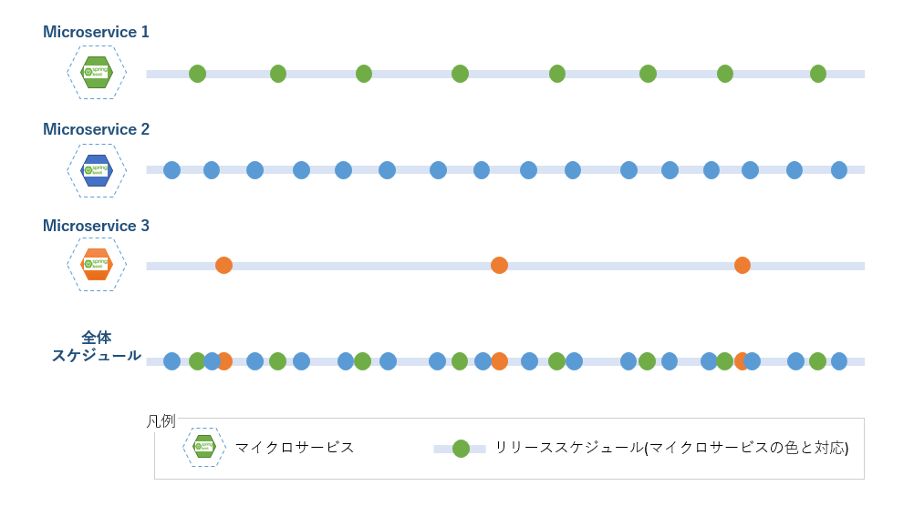

include::_include_all.adoc[]

[[deployment_section]]
= デプロイメント

[[deployment_overview]]
== Overview
マイクロサービスアーキテクチャにおけるデプロイメントは従来のデプロイメントと比べ、いくつかの考慮点がある。

頻繁なリリースの実現::
+
マイクロサービスアーキテクチャでは多数のサービスが稼働しており、個々のマイクロサービスは固有の要件により異なるリリーススケジュールを持っている。
新規マイクロサービスのリリースや、既存マイクロサービスの改修後リリースはそれぞれリリースタイミングが違うため、すべてのマイクロサービスが同じリリーススケジュールでリリースすることができない。
場合によって、緊急リリースなどの要望もしばしばある。 +
上記理由により、マイクロサービスアーキテクチャでは共通的なリリーススケジュールを持たせずに、個々のスケジュールに基づいてデプロイすることが一般的である。
+
異なるリリーススケジュールをもつマイクロサービスの数が増えるほど、システム全体におけるデプロイ頻度も高くなる。
+
.マイクロサービスのリリーススケジュール図

リリースにおける影響範囲の局所化::
+
個々のマイクロサービスをデプロイする度に、システムを広範囲に渡り停止する必要があると、システムとしてサービス提供できない時間が延びる。 +
可用性の向上はマイクロサービスアーキテクチャ導入の重要な目的でもあるため、そのようなデプロイは行ってはいけない。
+
デプロイによるシステムへの影響を最小限にするため、停止箇所は局所化する必要がある。

無停止デプロイの実現::
+
システムの可用性を考慮した際、局所化されているとはいえ、デプロイによる部分的なシステム停止は出来るだけ短時間である方がよい。 +
マイクロサービスアーキテクチャでは、多数のマイクロサービスが日々システムにデプロイされるため、部分的なシステム停止でもその影響は大きくなる。 +
したがって、マイクロサービスアーキテクチャでは、可能な限り無停止でのデプロイが要求される。
+
無停止デプロイの実現により、システムの可用性は確実に向上する。

デプロイの自動化::
+
上述のように、多数のマイクロサービスで構成されるシステムでは、日々頻繁にデプロイが発生する。デプロイ回数が増えるとデプロイに起因する障害の発生率も確実に高くなる。
+
人為的なデプロイミスを避けるため、デプロイ作業自体の自動化を行う。人手による日に何度ものデプロイ作業は現実的に行うことはできない事もあり、デプロイの自動化は必須となる。

デプロイ時間の短縮::
+
さらに、デプロイ自体の作業時間が長くなると、そもそも頻繁なデプロイは実現できない。 +
マイクロサービスの価値を最大化するため、デプロイにかける時間は可能な限り短時間に済ませられることが望ましい。
+
なお、デプロイした資材の問題や、不具合の発覚などによりデプロイを差し戻さなければならない場合がある。 +
その場合、問題のある新モジュールから安定稼働していた旧モジュールへ切り替える必要があるが、この切り戻し作業自体も無停止かつ短時間に行える必要がある。 +
切り戻しがスムーズに行えない、もしくは長時間かかる場合、デプロイ作業自体のリスクが高く、頻繁なリリースは実現できない。

これらの要求を実現する手法として、本ガイドラインでは、マイクロサービスアーキテクチャにおけるデプロイ手法の中からBlue-Green Deploymentを採用している。

=== 処理方式
==== Blue-Green Deploymentとは

Blue-Green Deploymentとは、事前に二つのアプリケーション環境(blueとgreen)をそれぞれ用意し、
新旧二つのバージョンに対しアクセスの振り向け先を切り替えるアプリケーションのデプロイ手法である。

特徴として、デプロイによるシステム停止時間を殆ど0にすることが可能であり、
また、障害発生時の旧バージョンへの切り戻しも振り向け先の変更で済むため、容易に、かつ短時間に行うことが可能となる。

==== Blue-Green Deploymentの仕組み

リリース前にblue環境が稼働しているアプリケーションを例とする。 +
新しいバージョンのアプリケーションを待機状態のgreen環境にデプロイする。 +
ルータの振り向け先をblueからgreenに切り替えるとユーザからのリクエストがすべてgreenに向くようになり、
新しいモジュールがリリースできる。その後、blue環境が待機状態となる。

.Blue-Green Deployment概念図

障害が発生した場合もgreen環境からblue環境へ迅速な切り戻しが可能となる。

==== Blue-Green Deploymentの流れ

下記に、MicroserviceA、MicroserviceBを例にとって、Blue-Green Deploymentの流れを説明する。

STEP1 : blue環境に初回デプロイを行う::
+
MicroserviceA(Ver：1.0)とMicroserviceB(Ver：1.0)をそれぞれのblue環境にデプロイする。
ルータの振り向け先をblueに指定すると、クライアントからのMicroserviceA、MicroserviceBへのアクセスはblue環境側で処理される。
+
.Blue-Green Deployment STEP-1

STEP2 : 新バージョン(Ver：1.1)のMicroserviceAをデプロイする::
+
新バージョン(Ver：1.1)のMicroserviceAをgreen環境としてデプロイを行う。 +
現在、blue環境が稼働しているため、green環境は待機系として扱われる。 +
デプロイ作業において、稼働中のMicroserviceA(Ver：1.0)、MicroserviceB(Ver：1.0)は停止の必要がない。

.Blue-Green Deployment STEP-2

STEP3 : ルータの振り向け先をgreen環境に変更する::
+
MicroserviceAに対応するルータの振り向け先をblue環境からgreen環境へ変更する。 +
クライアントからのMicroserviceAへのアクセスはgreen環境で処理し、blue環境は待機状態となる。 +
上記のとおりBlue-Green Deploymentでは、マイクロサービスを無停止でデプロイすることができる。
+
Blue-Green Deploymentはアプリケーション単位(この場合マイクロサービス単位)に行われるため、
MicroserviceAのデプロイは独立して行われ、MicroserviceBは停止や、ルータ切り替えなどの影響を受けない。

.Blue-Green Deployment STEP-3

切り戻し : ルータの振り向け先の変更::
+
新バージョンのMicroserviceA(Ver：1.1)に問題が発生した場合、ルータの振り向け先を元のblue環境に指定し、切り戻しを行う。 +
Blue-Green Deploymentでは、マイクロサービスを無停止で切り戻すことができる。

.Blue-Green Deploymentにおける切り戻し

[[deployment_code_example]]
== Code example
ここではKubernetes上で、Blue-Green Deploymentを実現する方法を説明する。

image:../images/14_deployment/deployment_code_example_01.png[width="860"]

[cols="1,10"]
|===
| 項番 | 説明

| (1) | namespaceにより本番環境、検証環境などの環境を表現する。
| (2) | Podのラベルを用いてデプロイのblue/greenを識別する。
| (3) | blue/greenの2つのPodはServiceでラベルを指定することで切り替えを行う。
| (4) | アプリケーションのバージョンはDockerイメージのタグで表現する。
|===

=== サンプルコード一覧
ファイルの全体構成を下記に示す。

[cols="4,5"]
|===
| ファイル名 | 内容
| deployment.yml | アプリのマニフェストテンプレートファイル。
| service.yml | アプリサービスのマニフェストテンプレートファイル。
| deploy.sh | デプロイを行うシェルスクリプト。
| switch.sh | blue/greenを切り替えるシェルスクリプト。
|===

=== deployment.yml
* アプリケーションコンテナ用マニフェストファイル。deploy.shにより動的にサービス名、バージョン(Dockerイメージタグ)、デプロイ先ラベル(blue/green)を書き換えるため、テンプレートファイルとして用意する。

[source, yaml]
.deployment.yml
----
apiVersion: apps/v1
kind: Deployment
metadata:
  name: flight-${TARGET_ROLE} # (1)
  labels:
    app: flight
    role: ${TARGET_ROLE} # (1)
spec:
  replicas: 1
  selector:
    matchLabels:
      app: flight
  template:
    metadata:
      labels:
        app: flight
        role: ${TARGET_ROLE} # (1)
    spec:
      containers:
      - name: flight
        image: ${TARGET_IMAGE} # (2)
        imagePullPolicy: IfNotPresent
        ports:
        - containerPort: 28080
        envFrom:
        - configMapRef:
            name: m9amsa-configmap
----

[cols="1,10"]
|===
| 項番 | 説明

| (1) | deploy.shによりデプロイ先の`role`ラベル(blue/green)を書き換える。
| (2) | deploy.shによりデプロイアプリのDockerイメージタグを書き換える。
|===

[source, yaml]
.deployment.ymlの置換想定例
----
apiVersion: apps/v1
kind: Deployment
metadata:
  name: flight-blue # (1)
  labels:
    app: flight
    role: blue # (1)
spec:
  replicas: 1
  selector:
    matchLabels:
      app: flight
  template:
    metadata:
      labels:
        app: flight
        role: blue # (1)
    spec:
      containers:
      - name: flight
        image: flight:60.1706642a # (2)
        imagePullPolicy: IfNotPresent
        ports:
        - containerPort: 28080
        envFrom:
        - configMapRef:
            name: m9amsa-configmap
----

=== service.yml
* アプリケーションコンテナ用マニフェストファイル。deploy.shにより動的にサービス名、バージョン(Dockerイメージタグ)、デプロイ先ラベル(blue/green)を書き換えるため、テンプレートファイルとして用意する。

[source, yaml]
.service.yml
----
apiVersion: v1
kind: Service
metadata:
  name: flight
  labels:
    role: ${TARGET_ROLE} # (1)
spec:
  type: ClusterIP
  selector:
    app: flight
    role: ${TARGET_ROLE} # (1)
  ports:
  - port: 80
    targetPort: 28080
----

[cols="1,10"]
|===
| 項番 | 説明

| (1) | deploy.sh/switch.shによりデプロイ先の`role`ラベル(blue/green)を書き換える。
|===

[source, yaml]
.service.ymlの置換想定例
----
apiVersion: v1
kind: Service
metadata:
  name: flight
  labels:
    role: green # (1)
spec:
  type: ClusterIP
  selector:
    app: flight
    role: green # (1)
  ports:
  - port: 80
    targetPort: 28080
----

=== deploy.sh
* デプロイを行うシェルスクリプトである。現在稼働中のラベル(blue/green)をもとめ、デプロイ先のラベル(blue/green)を動的に切り替える。パラメータとしてサービス名、Dockerイメージのバージョン(タグ)を指定する。

[source, shell]
.deploy.sh
----
#!/bin/bash

# omitted

TARGET_SERVICE=$1 # account, flight, flight-ticket-fare-calculation, purchase, purchase-notice, reserve, reserve-notice
TARGET_VERSION=$2
TARGET_ENV=$3
TARGET_MACHINE=$4

MANIFESTS_PATH="/var/lib/jenkins/workspace/msa-manifests"
AWS_REPO_PATH="repo.sampleapplication.xyz"

# omitted

if [ "${TARGET_ENV}" != "prod" ]; then
    TARGET_ENV="stag"
fi

TARGET_IMAGE=""
if [ "${TARGET_MACHINE}" == "local" ]; then
    TARGET_IMAGE="${TARGET_SERVICE}:${TARGET_VERSION}"
    MANIFESTS_PATH="./msa-manifests"
else
    TARGET_IMAGE="${AWS_REPO_PATH}\/${TARGET_SERVICE}:${TARGET_VERSION}"
fi

# (1)
CURRENT_ROLE=`kubectl get svc ${TARGET_SERVICE} -L role -n ${TARGET_ENV} | awk '{if(NR>1) print $7}'`

# (2)
if [ "${CURRENT_ROLE}" == "green" ]; then
    TARGET_ROLE="blue"
else
    TARGET_ROLE="green"
fi

# omitted

# (3)
kubectl delete deploy ${TARGET_SERVICE}-${TARGET_ROLE} -n ${TARGET_ENV}

# (4)
cat "${MANIFESTS_PATH}/${TARGET_SERVICE}/${TARGET_VERSION}/deployment.yml" | sed 's/\${TARGET_ROLE}'"/${TARGET_ROLE}/g" | sed 's/\${TARGET_IMAGE}'"/${TARGET_IMAGE}/g"| kubectl apply -n ${TARGET_ENV} -f -

i=0
availableCnt=0
max_count=180

# (5)
while [ $i -lt $max_count ];
do
    availableCnt=`kubectl get deploy ${TARGET_SERVICE}-${TARGET_ROLE} -n ${TARGET_ENV} | awk '{if(NR>1) print $4}'`
    printf "$i Available Count ======  ${availableCnt}\n"

    sleep 1

    if (( availableCnt > 0 )); then
        printf "Deployment apply success!  ${availableCnt}\n"
        break;
    fi

    i=$(( $i + 1 ))

done

if (( availableCnt > 0 )); then
# (6)
    cat "${MANIFESTS_PATH}/${TARGET_SERVICE}/${TARGET_VERSION}/service.yml" | sed 's/\${TARGET_ROLE}'"/${TARGET_ROLE}/g" | kubectl apply -n ${TARGET_ENV} -f -
    printf "Deployment complete! "

    sleep 1
    kubectl get service -n ${TARGET_ENV} | grep -E "(NAME|${TARGET_SERVICE})"
    kubectl get po -n ${TARGET_ENV} | grep -E "(NAME|${TARGET_SERVICE})"
else
    printf "Deployment failed!!!  ${availableCnt}\n"
    exit 1
fi

----

[cols="1,10"]
|===
| 項番 | 説明

| (1) | kubectl get コマンドを使って、現在serviceに設定されている`role`を取得する。
| (2) | デプロイ後に稼働系とする`role`を決める。
| (3) | deployment.ymlのimage名がデプロイ済みのものと同じ場合、imageのpullが実行されずPodが差し替わらない。それを回避するために、既存のdeploymentを削除してからデプロイを行う。
| (4) | アプリのマニフェストテンプレートファイル(deployment.yml)を書き換える。TARGET_ROLEを(2)で決めたblue/greenに、TARGET_IMAGEをパラメータのサービス名とバージョンに置換し、kubectl applyコマンドで置換されたマニフェストファイルを適用する。
| (5) | デプロイの完了まで待つ。
| (6) | アプリサービスのマニフェストテンプレートファイル(service.yml)を書き換える。TARGET_ROLEを(1)で決めたblue/greenに置換し、kubectl applyコマンドで置換されたマニフェストファイルを適用する。
|===

=== deploy.sh実行前後の結果を確認
[source, shell]
.deploy.sh実行前
----
$ kubectl describe service flight -n prod
Name:              flight
Namespace:         prod
Labels:            role=blue # (1)
Annotations:       kubectl.kubernetes.io/last-applied-configuration:
                     {"apiVersion":"v1","kind":"Service","metadata":{"annotations":{},"labels":{"role":"blue"},"name":"flight","namespace":"prod"},"spec":{"por...
Selector:          app=flight,role=blue # (1)
Type:              ClusterIP
IP:                10.100.5.100
Port:              <unset>  80/TCP
TargetPort:        28080/TCP
Endpoints:         192.168.19.148:28080
Session Affinity:  None
Events:            <none>

$ kubectl get pod -n prod
NAME                             READY   STATUS    RESTARTS   AGE
flight-blue-6dcfcb8479-j4lzg     1/1     Running   0         7h10m
flight-green-847c7f654b-7bd55    1/1     Running   0         7h10m # (2)

$ kubectl describe deployment flight-green -n prod
Name:                   flight-green
Namespace:              prod
CreationTimestamp:      Fri, 15 Nov 2019 01:25:20 +0000
Labels:                 app=flight
                        role=green

# omitted

  Containers:
   flight:
    Image:      repo.sampleapplication.xyz/flight:59.bb48438c # (3)
    Port:       28080/TCP

# omitted
----

[cols="1,10"]
|===
| 項番 | 説明

| (1) | 実行前、サービスの`role`がblueになっている。
| (2) | 実行前、podのhashは7bd55であり、Ageが最新ではない。
| (3) | 実行前、コンテナがflightの59.bb48438cイメージを元に生成されている。
|===

[source, shell]
.deploy.sh実行&結果確認
----
# (1)
$ ./deploy.sh flight 60.1706642a prod
TARGET_SERVICE : flight
TARGET_VERSION : 60.1706642a
TARGET_ENV : prod
TARGET_ROLE  ======  green
TARGET_ENV   ======  prod
TARGET_IMAGE ======  repo.sampleapplication.xyz\/flight:60.1706642a
deployment.extensions "flight-green" deleted
deployment.apps/flight-green created
0 Available Count ======  0
1 Available Count ======  0
2 Available Count ======  0
3 Available Count ======  1
Deployment apply success!  1
service/flight configured
Deployment complete! NAME                             TYPE        CLUSTER-IP     EXTERNAL-IP   PORT(S)    AGE
flight                           ClusterIP   10.100.5.100   <none>        80/TCP     29d
NAME                             READY   STATUS    RESTARTS   AGE
flight-blue-6dcfcb8479-j4lzg     1/1     Running   65         7h20m
flight-green-847c7f654b-vzzg7    1/1     Running   0          8s

$ kubectl describe service flight -n prod
Name:              flight
Namespace:         prod
Labels:            role=green # (2)
Annotations:       kubectl.kubernetes.io/last-applied-configuration:
                     {"apiVersion":"v1","kind":"Service","metadata":{"annotations":{},"labels":{"role":"green"},"name":"flight","namespace":"prod"},"spec":{"po...
Selector:          app=flight,role=green # (2)
Type:              ClusterIP
IP:                10.100.5.100
Port:              <unset>  80/TCP
TargetPort:        28080/TCP
Endpoints:         192.168.30.223:28080
Session Affinity:  None
Events:            <none>

$ kubectl get pod -n prod
NAME                             READY   STATUS    RESTARTS   AGE
flight-blue-6dcfcb8479-j4lzg     1/1     Running   65         7h20m
flight-green-847c7f654b-vzzg7    1/1     Running   0          38s # (3)

$ kubectl describe deployment flight-green -n prod
Name:                   flight-green
Namespace:              prod
CreationTimestamp:      Fri, 15 Nov 2019 08:45:44 +0000
Labels:                 app=flight
                        role=green

# omitted

  Containers:
   flight:
    Image:      repo.sampleapplication.xyz/flight:60.1706642a # (4)
    Port:       28080/TCP

# omitted
----

[cols="1,10"]
|===
| 項番 | 説明

| (1) | deploy.shを実行する。
| (2) | 実行後、サービスの`role`がgreenになっている。
| (3) | 実行後、podのhashが変わって(7bd55ではない)、Ageが最新になっている。
| (4) | 実行後、コンテナがshell実行時に指定されたflightの60.1706642aイメージを元に生成されている。
|===

=== switch.sh
* バージョン切り戻しを行うシェルスクリプトである。障害発生時などによりバージョン切り戻しを行う際にラベル(blue/green)の切り替えを行う。

[source, shell]
.switch.sh
----
#!/bin/bash

TARGET_SERVICE=$1 # account, flight, flight-ticket-fare-calculation, purchase, purchase-notice, reserve, reserve-notice

MANIFESTSPATH="/var/lib/jenkins/workspace/msa-manifests"

printf "TARGET_SERVICE : ${TARGET_SERVICE}\n"

TARGET_ENV="prod"
# (1)
CURRENT_ROLE=`kubectl get svc ${TARGET_SERVICE} -L role -n ${TARGET_ENV} | awk '{if(NR>1) print $7}'`

# (2)
if [ "${CURRENT_ROLE}" == "green" ]; then
    TARGET_ROLE="blue"
else
    TARGET_ROLE="green"
fi

printf "TARGET_ROLE ======  ${TARGET_ROLE}\n"
printf "TARGET_ENV  ======  ${TARGET_ENV}\n"

TARGET_VERSION=`ls -al ${MANIFESTSPATH}/${TARGET_SERVICE}/ | awk 'END{if(NR>1) print $9}'`

# (3)
cat "${MANIFESTSPATH}/${TARGET_SERVICE}/${TARGET_VERSION}/service.yml" | sed 's/\${TARGET_ROLE}'"/${TARGET_ROLE}/g" | kubectl apply -n ${TARGET_ENV} -f -
printf "Switch complete! "

sleep 1
kubectl get service -n ${TARGET_ENV} | grep -E "(NAME|${TARGET_SERVICE})"

----

[cols="1,10"]
|===
| 項番 | 説明

| (1) | kubectl get コマンドを使って、現在serviceの`role`を取得する。
| (2) | (1)で取得した`role`を元に、デプロイ先の`role`を決める。
| (3) | アプリサービスのマニフェストテンプレートファイル(service.yml)を書き換える。TARGET_ROLEを(2)で決めたblue/greenに置換し、kubectl applyコマンドで置換されたマニフェストファイルを適用する。
|===

=== switch.sh実行前後の結果を確認
[source, shell]
.switch.sh実行前
----
$ kubectl describe service flight -n prod
Name:              flight
Namespace:         prod
Labels:            role=green # (1)
Annotations:       kubectl.kubernetes.io/last-applied-configuration:
                     {"apiVersion":"v1","kind":"Service","metadata":{"annotations":{},"labels":{"role":"green"},"name":"flight","namespace":"prod"},"spec":{"po...
Selector:          app=flight,role=green # (1)
Type:              ClusterIP
IP:                10.100.5.100
Port:              <unset>  80/TCP
TargetPort:        28080/TCP
Endpoints:         192.168.30.223:28080
Session Affinity:  None
Events:            <none>
----

[cols="1,10"]
|===
| 項番 | 説明

| (1) | 実行前、サービスの`role`がgreenになっている。
|===

[source, shell]
.switch.sh実行&結果確認
----
# (1)
./switch.sh flight
TARGET_SERVICE : flight
TARGET_ROLE ======  blue
TARGET_ENV  ======  prod
service/flight configured
Switch complete! NAME                             TYPE        CLUSTER-IP     EXTERNAL-IP   PORT(S)    AGE
flight                           ClusterIP   10.100.5.100   <none>        80/TCP     29d

$ kubectl describe service flight -n prod
Name:              flight
Namespace:         prod
Labels:            role=blue # (2)
Annotations:       kubectl.kubernetes.io/last-applied-configuration:
                     {"apiVersion":"v1","kind":"Service","metadata":{"annotations":{},"labels":{"role":"blue"},"name":"flight","namespace":"prod"},"spec":{"por...
Selector:          app=flight,role=blue # (2)
Type:              ClusterIP
IP:                10.100.5.100
Port:              <unset>  80/TCP
TargetPort:        28080/TCP
Endpoints:         192.168.19.148:28080
Session Affinity:  None
Events:            <none>
----

[cols="1,10"]
|===
| 項番 | 説明

| (1) | switch.shを実行する。
| (2) | 実行後、サービスの`role`がblueになっている。
|===

[[deployment_reference]]
== Reference
* https://jenkins.io/doc/
  - Jenkins User Documentation
* https://martinfowler.com/bliki/BlueGreenDeployment.html
  - BlueGreenDeployment
* https://d1.awsstatic.com/whitepapers/AWS_Blue_Green_Deployments.pdf
  - Blue/Green Deployments on AWS

== Appendix
=== カナリアリリース
Blue-Green Deployment以外のデプロイ手法もある。ここではカナリアリリース手法について説明する。

カナリアリリース(Canary Release)とは、新モジュールを別環境にリリースし、一部ユーザのみが利用できるようにする。
新モジュールに問題がないことを確認しながら、段階的に全体ユーザに向けて展開していくリリース手法である。

一度にすべてのモジュールをデプロイするのではなく、新モジュールを先に一部ユーザのみに公開し、期待どおりに機能するかどうかを確認する手法である。
新モジュールの利用対象となるユーザ数は全体の割合や絶対値などで指定できる。

下記、カナリアリリースのデプロイ方法を説明する。

==== STEP-1 待機状態の環境に新モジュールをデプロイする
すべてのユーザが旧モジュールを利用のままで、新しいモジュールを待機状態の環境(下図のNew Version環境)にデプロイする。

.STEP-1

==== STEP-2 新モジュールを一部のユーザのみに公開する
最初段階では、新モジュールである環境を一部ユーザ(たとえば、5%)に公開する。
問題が発生した場合はデプロイをキャンセルし、ルータの振り向け先の設定で新モジュールを利用しているユーザが旧モジュールを使うようにする。
これにより、障害発生時の切り戻しも容易に行える。

.STEP-2

==== STEP-3 新モジュールの利用対象ユーザを100%まで徐々に増やす
新モジュールを一部のユーザに公開したが、問題がなければ徐々に残りのユーザにも新モジュールを公開する。
新モジュールの利用対象となるユーザを徐々に増やすことで負荷を徐々に増やし、新モジュールが実行環境に与える影響を監視することも可能である。

.STEP-3

